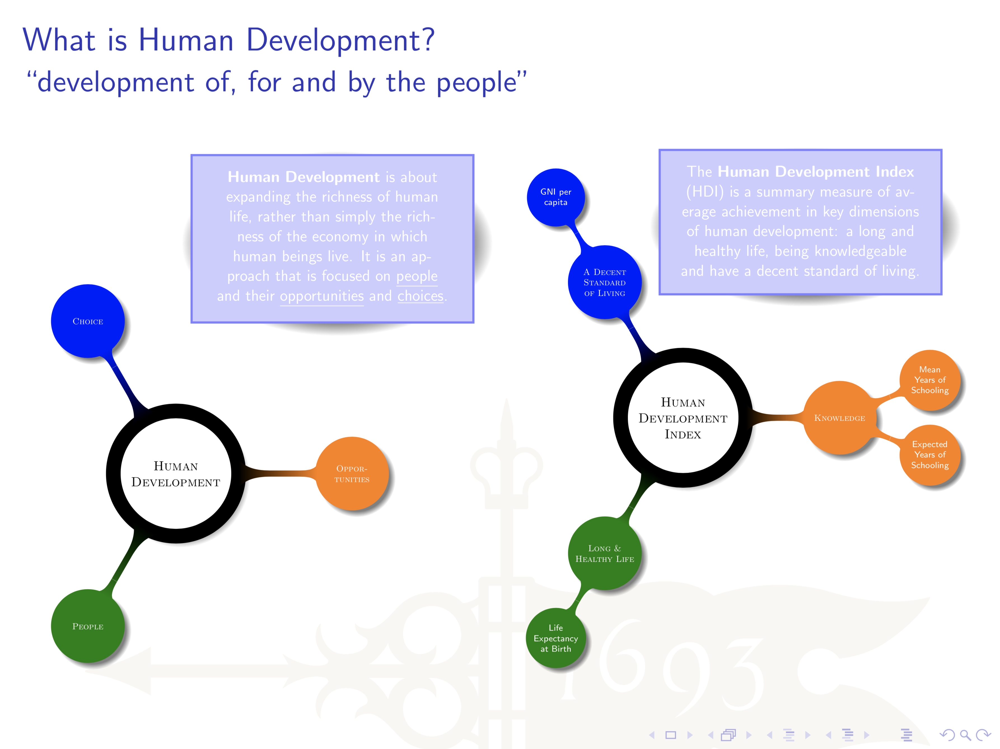
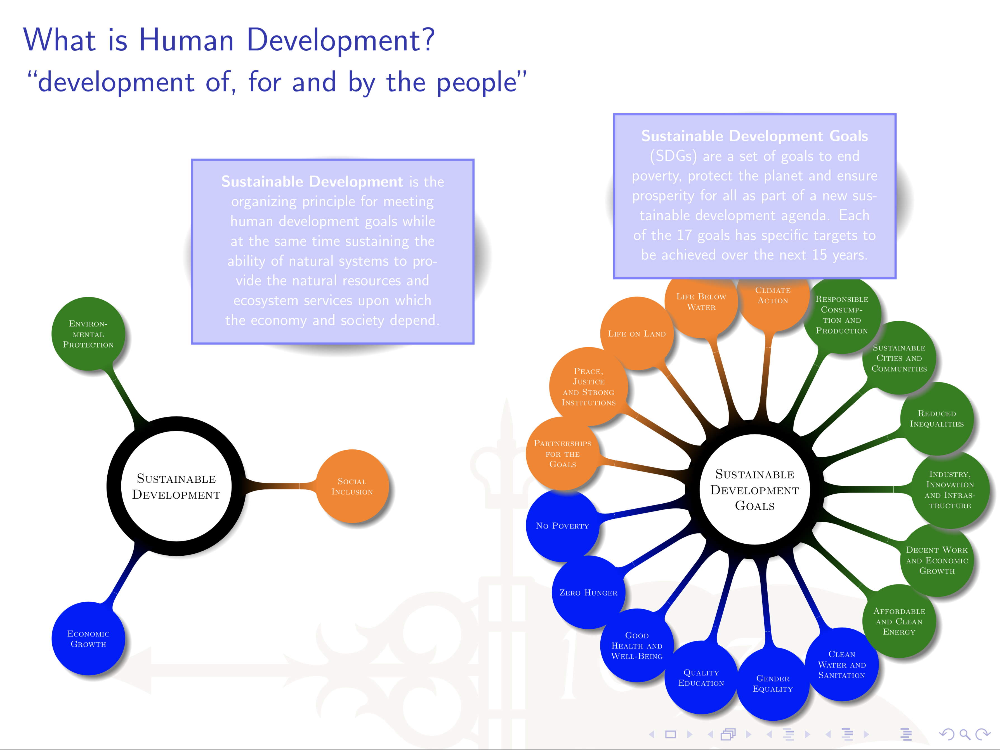

# Background

**Human development** has been defined as the process of enlarging human choices.  In the following two podcasts, Selim Jahan, Director of UNDP's Human Development Report Office, talks about how every day we make different types of choices: some being economic, others cultural and still others . Critical to enlarging the choices people have throughout every aspect of their lives, is enhancing capabilities, while also increasing opportunities to use those capabilities.  A mismatch between capabilities and opportunities can lead to human frustration and the loss of human potential. 

Jahan also talks about how for far too long the paradigm of economic growth has dominated the idea of human development as the end of development. While income is critical, it is not an end. Income presents potential for expanding the richness of life, rather than simply the richness of the economy in which human beings live. The human development approach being described here is one that begins with people, their opportunities and choices. 

> To use a similar phrase, one might say that human development is development of the people \(capital\), for the people \(translated to the lives of people\) and by the people \(people are not only receiving but active participants in the process.  Selim Jahan's modified reference to Abraham Lincoln's Gettysburg Address





Human develoment can also focus on the state of development in a country as well as that process over time.  While a slightly dated TEDx talk, Hans Rosling noted that many of the preconceived ideas about global development & global health are erroneous.  Listen to the following talk by Rosling and consider his observations on the following.

* The western world being understood as having long life in small family, while the third world, a shorter life in a larger family
* The tremendous social change that occurred in Asia before economic change and how health appeared to be a precursor to wealth
* The relationship between child mortality and GDP per capita, is there a gap when disaggregated from continents to countries to quintiles?



Finally, read the introduction as well as Chapters 1 & 2 from Amartya Sen's Development as Freedom where he further introduces and elaborates upon the idea that development is the process of expanding the real freedoms that people enjoy.



Consider the following ideas from Sen's highly significant work.

* Freedom is central to the process of development; development is the process of expanding the real freedoms that people enjoy
* Despite vast wealth, the contemporary world denies elementary freedom to vast num- bers, perhaps the majority of the world population
* Freedom involves both processes that allow freedom of actions and decisions and the actual opportunities that people have given their personal and social circumstances
* Some view development as a “fierce” process in a world where wisdom demands toughness and calculated neglect of various concerns that are seen as “soft- headed”
* Contrast the alternative outlook that sees development as a “friendly process”, based on mutually beneficial exchanges, working social safety nets, political liberties and/or social development

Finally, review the United Nations knowledge platform on the Sustainable Development Goals.  Consider your research area, and which of the goals your work in this class is mostly likely to intersect.



