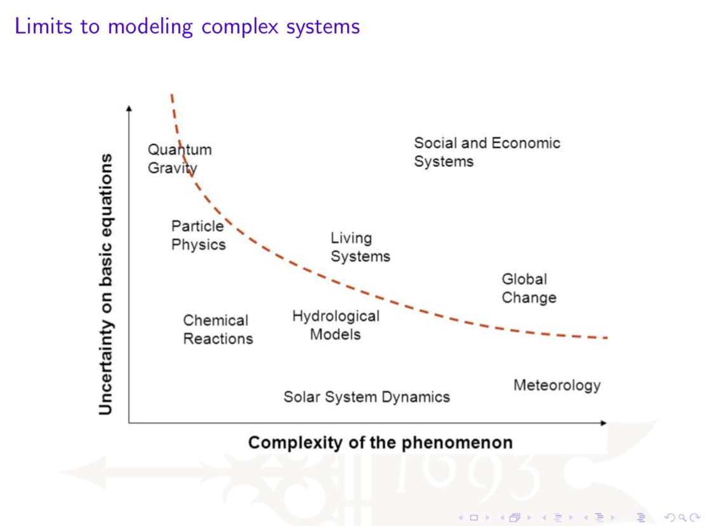
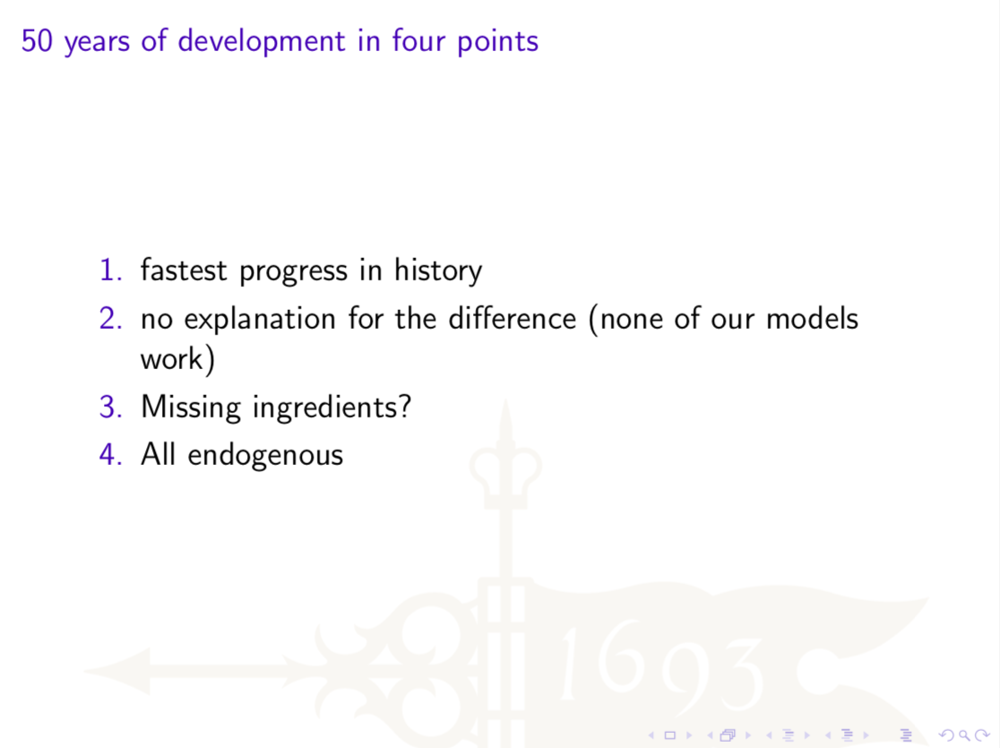
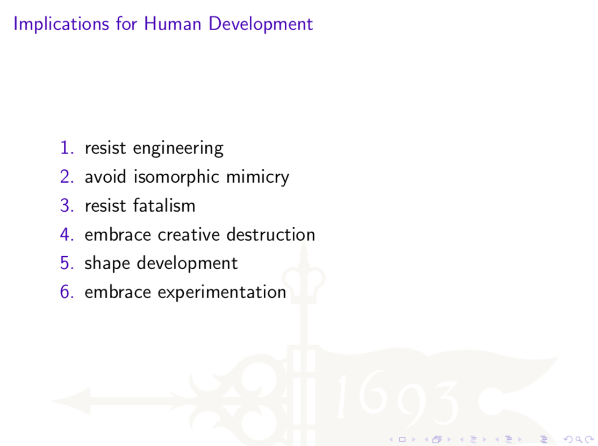

# Background



To begin, watch _An African Election_, a movie about politics, economics and human development in the West African nation, Ghana.  This movie documents the 2008 Presidential Election between Professor John Atta Mills from the National Democratic Party \(NDC\) and Nana Akufo-Addo from the National Patriotic Party \(NPP\).  Consider some of the human development themes from the movie, especially the film's focus on demoncracy, capitalism, poverty and their pervasive relationship to human development.

> “Democracy is only as strong or weak as the participants in the process choose to make it.”  Hannah Tetteh, NDC spokesman

> “If every four years you go to the polling station and you put a piece of paper in a ballot box, and you are not generating sufficient wealth, and you’re not distributing the wealth that is generated equitably, and people still suffer poverty, ignorance and disease, then democracy is absolutely meaningless.”  Kwesi Pratt, Radio Host

What is the role of democracy in a developing country and is there a link between political stability, poverty and human development?  Does the film provide any insight as to how Ghana’s democracy is supporting or detracting from its development?  What is your response to the relationship the film presents with regard to how **democracy** impacts human development?  Can you identify an intersection between the film's narrative on this theme and your selected area of investigation?

> “The distribution of the cake should be fair around the world.”  A Ghanian Miner noting he does the same job as an American miner but gets paid much less
>
> “It is the savagery of capitalism.”  J.J. Rawlings referencing Pope John Paul and the effects of globalization on developing West Africa

Also consider the relationship between economic prosperity, poverty and human development.  What role does capitalism have in promoting human development?  Do you think Ghana is evidencing the "fierce" or "friendly" process as described by Amartya Sen?  Do you think there is a global connection that links economic justice to democratic ideals?  What is your response to the relationship the film presents with regard to how **capitalism** impacts human development?  Can you identify an intersection between the film's narrative on this theme and your selected area of investigation?

Click on the following link to watch _An African Election_ through panopoly.  You should be able to directly access the film in its entirity after logging in with your William & Mary account.



After watching _An African Election_, listen to the [May 2012, Kapuściński Lecture by Owen Barder](https://www.cgdev.org/media/implications-complexity-development-owen-barder) from the Center for Global Development.  While listening to the lecture, also open the slides Barder has provided to accompany his talk by accessing the link found beneath the following soundcloud audio file.





There are a number of different themes presented through the course of Barder's lecture, but most central is the concept of complexity and its relevance in better understanding human development.

> Development should not be thought of as the sum of improvements in the well being of people or the output of firms where it can be catalyzed by providing some missing ingrediant.  Instead human development should be understood as an emergent property from a complex and adpating economic and social system that is comprising of interacting, simulataneoulsy co-evolving agents...And his \(Nicholas Georgescu-Roegen\) insight, which is, really, at the heart of all this stuff, is that **economic systems** are not like evolutionary systems, they **are evolutionary systems**.  Owen Barder

Like Amartya Sen's thesis that human development encompasses more than economic growth but rather also includes the ability to “enlarge people's choices, capabilities and freedoms, so that they can live long and healthy lives, have access to knowledge, a decent standard of living, and participate in the life of their community,” Barder is also seeking to redefine the fundamental tenets that serve as the foundation for defining human development.  At the core of Barder's thesis is the idea that economic systems are fundamentally evolutionary by nature.

Consider Barder's lecture within the context of your own research topic.  Does your area of investigation exhibit any of the following properties of a complex system as introduced by Barder?

* It's difficult or impossible to predict in detail
* Can make broad predictions about the system as a whole
* Has emergent properties
* Tends towards greater complexity
* The system does not tend towards equilibrium

How can developing a better understanding of economic and social systems as complex, evolutionary systems help us to better understand human development? What role does data science play in advancing this better understanding?  What are the implications of Barder's final recommendations for your investigation?

