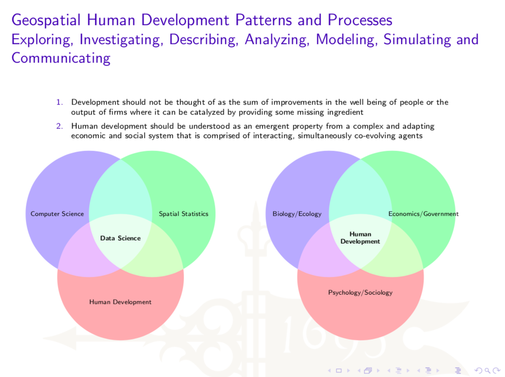

# Background

“Revolutions in science have often been preceded by revolutions in measurement.  Just as the microscope transformed biology by exposing germs, and the electron microscope changed physics, all these data are turning the social sciences upside down.  Researchers are now able to understand human behaviour at the population level rather than the individual level.  Sinan Aral \(cited in [Cukier, 2010](https://www.economist.com/special-report/2010/02/27/data-data-everywhere)\)

Read 



Read



