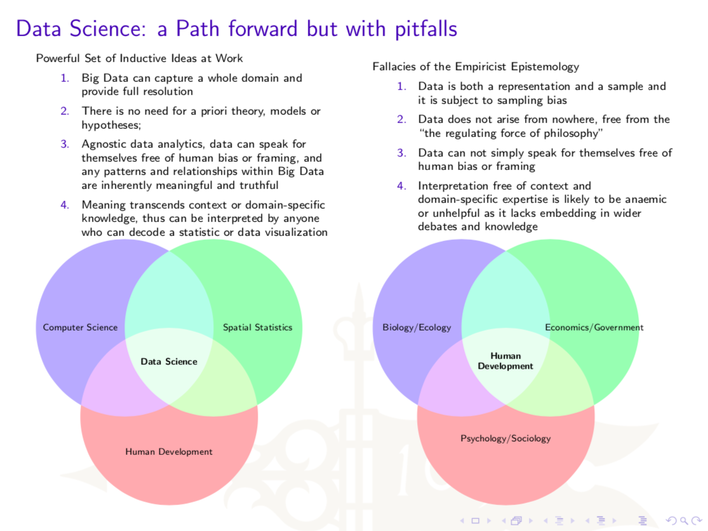

# Background

> _Revolutions in science have often been preceded by revolutions in measurement.  Just as the microscope transformed biology by exposing germs, and the electron microscope changed physics, all these data are turning the social sciences upside down.  Researchers are now able to understand human behaviour at the population level rather than the individual level._  Sinan Aral \(cited in [Cukier, 2010](https://www.economist.com/special-report/2010/02/27/data-data-everywhere)\)

In Chris Anderson's 2010 Wired Article, _The End of Theory: The Data Deluge makes the Scientific Method Obsolete,_ he argues that massively abundant data has replaced the need for models and that this massive corpus can be treated as a laboratory for the human condition.  Anderson's supposition requires us to detach the tether of data as something that can be visualized in its totality and consider a world where massive amounts of data and applied mathematics replace every other tool.  He argues that the prevalence and growth of big data has generally advanced the assumption that sampling design, methodology and validation becomes increasingly unnecessary as sample size presumes to approach population size.  What do you think?  Is theory really dead?



In response, Rob Kitchin published the 2014 article _Big Data, New Epistemologies and Paradigm Shifts_, arguing that revolutions in science have often been preceded by revolutions in measurement and that we should proceed with caution with regards to the emerging data science paradigm while also being mindful of fallacies that are often employed as part of the empiricist's _modus operandi_.  Kitchen constitutes a paradigm as an accepted way of interrogating the world and synthesizing knowledge common to a substantial proportion of researchers in a discipline at any one time. Following, Thomas Kuhn's seminal work, [The Structure of Scientific Revolutions](https://wm-primo.hosted.exlibrisgroup.com/primo-explore/search?institution=01COWM_WM&vid=01COWM_WM_NEWUI&query=any,contains,Thomas%20Kuhn%20the%20structure%20of%20scientific%20revolutions&tab=default_tab&search_scope=EVERYTHING&displayMode=full&dum=true&mode=basic&bulkSize=30&highlight=true&displayField=all&allsearch=Search&lang=en_US), Kitchen argues that new ways of thinking emerge that challenge accepted theories and approaches.  This fourth exploratory paradigm of empiricism reborn, reasons the empiricist epistemology is attractive largely due to many of the reasons posited by Anderson.

What hope does big data offer in its ability to capture a whole domain and provide full resolution?  Has the need for a priori theory, models or hypothesis become extinct?  Can data analytics truly be agnostic and permit data to speak for itself free of human bias or framing, patterns and relationships are inherently meaningful and truthful?  Is it possible for that meaning to transcend context or domain-specific knowledge such that it can be interpreted by anyone?  How does Kitchen respond to the idea that theory is dead?



