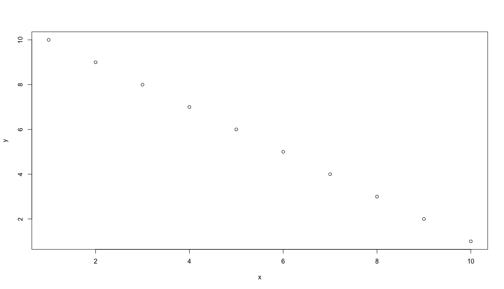
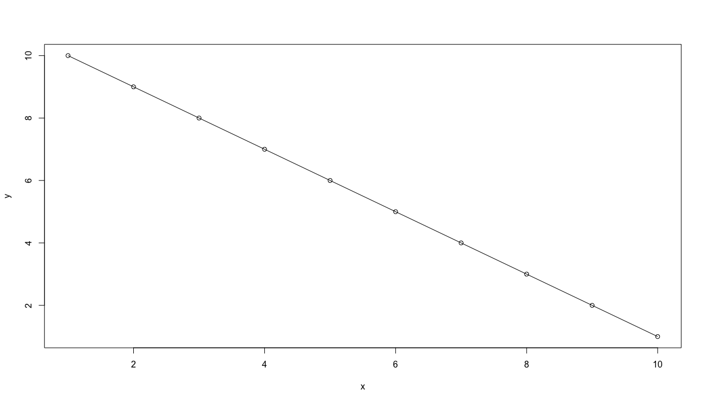

# Creating an object & creating a plot

Since you have already set your working directory in the previous step, now you can create your first object.  Do so by writing the following command in your script.

`x <- 1:10`

There are essentially three parts to this command.  First take note of the `<-` symbol, which is often called the assignment operator.  The `<-` operator will function by assigning everything on its right hand side to the newly named object on the left.  For example, if you entered the command `t <- 1` and then typed `t` directly in the console and pressed return, R would inform you of the value of `t`, which would be 1.  After creating and defining `x` do the same thing for `y` but this time start with the highest value and decrease sequentially to 1.

`y <- 10:1`

Now lets move to the console and ask R a few things directly. Sometimes we want to save our script, while at other times we just want to ask R a quick question. First lets ask R to list all the objects that exist in our workspace at this point in time.  We use the `ls()` command to list all objects that exist in our workspace.

`[1] "x" "y"`

Let's also ask R to tell us more about the two objects we have created and placed in our workspace. Go ahead and type `x` and then `y` directly into your console and consider the output.

`x`

`[1] 1 2 3 4 5 6 7 8 9 10` 

`y`

`[1] 10 9 8 7 6 5 4 3 2 1`

We can see that our earlier use of the colon in `x <- 1:10` created an object named `x` that contains each whole number in sequence from 1 to 10, while y likewise did the same except in reverse. Also by simply typing the name of the object, R reveals to us everything it knows.  Since we have two objects of equal length, lets plot x & y together.

`plot(x,y)`



We can continue to describe our plot by adding an argument to our command by specifying the plot type as a line and not simply points

`plot(x, y, type = "l")`

or alternatively a plot with both a line and points over that line.

`plot(x, y, type = "o")`



We can also add some description to our plot in order to better communicate our results.  We can begin by adding a title as well as labels for both the x and y axes.

```
plot(x, y, type = "o", 
main = "The Path of a Running Boy", 
xlab = "longitude", 
ylab = "latitude")
```


