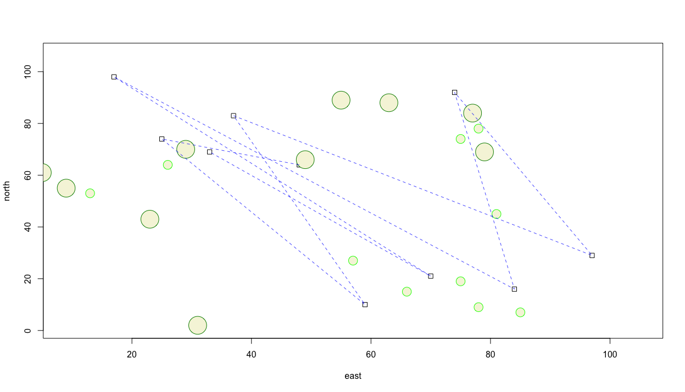

# Creating an object & creating a plot

Since you have already set your working directory in the previous step, now you can create your first object.  Do so by writing the following command in your script.

`x <- 1:10`

There are essentially three parts to this command.  First take note of the `<-` symbol, which is often called the assignment operator.  The `<-` operator will function by assigning everything on its right hand side to the newly named object on the left.  For example, if you entered the command `t <- 1` and then typed `t` directly in the console and pressed return, R would inform you of the value of `t`, which would be 1.  After creating and defining `x` do the same thing for `y` but this time start with the highest value and decrease sequentially to 1.

`y <- 10:1`

Now lets move to the console and ask R a few things directly. Sometimes we want to save our script, while at other times we just want to ask R a quick question. First lets ask R to list all the objects that exist in our workspace at this point in time.  We use the `ls()` command to list all objects that exist in our workspace.

`[1] "x" "y"`

Let's also ask R to tell us more about the two objects we have created and placed in our workspace. Go ahead and type `x` and then `y` directly into your console and consider the output.

`x`

`[1] 1 2 3 4 5 6 7 8 9 10` 

`y`

`[1] 10 9 8 7 6 5 4 3 2 1`

We can see that our earlier use of the colon in `x <- 1:10` created an object named `x` that contains each whole number in sequence from 1 to 10, while y likewise did the same except in reverse. Also by simply typing the name of the object, R reveals to us everything it knows.  Since we have two objects of equal length, lets plot x & y together.

`plot(x,y)`


We can continue to describe our plot by adding an argument to our command by specifying the plot type as a line and not simply points

`plot(x, y, type = "l")`

or alternatively a plot with both a line and points over that line.

`plot(x, y, type = "o")`


We can also add some description to our plot in order to better communicate our results.  We can begin by adding a title, indicating the units of measurement while also adding labels for both the x and y axes.

```r
plot(x, y, type = "o", 
main = "The Path of a Running Boy",
sub = "units of distance = meters",
xlab = "longitude", 
ylab = "latitude")
```


We can also change the linetype by specifying the `lty =` argument or set the lineweight by using the `lwd =` argument.  The color of our line can be changed using the `col = "some_color"` argument, while the point symbol itself can be modified by using the `pch =` argument.  Scale of the symbol is increased or descreased using `cex =`.  Have a look at the [Quick-R](https://www.statmethods.net/advgraphs/parameters.html) website for a comprehensive list of some available graphical parameters.

```r
plot(x, y, type = "b", main = "The Path of a Running Boy", 
     sub = "units of distance = meters", 
     xlab = "longitude", 
     ylab = "latitude",
     lty = 2,
     lwd = .75,
     col = "blue",
     pch = 0,
     cex = 1.5)
```



## Creating a More Complicated Plot while also creating and then using a Data Frame

Now lets make your plot a bit more complicated than simply a line with points.  First increase the scale of our plot area by increasing the range of values for both the x & y axes.

```r
x <- 1:100
y <- 1:100
```

Now instead of using those values, let's randomly select from both `x` & `y` in order to produce a random series of x & y coordinates.

```r
east <- sample(x, size = 10, replace = TRUE)
north <- sample(y, size = 10, replace = TRUE)
```

The above command `sample()` will randomly select in a uniform manner, one number from `x` and then also `y`, 10 times, creating the vector objects `east` & `north`.  I have also included the `replace = TRUE` argument, such that each time a number is selected, it is returned and potentially can be selected again in the next draw.  Now, lets take each value and use it as the coordinates for the center point of a number of squares.  We will use the `symbols()` command in order to add additional specifications to our command.

```r
symbols(east, north, squares = rep(.75,10), inches = FALSE)
```

Following is one possible outcome produced by the randomly produced coordinates.  While the squares produced in your plot will be in different locations, the number of squares as well as the size of each, should be very similar.  Lets also consider the additional arguments in the `symbols()` command.  In the `squares =` argument within the command, I have also used the `rep()` function, which will repeat the length of each square, `.75` in this case, 10 times, or 1 time for each square.  I have also added the `inches = FALSE` argument so the units are considered to be similar to the axes.


Now lets add some circles to our plot.  This time, instead of assigning an object a permanent value by randomly selecting from a series of numbers, lets randomly select values as part of creating the plot with the `symbol()` function.

```text
symbols(sample(x, 10, replace = TRUE), 
        sample(y, 10, replace = TRUE), 
        circles = rep(.75,10), 
        inches = FALSE,
        fg = "green",
        add = TRUE)
```

Where as before I created two objects and plotted their values as x & y coordinates, this time I have nested the `sample()` command within the `symbols()` function, in the place where R is looking for the x & y value coordinates.  In this manner, each time I execute the command, 10 circles will be randomly placed throughout the defined area, each with a radius of `.75`.  I have also included the `add = TRUE` argument within the command, in order to add the circles to our previous plot of square.  The `fg =` argument permits us to select a color for each circle.


Let's also add some larger trees and specify their color as well.  Again we will randomly place them while using the `add = TRUE` argument so they are added to our previous plot.  Also, consider a wider range of colors to use as the outline for each circle, while also filling each circle with a color.  In order to determine how to fill the circle with a color, use the `?` followed by the command you are interested in learning more about in order to view all of the available options.  In this case you can type `?symbols` directly in the console in order to see all of the arguments possible.  If you scroll down in the help window, you will see that `fg =` is used to specify the color or your symbol border, while `bg =`  is used to indicate the color for your symbol's fill.  You may also be interested to know which colors are available to select.  In order to review a list of all available colors, simply type `colors()` directly into your console.  Running the following chunk of commands will then produce a plot similar to the following image.

```text
symbols(east, north, squares = rep(.75,10), inches = FALSE)

symbols(sample(x, 10, replace = TRUE), 
        sample(y, 10, replace = TRUE), 
        circles = rep(.75,10), 
        inches = FALSE,
        fg = "green1",
        bg = "beige",
        add = TRUE)

symbols(sample(x, 10, replace = TRUE), 
        sample(y, 10, replace = TRUE), 
        circles = rep(1.5,10), 
        inches = FALSE,
        fg = "green4",
        bg = "beige",
        add = TRUE)

```


