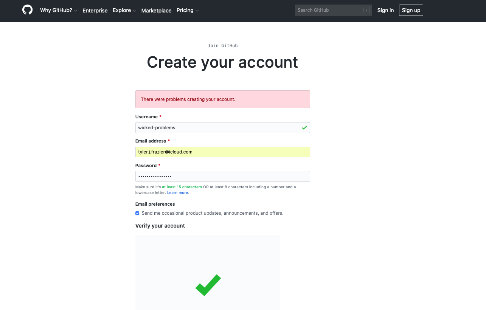
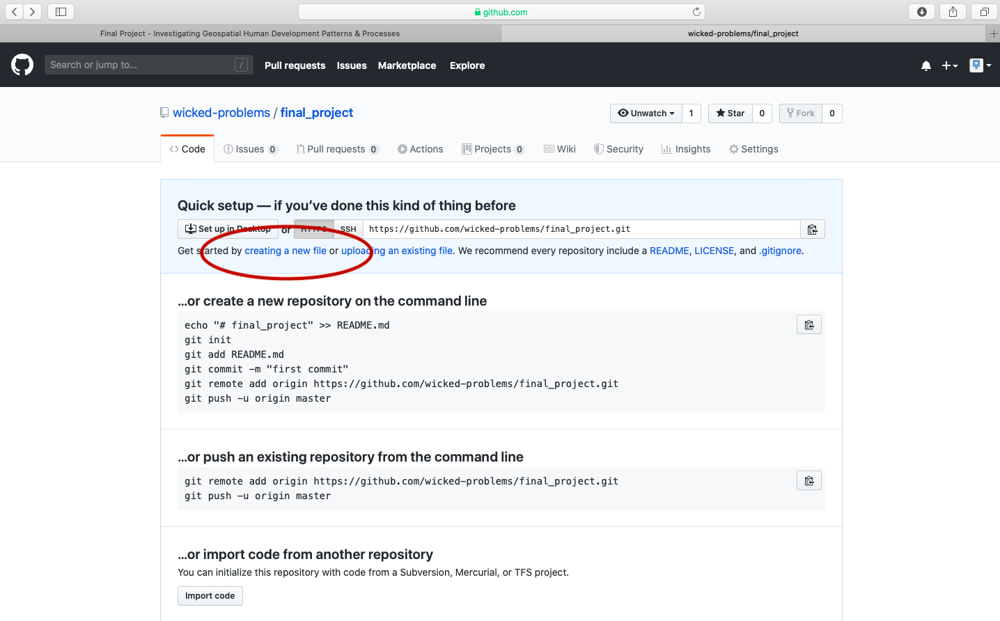
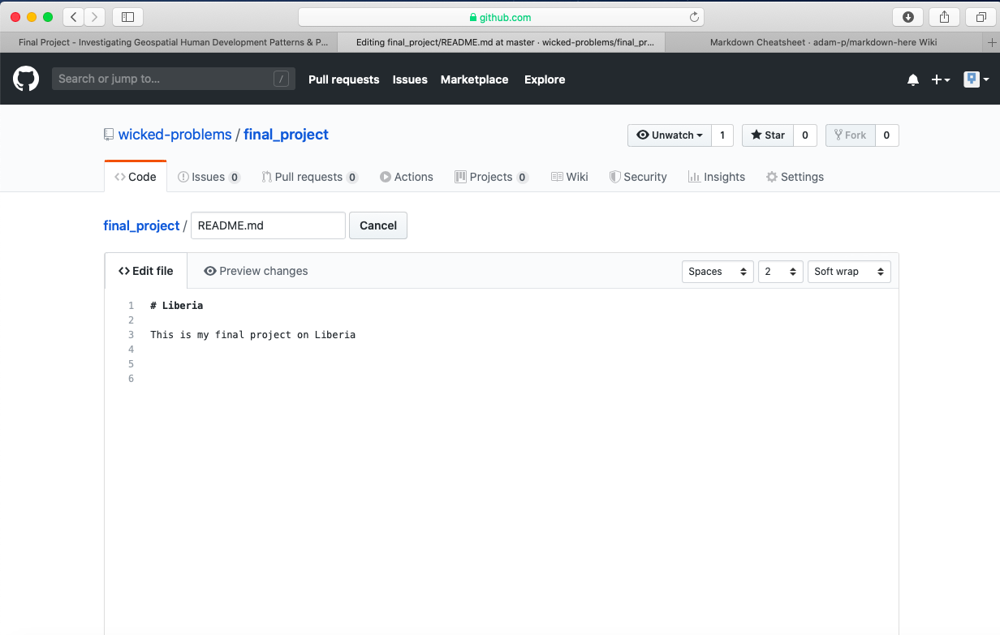
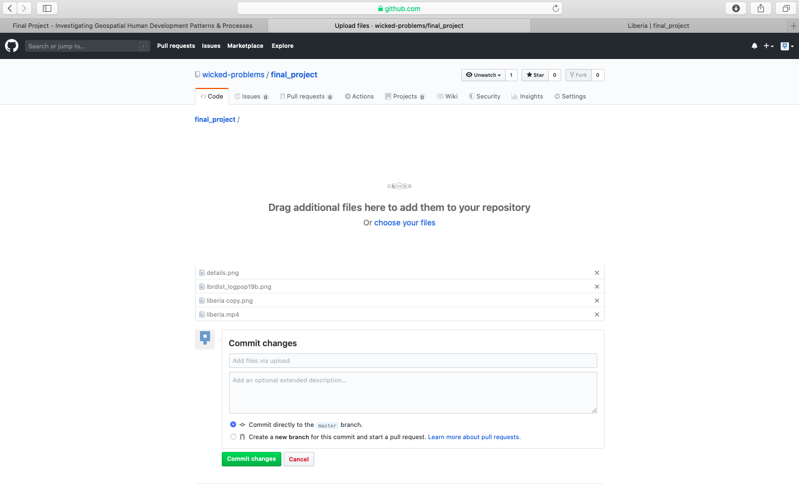
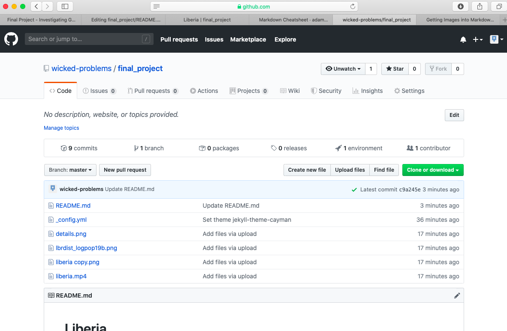
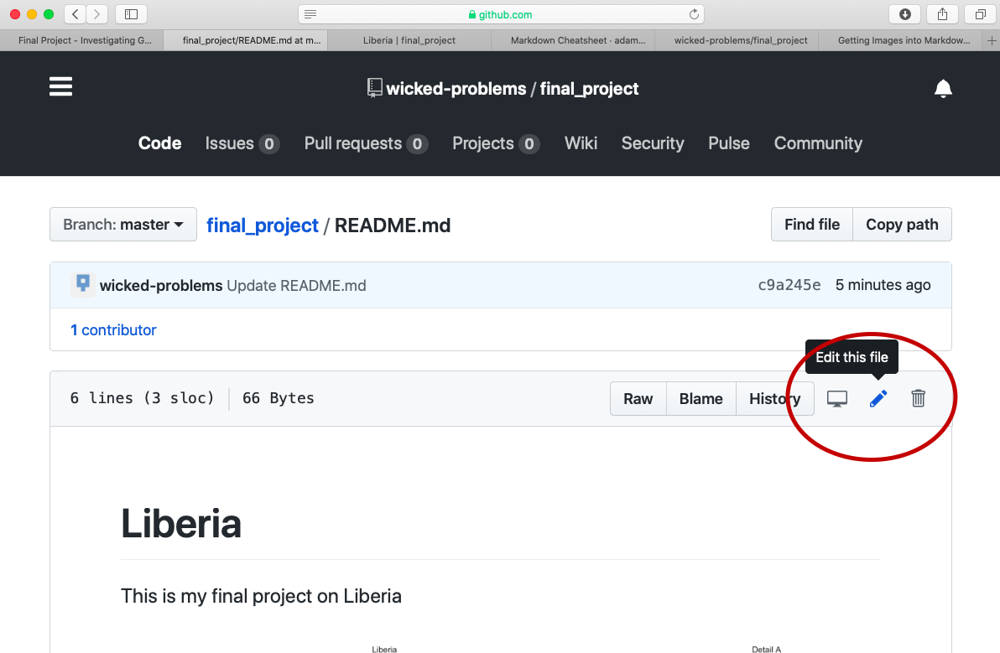

# Final Project

For the final project in this course you will create a **GitHub Pages** site using a fairly simple programming language called markdown and populate that site with content you have created through the course of this semester.  Upon completing your GitHub Pages site, post a link to your website on the slack channel \#data100\_final prior to the deadline of 5PM on Wednesday, December 18th.

To begin go to [https://github.com](https://github.com) and create a new account.  You should see a website that is very similar to the following image.

After clicking on the sign up link, create your account by designating your username, e-mail address and password.  In order to simulate the process of signing up, I am using the username `wicked-problems.`  My real GitHub account is [https://github.com/tyler-frazier](https://github.com/tyler-frazier), and you are welcome to follow me, although it is not necessary for this final project.

After creating your account, you should receive an e-mail asking to verify your account.  Go ahead and verify, so GitHub can permit you to create a new repository.  Once you verify your e-mail address, GitHub will likely ask if you want to create a new repository.  If somehow you are not automatically asked to create a new repository, it is also possible by selecting the + pull down arrow in the top right corner of the page.

You will also notice that there is a guide made available for new users \(the green, read the guide tab\).  This is really good guide to read, in order to learn how to use GitHub as a version control system.  Although you will be using only a small amount of GitHub's full potential for this final project, I highly recommend making a mental note of the guide and returning to the 10 minute read when you have some time.  If you are planning to major or minor in Data Science, Computer Science, or any discipline that has a signficiant compuational component, it will be very likely that at some point in the future you will need to use a version control system \(such as GitHub\) for repository control, sharing, collaboration, conflict resolution etc...[https://guides.github.com/activities/hello-world/](https://guides.github.com/activities/hello-world/)

Now, go ahead and create your first repository.  In the following example I will name my repository `final_project`.

After creating your repository, go to the main page for your repository.  You should see a quick setup script under the `code` tab.  Click on `create a new file` under the quick set-up at the top of the page in order to populate your newly created repository with `README.md` file.  The `.md` extension after the filename is the extension for a markdown file.  Markdown is a simple, plain text formatting syntax language which has as its main design goal, as-is readability.   It is a relatively simple language that will enable you to program webpage content fairly easily. 

This should bring you to a new page where you are able to create a new file.  In order for your GitHub Pages site to function properly, you will need a `README.md` file in the root folder of your repository.  Below the field for the file name is the markdown file body, where you will type your script.  Add a first level `header` to your `README.md` file by adding one `#` and following it with your title.  

You can also preview the output from your markdown file, by clicking on the preview changes tab.

After typing the simple markdown script, scroll to the bottom of the page and click on the green commit button, to commit your file to your repository.  You will need to press this green button, each time you edit the content within a file or add new files to your repository.  By making a new commit to your repository, you are essentially updating all of the changes you had previously made.  While in the case of your final project, there is essentially only one person executing changes per respository, potentially a version control system has the power of resolving conflicts amongtst multiple persons all committing changes to the same files simultaneously to the same respository.  That is the power of a version control system, such as GitHub.

To begin getting an understanding of how to use markdown, have a quick look at the following cheatsheet.



For the final project, you will only be using headers, paragraph text and inserting images and possibly videos to your git-hub pages site.  After having a look at the markdown cheatsheet, return to the main page of your repository, which should look like the following.  After navigating to that location, click on the `settings` tab in the top right hand corner.

Scroll down to the GitHub pages section under settings and change the page source from `none` to `master_branch`.

After setting the branch where your git-hub pages files will reside, also select the theme tab and choose one of the available themes.  I chose the theme `Caymen` for my page, but you are welcome to select any of the available themes for your final project.  After, selecting your theme and returning to the git-hub pages section, you should notice a web address appear where your site has been published.  It might take a moment or two for your webpage to appear, but it should readily accessible.

After clicking on the link, you should appear at your newly created webpage that you will use to publish the results from your investigation.



Now let's start making changes to your website using markdown.  For starters go back to the main page of your repository and select the upload files tab.

This should bring you to a page that will enable you to upload the images you have produced from each of the previous projects.  The interface should appear similar to the following image.

I will begin by dragging and dropping a few of the plots produced that describe the administrative subdivisions of Liberia as well as the spatial distribution of it's population.

After dropping the files into my repository, the basic file structure looks like the following.

Now let's go ahead and add the image `details.png` to your `README.md` file.  Go back to `README.md` and select the pen image in the upper right hand side of the screen to begin editing your markdown file.

After opening up the markdown file editor, I will add the following lines of code to the file in order to add a second level header and the image `details.png` to my markdown file.  Don't forget to scroll down to the bottom of the page and click on the commit button to make sure the changes you have made to the file are properly committed to the repository.

After committing the changes and waiting a few moments, changes will appear to have been made to the published webpage.

