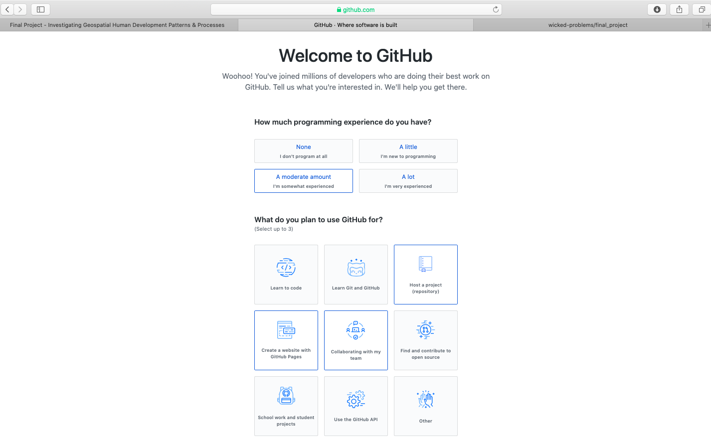
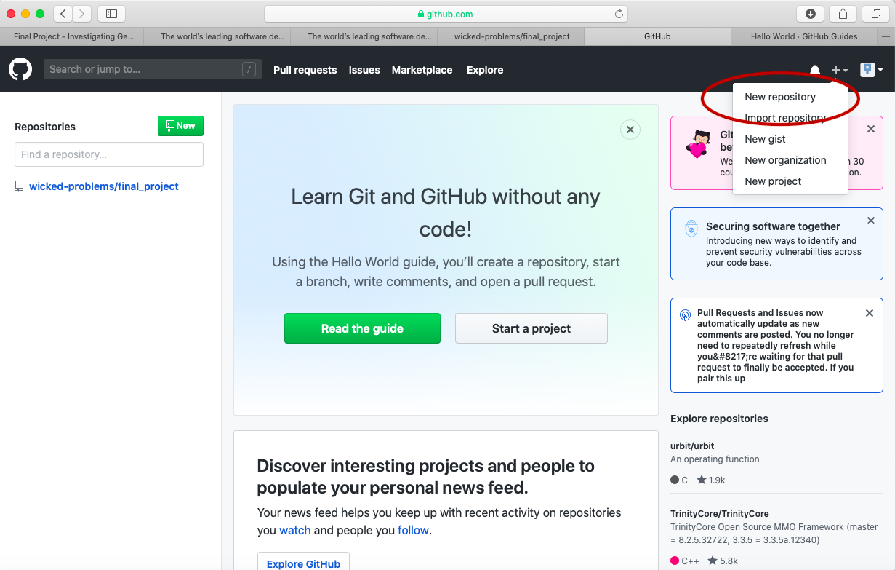

# Final Project

For the final project in this course you will create a Git-hub pages site using a fairly simple programming language called markdown and populate that site with content you have created through the course of this semester.  Upon completing your github pages site, you will post a link to your website on the slack channel \#data100\_final.

To begin go to the git-hub webpage and create a new account.  Git-hub is found at the web address[https://github.com](https://github.com).  Sign up for a new account.

After clicking on the sign up link, create your account by designating your usename, e-mail address and password.  In order to simulate the process of signing up, I am using the username `wicked-problems.`  My real git-hub account is [https://github.com/tyler-frazier](https://github.com/tyler-frazier), please feel free to follow me.

After creating your account, you should receive an e-mail asking to verify your account.  Go ahead and verify, so Github can permit you to create a new repository.  Once you you verify your e-mail address, git-hub will likely ask you if you want to create a new repository.  If you somehow landed on the profile page for your account then can also create a new repository be selecting the + pull down arrow in the top right corner of the page.

You will also notice that there is a guide made available for new users \(the green, read the guide tab\).  This is really good guide to read, in order to learn how to use git-hub as a version control system.  Although you won't be using most of the functionality provided by git-hub for this final project, I highly recommend making a mental note of the guide and returning to the 10 minute read when you have some time.  If you are planning to major or minor in Data Science, Computer Science, or pretty much any discipline that has a signficiant compuational component, it will be very likely that at some point in the future you will need to use a version control system such as git-hub for repository control, sharing, collaboration, conflict resolution etc...[https://guides.github.com/activities/hello-world/](https://guides.github.com/activities/hello-world/)

Now, go ahead and create your first repository.  I will name my repository `final_project`.

After creating your repository, go to the main page for your repository.  You should see a quick setup script under the `code` tab.  Click on `create a new file` under the quick set-up at the top of the page.

  

 

