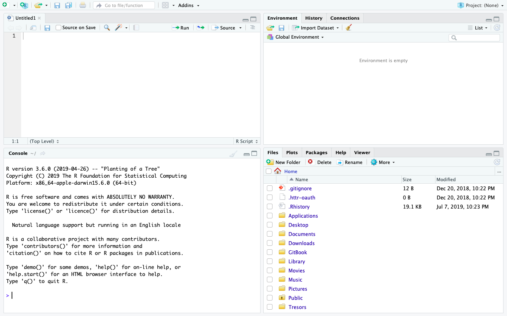
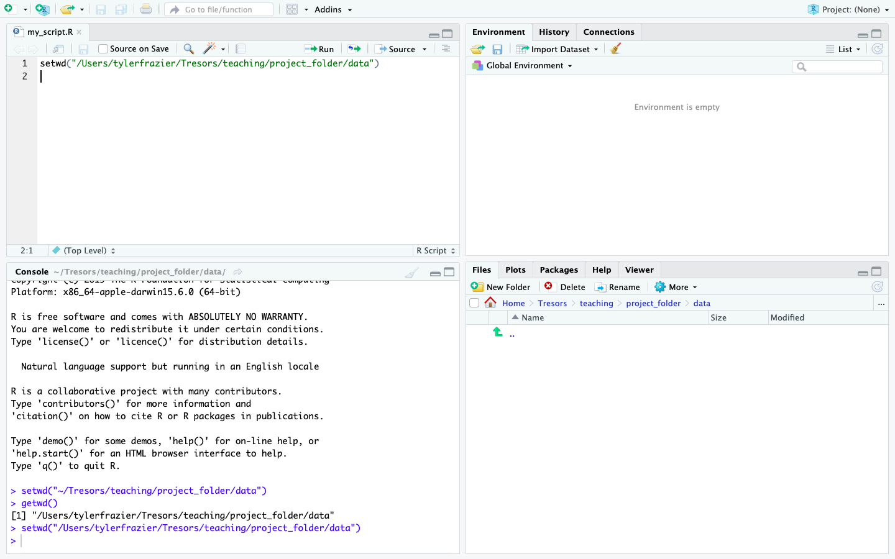

# Getting Started with RStudio & R

## Starting RStudio

Once you have finished the installation process, run the RStudio IDE, which will automatically find R on your computer.  Find the application RStudio on your computer.  The RStudio executable should be located in the applications folder on a Mac.  Once running the RStudio application on a Mac it is often helpful to keep the application icon in the dock, which is the bar of applications that exists along the bottom of your computer desktop screen.  On Windows, if you select the Window icon in the bottom left corner and begin typing RStudio, you should see the application icon appear. On a Linux system, the application should appear in one of the OS drop down windows.  Choose the application icon and open it.

If both R and RStudio were properly installed, then the start up for RStudio should appear something like the following image.

One of the first things to note at start up is the bottom left hand pane, which is essentially a window to the R interpreter.  RStudio reports the version of R that has been installed on your computer.  Next go to the pull down menu for **File &gt; New Script &gt; R Script** and select that option.  This will create a new R Script that will appear in the top left pane of your R Studio IDE.  One can think of the script as the location where all computer code will be written and saved, in a manner somewhat analogous to writing a letter or essay with a work processor.  Below the script in RStudio is the console or the location where your commands are sent and responses from R will be returned.  You can think of the **&gt;** symbol in the console as R somewhat figuratively waiting for your command and subsequently also the location where R will respond.

Since you now have a script file where you will save your first R commands, you should also have a working director where you will save your `my_first_script.R` file.  At this point you should minimize RStudio, and return to your file explorer or finder and create a folder that you will use to save your script, output as well as any files you may import to R.  Generally, I create a project specific folder and then within that folder I begin with two subdirectories, one that is dedicated for storing data and a second one that is dedicated to saving my scripts.  After you have created your project folder, return to RStudio and then select **Session &gt;** **Set Working Directory &gt; Choose Directory** from the drop down menu.  Choosing this command will result in a file explorer window appearing in order for RStudio to select the working directory for your work session.  The working directory is the default location where R will automatically look in order to import or export and data.  Go ahead and select the **data** subdirectory you just created within your project folder.  Upon selecting your data folder, you should notice a command appear within the console pane in the bottom left hand corner of RStudio.

`setwd("~/my_folder/my_project_folder/my_data_folder")`

By using the RStudio IDE GUI you have just executed your first command.  You can confirm that the command was properly executed from within the console by typing the following command directly in the console.

`getwd()`

You should notice that R returns the path from the working directory you just designated.  Instead of setting your working directory using the drop down menu, the preferred method is to designate that path by using code in R.  Fortunately, RStudio has already specified the command for you, so just go ahead and copy the `setwd()` command from above and paste it into your script file in the top left hand corner of your RStudio work session.  You could also retype it, but in general, copying and pasting is going to be much more efficient.  On a Mac copying and pasting is accomplished by using the **⌘C** & **⌘V** keys or on Windows **control-C** and **control-V**. ****  After copying and pasting that line of code within your script, go ahead and execute the function again, except this time, send the command directly from your script to the console.  To do this use, move the cursor to the line where you pasted the code and then select **⌘return** on a Mac or **control-return** on Windows.  Congratulations! You have just written and executed your first line of code.

Now that your script has content, you should save the file.  Select the **&gt;File&gt;Save** command from the drop down window and choose the data subdirectory you created within your project folder.  Name your script file and then select save.  Your RStudio work space should appear similar to the following image.

