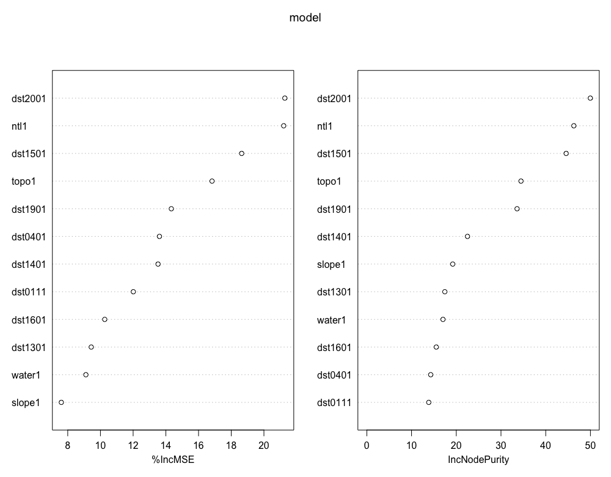
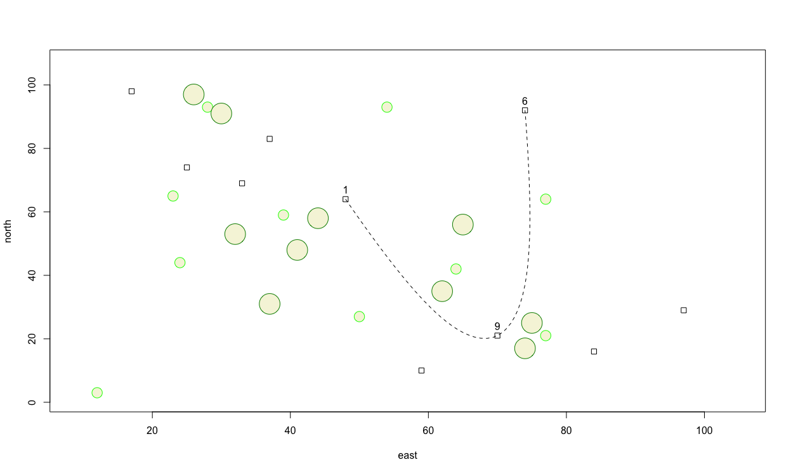
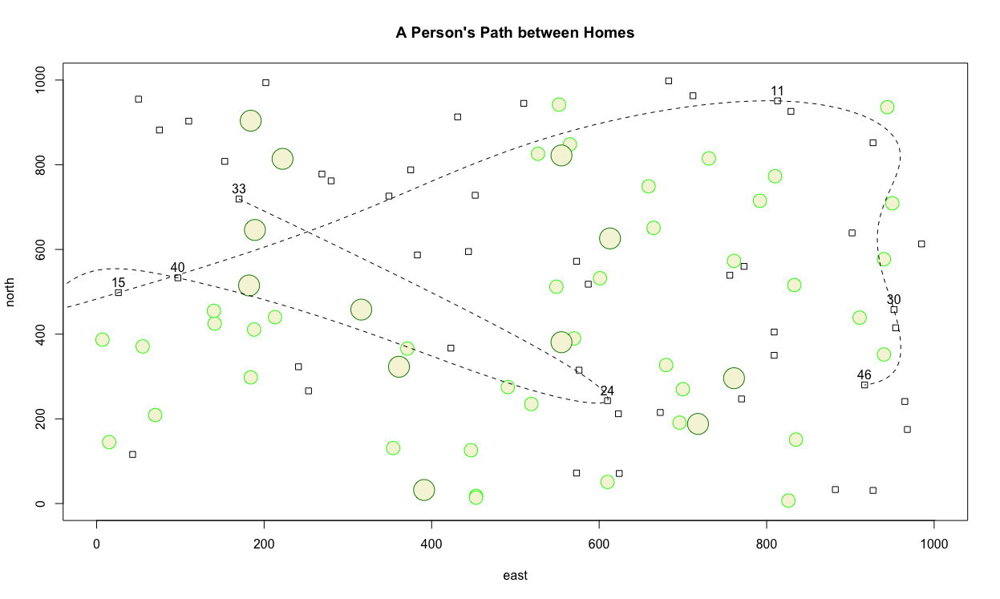

# Creating and Plotting Objects

## Creating an object & creating a plot

Since you have already set your working directory in the previous step, now you can create your first object.  Do so by writing the following command in your script.

`x <- 1:10`

There are essentially three parts to this command.  First take note of the `<-` symbol, which is often called the assignment operator.  The `<-` operator will function by assigning everything on its right hand side to the newly named object on the left.  For example, if you entered the command `t <- 1` and then typed `t` directly in the console and pressed return, R would inform you of the value of `t`, which would be 1.  After creating and defining `x` do the same thing for `y` but this time start with the highest value and decrease sequentially to 1.

`y <- 10:1`

Now lets move to the console and ask R a few things directly. Sometimes we want to save our script, while at other times we just want to ask R a quick question. First lets ask R to list all the objects that exist in our workspace at this point in time.  We use the `ls()` command to list all objects that exist in our workspace.

`[1] "x" "y"`

Let's also ask R to tell us more about the two objects we have created and placed in our workspace. Go ahead and type `x` and then `y` directly into your console and consider the output.

`x`

`[1] 1 2 3 4 5 6 7 8 9 10` 

`y`

`[1] 10 9 8 7 6 5 4 3 2 1`

We can see that our earlier use of the colon in `x <- 1:10` created an object named `x` that contains each whole number in sequence from 1 to 10, while y likewise did the same except in reverse. Also by simply typing the name of the object, R reveals to us everything it knows.  Since we have two objects of equal length, lets plot x & y together.

`plot(x,y)`



We can continue to describe our plot by adding an argument to our command by specifying the plot type as a line and not simply points

`plot(x, y, type = "l")`

or alternatively a plot with both a line and points over that line.

`plot(x, y, type = "o")`


We can also add some description to our plot in order to better communicate our results.  We can begin by adding a title, indicating the units of measurement while also adding labels for both the x and y axes.

```r
plot(x, y, type = "o", 
main = "The Path of a Running Boy",
sub = "units of distance = meters",
xlab = "longitude", 
ylab = "latitude")
```


We can also change the linetype by specifying the `lty =` argument or set the lineweight by using the `lwd =` argument.  The color of our line can be changed using the `col = "some_color"` argument, while the point symbol itself can be modified by using the `pch =` argument.  Scale of the symbol is increased or descreased using `cex =`.  Have a look at the [Quick-R](https://www.statmethods.net/advgraphs/parameters.html) website for a comprehensive list of some available graphical parameters.

```r
plot(x, y, type = "b", main = "The Path of a Running Boy", 
     sub = "units of distance = meters", 
     xlab = "longitude", 
     ylab = "latitude",
     lty = 2,
     lwd = .75,
     col = "blue",
     pch = 0,
     cex = 1.5)
```


## Creating a More Complicated Plot while also creating and then using a Data Frame

Now lets make your plot a bit more complicated than simply a line with points.  First increase the scale of our plot area by increasing the range of values for both the x & y axes.

```r
x <- 1:100
y <- 1:100
```

Now instead of using those values, let's randomly select from both `x` & `y` in order to produce a random series of x & y coordinates.

```r
east <- sample(x, size = 10, replace = TRUE)
north <- sample(y, size = 10, replace = TRUE)
```

The above command `sample()` will randomly select in a uniform manner, one number from `x` and then also `y`, 10 times, creating the vector objects `east` & `north`.  I have also included the `replace = TRUE` argument, such that each time a number is selected, it is returned and potentially can be selected again in the next draw.  Now, lets take each value and use it as the coordinates for the center point of a number of squares.  We will use the `symbols()` command in order to add additional specifications to our command.

```r
symbols(east, north, squares = rep(.75,10), inches = FALSE)
```

Following is one possible outcome produced by the randomly produced coordinates.  While the squares produced in your plot will be in different locations, the number of squares as well as the size of each, should be very similar.  Lets also consider the additional arguments in the `symbols()` command.  In the `squares =` argument within the command, I have also used the `rep()` function, which will repeat the length of each square, `.75` in this case, 10 times, or 1 time for each square.  I have also added the `inches = FALSE` argument so the units are considered to be similar to the axes.


Now lets add some circles to our plot.  This time, instead of assigning an object a permanent value by randomly selecting from a series of numbers, lets randomly select values as part of creating the plot with the `symbol()` function.

```text
symbols(sample(x, 10, replace = TRUE), 
        sample(y, 10, replace = TRUE), 
        circles = rep(.75,10), 
        inches = FALSE,
        fg = "green",
        add = TRUE)
```

Where as before I created two objects and plotted their values as x & y coordinates, this time I have nested the `sample()` command within the `symbols()` function, in the place where R is looking for the x & y value coordinates.  In this manner, each time I execute the command, 10 circles will be randomly placed throughout the defined area, each with a radius of `.75`.  I have also included the `add = TRUE` argument within the command, in order to add the circles to our previous plot of square.  The `fg =` argument permits us to select a color for each circle.


Let's also add some larger trees and specify their color as well.  Again we will randomly place them while using the `add = TRUE` argument so they are added to our previous plot.  Also, consider a wider range of colors to use as the outline for each circle, while also filling each circle with a color.  In order to determine how to fill the circle with a color, use the `?` followed by the command you are interested in learning more about in order to view all of the available options.  In this case you can type `?symbols` directly in the console in order to see all of the arguments possible.  If you scroll down in the help window, you will see that `fg =` is used to specify the color or your symbol border, while `bg =`  is used to indicate the color for your symbol's fill.  You may also be interested to know which colors are available to select.  In order to review a list of all available colors, simply type `colors()` directly into your console.  Running the following chunk of commands will then produce a plot similar to the following image.

```text
symbols(east, north, squares = rep(.75,10), inches = FALSE)

symbols(sample(x, 10, replace = TRUE), 
        sample(y, 10, replace = TRUE), 
        circles = rep(.75,10), 
        inches = FALSE,
        fg = "green1",
        bg = "beige",
        add = TRUE)

symbols(sample(x, 10, replace = TRUE), 
        sample(y, 10, replace = TRUE), 
        circles = rep(1.5,10), 
        inches = FALSE,
        fg = "green4",
        bg = "beige",
        add = TRUE)

```


Thus far we have only created R objects that are of the vector class.  We can review the class of one of the objects we have created by typing `class(east)` directly into the console and observe that R informs us that the object is a vector of integers.  Now let's create a new class of an object called a data frame that contains a series of rows and columns where each row represents an observation while each column represents a different variable.  We can start with the coordinates that represent the center point of each square.

```r
dwellings <- cbind.data.frame(id = 1:10, east, north)
```

In this case, we are using the `cbind.data.frame()` command to column bind together the newly created variable named `id` with our two integer vectors `east` & `north` into a newly formed data frame named `dwellings`.  After executing the above command, you can type the name of your data frame directly into the console to review its content.  Within the environment pane in the top right hand window, under the data tab, you can also use your mouse to click on the data frame symbol that is off to the right of the `dwellings` data object.

|  | id | east | north |
| :--- | :--- | :--- | :--- |
| 1 | 1 | 48 | 64 |
| 2 | 2 | 25 | 74 |
| 3 | 3 | 59 | 10 |
| 4 | 4 | 37 | 83 |
| 5 | 5 | 97 | 29 |
| 6 | 6 | 74 | 92 |
| 7 | 7 | 84 | 16 |
| 8 | 8 | 17 | 98 |
| 9 | 9 | 70 | 21 |
| 10 | 10 | 33 | 69 |

You'll notice that R also provides row numbers that in this case are identical to the identification number we have assigned to each square.  Instead of assigning our `id` variable manually, we could have just as easily used `id = row.numbers(dwellings)` in order to achieve the same result, if the object `dwellings` already exists.

Now let's add a line that represents some type of transportation activity between each of the different dwelling units we have represented within our plot as squares.  We can add lines to the plot with the `lines()` command.  In order to identify the beginning and ending point of each line we set the `x =` argument to the `east` variable within the `dwellings` data frame.  Likewise we set the the `y =` argument to the `north` variable also witin the `dwellings` data frame.  One manner of informing R which variable is needed within a data frame is to use the `$` operator.  In general terms, the form to call a variable is `my_data_frame$my_variable`.  Following is an example, which should produce something similar to the subsequent plot.

```r
lines(x = dwellings$east,
      y = dwellings$north,
      lty = 2,
      lwd = .75,
      col = "blue")
```


You'll notice that unlike the previous commands, it wasn't necessary to include `add = TRUE` in order to add the lines to the plot.  Perhaps it would also be helpful to add some text to annotate each household.  We can accomplish this using the `text()` command.  As with `lines()`, we also do not need to use the `add = TRUE` argument.  The `text()` function also requires identifying the location of the text you will use to annotate each dwelling unit.  That is accomplished through using the `labels =` argument.  Again, identify the variable where the id is located within the data frame using the `my_data_frame$my_variable` format.

```r
text(x = dwellings$east,
     y = dwellings$north,
     labels = dwellings$id)
```

 Since label coordinates are the same as the center point for each square, reading the labels is confounded.  Instead of placing the label directly on top of the dwelling unit, add a few units north to the `y =` argument in order to displace each label a bit in the northerly direction.


Now perhaps instead of traversing a path between each house sequentially, our traveling person selected on 3 of the dwellings and moved between each of those buildings.  First we will randomly select 3 numbers that will be used to identify the chosen homes.  This time, set the `replace =` argument to `FALSE` since our traveling person will only visit each dwelling unit one time.

```r
locs <- sample(1:10, 3, replace = FALSE)
```

Now instead of using the `lines()` command to identify the `x =` and `y =` coordinates of each dwelling unit's center point, we will select only 3 building locations.  To do this, we wil lintroduce another method of traversing and selecting rows and/or columns from a data frame for use in an command and its arguments.  The `[` and `]` symbols are extremely powerful operators and can be used to subscript from within a function or argument.  Subscripting operators follow the format of first selecting the rows followed by a comma and then columns in this `[row_numbers, column_numbers]` format.  If either the rows space or columns space is left blank, then R assumes ALL rows and/or columns should be selected.  In the following command, I am using these subscripting operators to first select the 3 rows from the data frame that were randomly identified and then also include either column 2 for the easterly coordinate, or column 3 for the northerly coordinate.

```r
lines(x = dwellings[locs, 2],
      y = dwellings[locs, 3],
      lty = 2,
      lwd = .75,
      col = "blue")
```

Alternatively I could have also specified `x = dwellings[locs, ]$east` and `y = dwellings[locs, ]$north` in order to achieve the same result.  The following snippet demonstrates how that is accomplished while adding text in order to annotate each house with its id.

```r
# text(x = dwellings$east,
#      y = dwellings$north + 3,
#      labels = dwellings$id)

text(x = dwellings[locs, ]$east, 
     y = dwellings[locs, ]$north + 3,
     labels = dwellings[locs, ]$id)
```

You'll notice in the previous snippet of code that the `#` sign has been added to the first character space on lines 1, 2, & 3.  Adding the `#` sign enables you to comment out that line of code so R will ignore it.  In the above example, I have commented out the lines of code we produced earlier where we labeled all 10 houses, and followed it with out code that serves to label only the 3 units that were randomly selected.  At this point our plot should appear similar to the following image.


Now instead of using a straight line, let's use a spline to represent a more continuous path betweem each of the selected locations along the persons travel path.  Comment out the previous `lines()` command and instead use the `xspline()` command to identify the path.  I will set the `shape = -1` in order to interpolate all points while crossing each dwelling unit.

```text
xspline(x = dwellings[locs, 2],
      y = dwellings[locs, 3],
      shape = -1,
      lty = 2)
```



Finally, add a title to your plot using `title(main="A Person's path between Homes")`.

## Challenge Question

Create a similar plot as the one produced above, but instead meet the following specifications.

* Increase the minimum and maximum limits of your area from 1 to 1000 in both the `x` & `y` dimension.
* Randomly place 50 dwelling units throughout the 1000 x 1000 dimensioned area. Size each square appropriately.
* Randomly place 40 small circles \(trees\) throughout the 1000 x 1000 dimensioned area.  Set the radius of each circle to the same or approximately the same as the width of each home.
* Randomly place 12 large trees throughout the defined area, such that each tree has almost twice the radius as each home's width.
* Randomly select 7 homes from the 50 total, and use a dashed spline to describe the path between each labeled dwelling unit.
* Title your plot.



* * * 
