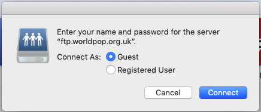
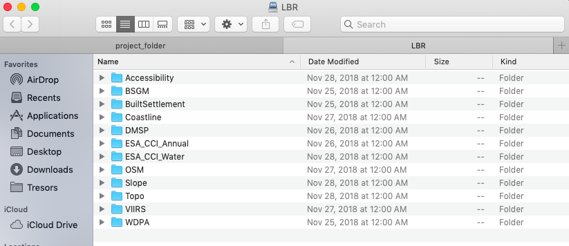
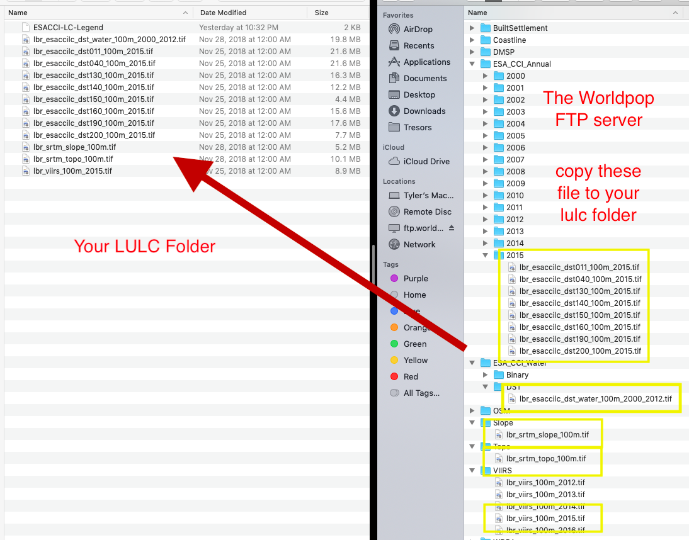

# Investigating Land Use and Land Cover Data

For the next lab you will use land use and land cover data to describe and analyze your LMIC as well as to model relationships between different large area, geospatial attributes.  To start, create a new folder within your project `data` folder.  This will be the location where you will store a number of different raster files, or geospatial coveriates, that you will use to begin describing and analyzing your LMIC.  I have called my subfolder `lulc` which stands for land use and land cover.

Once you have created your `lulc` folder within your `data` folder, open google and search for the 3 digit ISO code for your seleted low or middle income country.  I simply type _ISO code Liberia_ and hit return in google and the result **LBR**.  Once you have determined your 3 digit ISO code, copy the following webaddress and paste it into your internet browser, BUT be sure to modify the last part of the path and replace it with your LMIC's ISO code.

[ftp://ftp.worldpop.org.uk/GIS/Covariates/Global\_2000\_2020/ISO/](ftp://ftp.worldpop.org.uk/GIS/Covariates/Global_2000_2020/ISO/)

After entering the path into your browser, you may be asked to enter your name and password in order to access the file transfer protocal \(ftp\) site at ftp.worldpop.uk.org.  Choose guest and then attempt to connect.

After connecting you may gain access to the folder at worldpop containing the geospatial covariates either though the finder or file explorer, or possibly directly through your browser.  My connection protocal in OS X forwards to my finder and opens a new folder from the worldpop server to my computer with the following subfolders for Liberia.

Each of these different folders contains sets of geospatial covariates or raster files that you will need to copy and paste into your `lulc` folder.  To start, open the `ESA_CCI_Annual` folder.  There should be several years within the folder, select the folder with the 2015 data.  Copy all of the files from the `ESA_CCI_Annual` folder to your `lulc` folder.  There will be several, each one being megabytes to tens of megabytes in size, so be patient when copying the data.  Also keep in mind, it is likely that the worldpop server will be overloaded with all of your classmates trying to access the data at the same time.  After you have copied the `ESA_CCI_Annual` raster data for 2015, do likewise for the `ESA_CCI_Water` raster that is found within the `DST` folder \(which stands for distance\).  Following the water geospatial covariate layer, continue to the folders that contain topographical and slope data.  Finally, open the `VIIRS` folder and copy the `.tif` file into your `lulc` folder that has the night time lights values for your LMIC.  After you have finished copying all of the files to your `lulc` folder, your data structure should appear similar to the following, except each of your files will begin with the ISO code for your LMIC.

Visit the ESA-CCI Viewer at [https://maps.elie.ucl.ac.be/CCI/viewer/](https://maps.elie.ucl.ac.be/CCI/viewer/) and have a look at large portion of the data you just copied into your data subdirectory.

