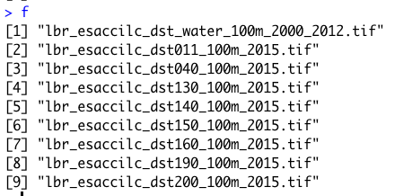
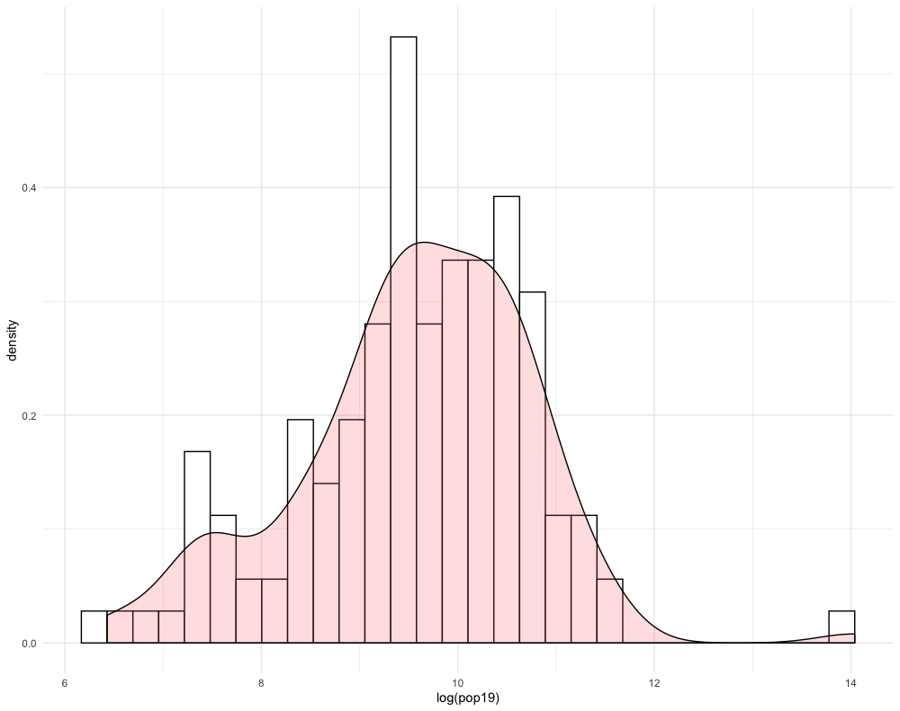
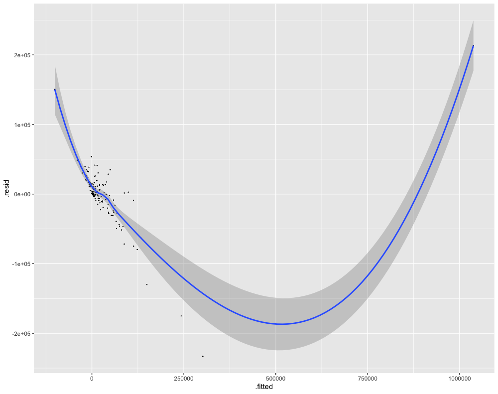

# Acquiring, Modifying and Describing the Data

For the next lab you will use land use and land cover data to describe and analyze your LMIC as well as to model relationships between different large area, geospatial attributes.  To start, create a new folder within your project `data` folder.  This will be the location where you will store a number of different raster files, or geospatial coveriates, that you will use to begin describing and analyzing your LMIC.  I have called my subfolder `lulc` which stands for land use and land cover.

Once you have created your `lulc` folder within your `data` folder, open google and search for the 3 digit ISO code for your seleted low or middle income country.  I simply type _ISO code Liberia_ and hit return in google and the result **LBR**.  Once you have determined your 3 digit ISO code, copy the following webaddress and paste it into your internet browser, BUT modify the last part of the path \(i.e. /ISO/\) and replace it with your LMIC's ISO code.

[ftp://ftp.worldpop.org.uk/GIS/Covariates/Global\_2000\_2020/ISO/](ftp://ftp.worldpop.org.uk/GIS/Covariates/Global_2000_2020/ISO/)

After entering the path into your browser, you may be asked to enter your name and password in order to access the file transfer protocal \(ftp\) site at ftp.worldpop.uk.org.  Choose guest and then attempt to connect.


After connecting as a guest you should gain access to the folder at worldpop containing the geospatial covariates, either though the finder, file explorer, or possibly directly through your browser.  My connection protocal in OS X forwards to my finder and opens a new folder from the worldpop server.  This folder on my computer is a kind of window to the WorldPop server location where the geospatial covariates for Liberia are located.


Each of these different folders contains sets of geospatial covariates or raster files that you will need to copy and paste into your `lulc` folder.  To start, open the `ESA_CCI_Annual` folder.  There should be several years within the folder; select the folder with the 2015 data.  Copy all of the files from the `ESA_CCI_Annual` folder to your `lulc` folder.  There will be several, each one being some megabytes to tens of megabytes in size, so be patient when copying the data.  Also keep in mind, it is likely that the WorldPop server will be overloaded with all of your classmates trying to access the data at the same time.  After you have copied the `ESA_CCI_Annual` raster data for 2015, do likewise for the `ESA_CCI_Water` raster that is found within the `DST` folder \(which stands for distance\).  Following the water geospatial covariate layer, continue to the folders that contain topographical and slope data.  Finally, open the `VIIRS` folder and copy the `.tif` file into your `lulc` folder that has the night time lights values for your LMIC.  After you have finished copying all of the files to your `lulc` folder, your data structure should appear similar to the following, except each of your files will begin with the ISO code for your LMIC.


Visit the ESA-CCI Viewer at [https://maps.elie.ucl.ac.be/CCI/viewer/](https://maps.elie.ucl.ac.be/CCI/viewer/) and have a look at the ESA-CCI data you just copied into your data subdirectory.  In the bottom left hand corner of the viewer you will find a legend for the map.  Open the legend and consider the values in the left hand column as well as each one's corresponding label.  Each value cooresponds to the three digit code found within the raster files your just copied into your `lulc` folder.  For example, the file `lbr_esaccilc_dst150_100m_2015.tif` is the geospatial covariate layer for _Sparse vegetation \(tree, shrub, herbaceous cover\) \(&lt;15%\)_ since the third part of the file name **dst150** cooresponds to the 150 value in the legend.  As before, the dst part of the filename again stands for distance, since each gridcell will provide a distance measure.  Save the legend to your data folder for reference, since it is likely you will need it again later.

Once all the data is properly situated in your folder, open RStudio and create a new script.  Use the `library()` command to load the `raster`,`sf`,`tidyverse`, `doParallel` and `snow` libraries of functions just as we did before.  Set your working dirctory to your data folder.  Also, be sure to `load()` the `sf` files you previously created for your LMIC's adm1 & adm2, each one with the population data variable you created.

```r
rm(list=ls(all=TRUE))

# install.packages("raster", dependencies = TRUE)
# install.packages("sf", dependencies = TRUE)
# install.packages("tidyverse", dependencies = TRUE)
# install.packages("doParallel", dependencies = TRUE)
# install.packages("snow", dependencies = TRUE)

library(sf)
library(raster)
library(tidyverse)
library(doParallel)
library(snow)

setwd("/the_path/to_your/project_folder/with_data/")

### Import Administrative Boundaries ###

load("lbr_adms.RData")
```

With your working directory set to the `lulc` folder where your geospatial covariate rasters are located, you will write a command that imports all of the `esaccilc_dst` files into your R workspace, at the same time, while also stacking each rasters on top of one another, until you have formed what is called a `RasterStack`.  To do this first start with the `list.files()` command and create an object named `f` that will contain the names of all of the `esaccilc_dst` files in your `lulc` folder.  It's probably possible to import ALL of your raster files from the `lulc` folder by identifying a common pattern to ALL the geospatial covariate files, but for now we will start with just the files containing the `esaccilc_dst` `.tif` pattern in their file name.  The `recursive = TRUE` argument will enable the `list.files()` command to search not only in the parent `lulc` directory, but also in any child subdirectories.

```r
f <- list.files(pattern="add_file_name_pattern_here", recursive=TRUE)
```

After properly executing the above command, you should notice the object `f` appear in your top right pane.  It is also possible to check the contents of `f` which should be the names of all the `esaccilc_dst` files. 



The object `f` is needed to identify all of the `raster` objects you will stack one on top of another until you have created your `RasterStack`.  You may recall in project 1 using the `raster()` command to import a `.tif` into RStudio.  This time you will use both the `raster()` command on the inside of a function as well as the `stack()` command on the outside of the function.  In combination with the `lapply()` command \(which stands for list apply\), the `raster()` command will iterate through your `f` object, identifying the name of each `.tif` file from your `lulc` folder, until each one has been imported, and then with the `stack()` command, stack each raster one by one, until your formal `RasterStack` class object has been created.  The `function(i)` part of the argument is used to indicate which function will be used to iterate the number of times as objects in your `i` argument, which in this case is equal to the number of rows in `f`.

```r
lulc <- your_outside_cmd(lapply(f, function(i) your_inside_cmd(i, band=1)))
```

Once you have executed your `stack()` command to create your `RasterStack` object in your workspace, check to confirm the contents of your `lulc` object.


You will notice that the `RasterStack` object not only is comprised of nearly 25 million gridcells in this instance, there is also a new dimension to the object named `nlayers`, which is 9.  Within this `RasterStack` is the `names` identifier, with each name representing one of the files we copied from the WorldPop website into your `lulc` data folder and then imported into RStudio.  While the name of each layer is provided on the `names` row having been directly assigned from each file name, specifically the names themselves are very long and confusing.  Rename each layer, by again identifying patterns from the object `f` we created, and replacing the superfluous parts with an empty space or `""`.  You will need to retain the part of each file name that begins with `dst` and is then followed by three digits.  For example, with the file name `lbr_esaccilc_dst040_100m_2015.tif` you will need to retain everything BUT the `dst040` part of the name.  To do this, you will first want to replace the common pattern from the last part of the file name sequence with a `""`. Then you will want to replace the first part of the common pattern from the file name sequence with a `""`.  You will do this by nesting the two commands within each other.

```r
nms <- sub("last_part.tif", "", sub("first_part_", "", object_with_the_file_names))
```

Type `nms` directly into the console to confirm you have correctly created this new object that contains the truncated form of each raster layer name you plan to assign.


The first file that contains the distance to water layer had a slightly different naming pattern, but don't worry about it just yet.  Go ahead and assign it as is, but keep in mind you will also replace that layer's name momentarily.

Once you have created your `nms` object that contains each layer's name, use the `names()` command with your `lulc` object as the object and simply assign the names using `nms`.

```r
add_command_here(your_RasterStack_obj) <- object_with_truncated_names
```

Confirm you have correctly used the `names()` command with your `lulc` object to rename each layer by viewing the `RasterStack` in the console.  You should notice that there are several new names listed for each layer in your `RasterStack`.  


There are still three more raster `.tif` files in your `lulc` data folder that need to be imported and added as new layers to your `lulc` `RasterStack` object.  Import the topography, slope and night time lights layers into R by using the `raster()` command as you have done in the past.

```r
topo <- raster("lbr_srtm_topo_100m.tif")
slope <- raster("lbr_srtm_slope_100m.tif")
ntl <- raster("lbr_viirs_100m_2015.tif")
```

Once you have those three new `raster` class objects in your R workspace, use the `addLayer()` command to combine all twelve layers into a single `RasterStack`.  To add these three layers to your existing `RasterStack` with 9 layers first specify your existing object, then follow it with the three newly imported geospatial covariate rasters you plan to stack on top of the existing nine.

```r
lulc <- command(existing_stack, new_raster1, new_raster2, new_raster3)
```

Manually update the names for the water layer as well as each of the three newly stacked rasters.  Again use the `names()` command with your `RasterStack` object, but this time specifiy which layers will have their names modified and updated.  In this case you want to update the names of the first layer as well as layers ten through twelve.  Using the `[]` subscripting operators with the `c()` combine command is a powerful way to traverse an object in order to pinpoint your specified command.  In this case it is important that the number of names being modified \(as specified by the 1, 10, 11 & 12 on the left hand side inside the subscripting operators\) is the same length as the number of names being assigned \(specified by the names water, topo, slope and ntl within the combine command on the right hand side\).

```r
add_command_here(object_name)[c(1,10:12)] <- c("water","topo","slope", "ntl")
```

With all of the geospatial covariates in place as separate layers within your `RasterStack` , you are now able to plot each one.  Have a look at a few of the different layers using the `plot()` command with the `[[layer_number]]` double subscripting operators.  Using the `[[]]` double subscripting operator will identify entire lists, rather than rows, objects and/or observations from within a `data.frame`.  Try adding the `adm1` or `adm2` `sf` object to your plot.  Also use the `contour()` command to add contour lines to your topographic map.

```r
plot(lulc[[12]])
```


```r
plot(lulc[[8]])
plot(st_geometry(lbr_adm1), add = TRUE)
```


```r
plot(lulc[[10]])
contour(lulc[[10]], add = TRUE)
```


## Extracting Land Use and Land Cover Data for Description

Now that you have your `lulc` `RasterStack` in place, use the `extract()` command to assign the adm2 ID to each gridcell.  Just as you did before, `save()` your `data.frame` object so you don't have to unnecessarily rerun the computationally expensive `extract()` command again and again.

```r
ncores <- detectCores() - 1
beginCluster(ncores)
lulc_vals_adm2 <- raster::extract(lulc, lbr_adm2, df = TRUE)
endCluster()
save(lulc_vals_adm2, file = "lulc_vals_adm2.RData")
```

Comment off these 5 lines using the `#`, once the `extract()` has finished, and then add the `load("name_of_you_data_file.RData")` command to reload the data the next time you run your script.

Use the `sum()` command with the `summarize_all()` command to sum all of the values within each adm2 subdivision for each of the twelve different raster layers.  The `summarize_all()` command is  different than the one used in the previous project, since you will summarize all of the geospatial covariates at once rather than specifying each one at a time \(although it is still possible, it would just take a lot more typing\).

```r
lulc_ttls_adm2 <- lulc_vals_adm2 %>%
  group_by(add_column_name) %>%
  summarize_all(sum, na.rm = TRUE)
```

Your object `lulc_ttls_adm2` should have the same number of rows as your `adm2` `sf` object as well as thirteen variables, one for each of the geospatial covariates obtained from WorldPop and the `ID` column.  You will notice that the names of each column in your `lulc_ttls_adm2` object will correspond with the names of each layer from your `RasterStack`.


Now use the `bind_cols()` command to bind each of these thirteen rows to the eleven existing variables in your adm2 object.

```r
lbr_adm2 <- add_command_here(lbr_adm2, lulc_ttls_adm2)
```

Your adm2 `sf` object should now have something on the order of 24 variables.  To start with your description and analysis of the land use and land cover data, consider first the `pop19` variable you created in the last project.  Use `ggplot()` to produce a histogram using the `geom_histogram() +` command.

```r
ggplot(lbr_adm2, aes(pop19)) +
  geom_histogram()
```

Compare how the histogram plot changes after adding the `log()` command to the `pop19` variable within the `aes()` argument.


Likewise, do the same with the `geom_density() +` command, also adding the `log()` command by wrapping the `pop19` variable within it.

```r
ggplot(lbr_adm2, aes(pop19)) +
  geom_density()
```


You will notice that the density plot has a similar profile as the histogram.  We can compare the two by overlapping the histogram with the density plot or probability density function \(pdf\).  In order to transform a histogram into a density plot, the density function uses somethings called a **kernel** and **bandwidth** to smooth the data over the space.  A good analogy for thinking about how a histogram transforms into a pdf is to think of each verticle bar as stacked, square pieces of chocolate, and then you took a hairdryer to warm the chocolate squares until they melted and smoothed out over the space.  While there are statistical methods that can be used to modify the shape and profile of the pdf function, essentially the area of the histogram and the density plot should be nearly the same.

```r
ggplot(lbr_adm2, aes(pop19)) +
  geom_histogram(aes(y = ..density..), color = "black", fill = "white") + 
  geom_density(alpha = 0.2, fill = "#FF6666") + 
  theme_minimal()
```



Create another histogram with the pdf overlapping, but this time use a different variable.  For example in the following plot, I have used the `ntl` variable, without the `log()` function added.


Regress the data from two variables against each other and examine the coorelationship that is being described by the two variables.  Use the `geom_point()` command to add the points for your two variables as well as the `geom_smooth()` command to add the regression line \(as well as the confidence interval\).

```r
ggplot(lbr_adm2, aes(pop19, ntl)) + 
  geom_point(size = .1, color = "red") +
  geom_smooth()
```


Estimate the parameters of your model using the `lm()` command and then return a `summary()` to find out more information regarding the model's fit and capacity to explain the coorelationship between your two selected variables.

```r
fit <- lm(pop19 ~ ntl, data=lbr_adm2)
summary(fit)
```


Add a few more variables to the `lm()` command.  For example in the following plot I have estimated a regression model where the population of Liberia in 2019 is the dependent variable \(response\), while night time lights \(`ntl`\), urban cover \(`dst190`\), and bare cover \(`dst200`\) are the independent variables \(predictors\).

```r
ggplot(lm(pop19 ~ ntl + dst190 + dst200, data=lbr_adm2)) + 
  geom_point(aes(x=.fitted, y=.resid), size = .1) +
  geom_smooth(aes(x=.fitted, y=.resid))
```


Again estimate the model and check the fit.

```r
fit <- lm(pop19 ~ ntl + dst190 + dst200, data=lbr_adm2)
summary(fit)
```


Finally, add all of the variables to your regression model.  Compare the results.

```r
ggplot(lm(pop19 ~ water + dst011 + dst040 + dst130 + dst140 + dst150 + dst160 + dst190 + dst200 + topo + slope + ntl, data=lbr_adm2)) + 
  geom_point(aes(x=.fitted, y=.resid), size = .1) +
  geom_smooth(aes(x=.fitted, y=.resid))
```



```r
fit <- lm(pop19 ~ water + dst011 + dst040 + dst130 + dst140 + dst150 + dst160 + dst190 + dst200 + topo + slope + ntl, data=lbr_adm2)
summary(fit)
```


## Team Challenge Question

Follow the steps from above used to produce the plots describing Liberia, but instead each team member should use their own selected LMIC country.  Produce **two combined histogram** **with** **density plots** that describe the coorelationship between population at the adm2 level as a dependent variable and two of the other land use land cover variables you added.  You are also welcome to use density as a variable.

Also use `ggplot()` to plot **two linear models**.  Use the `fit()` and `summary()` commands to describe your models.  Are you able to definitively identify coorelation between population and any of the other or combination of other land use and land cover geospatial covariates?  How about density?

Meet with your group and prepare four different plots from at least three different countries \(or team members\) for the Friday informal group presentation.  Then as a group, upload all 5 team members plots to \#data100\_igps \(informal group presentations\) by Sunday night.  Each member should upload at least **two combined histogram / density plots** as well as **two linear model plots**.

## Individual Stretch Goal 1

Manually recreate the `ggplot()` model of your regression from above.  First identify the `fitted.values` as a variable in the model you named `fit.`  Use the `$` operator to identify the variable within the model object and return all of the values.

```r
name_of_model$variable.with.fitted.values
```

Send this `object$variable` directly to the console and review the results.  You should have the same number of fitted values as subdivisions within your adm2.  Each individual fitted value is calculated by multiplying each variables' estimate \(or coefficient\) by the actual value for that observation \(or row\) and then summating the total of those products.

Likewise, manually calculate each individual model residual by subtracting all of the values for the dependent or response variable, `pop19`, from each cooresponding calculated, fitted value.  The difference of these two outcomes are the model residuals.

```r
your_adm2$pop19 - name_of_model$variable.with.fitted.values
```

Plot the two variables as a `ggplot` object.  First create a `data.frame` using the `cbind.data.frame()` command.  Name each of the new columns within your data frame accordingly.

```r
model_data <- cbind.data.frame(fitted = name_of_model$variable.with.fitted.values, residuals = your_adm2$pop19 - name_of_model$variable.with.fitted.values)
```

Use `ggplot()` to plot your model.

```r
ggplot(data = you_data_frame, aes(x = variable, y = variable)) +
  geom_point(size = 0.25) +
  geom_smooth(size = 0.5)
```


The three observations beneath the curve before it begins to rise seem to evidence the final contributions to the model before it transitions towards the observation for Monrovia.  Add labels to these four points, by using the `subset()` command and creating a new object that you will use to annotate each of those four observations.

```r
text <- subset(model_data, fitted > add_value_here)
```

Use this new object to plot the names of these four observations from the data.

```r
ggplot(data = your_data, aes(x = variable, y = variable)) +
  geom_point(size = 0.25) +
  geom_smooth(size = 0.5) +
  geom_text(data = your_data,
            aes(x = variable,
                y = variable,
                label = name),
            size = 2,
            nudge_y = value)
```


Likewise manually calculate residual standard error.

```r
#How to calculate Residual Standard error (Like Standard Deviation)
k <- length(fit$coefficients)-1 #Subtract one to ignore intercept
SSE <- sum(fit$residuals^2)
n <- length(fit$residuals)
#Residual Standard Error
sqrt(SSE/(n-(1+k)))
```

Also, manually calculate multiple R^2.

```text
#Multiple R-Squared (Coefficient of Determination)
SSyy <- sum((lbr_adm2$pop19 - mean(lbr_adm2$pop19))^2)
SSE <- sum(fit$residuals^2)
(SSyy-SSE)/SSyy
#Alternatively
1-SSE/SSyy
```

Calculate adjusted R^2.

```r
#Adjusted R-Squared
n <- length(lbr_adm2$pop19)
k <- length(fit$coefficients)-1
SSE <- sum(fit$residuals^2)
SSyy = sum((lbr_adm2$pop19 - mean(lbr_adm2$pop19))^2)
1-(SSE/SSyy)*(n-1)/(n-(k+1))
```

Calculate the F-statistic.

```r
#F-Statistic
((SSyy-SSE)/k) / (SSE/(n-(k+1)))
```

Finally, manually add the adjusted R^2 and F-statistic as labels to your plot.

```r
ggplot(data = model_data, aes(x = fitted, y = residuals)) +
  geom_point(size = 0.25) +
  geom_smooth(size = 0.5) +
  geom_text(data = text,
            aes(x = fitted,
                y = residuals,
                label = adm1),
            size = 2,
            nudge_y = 7500) +
  geom_text(aes(x = 500000,
                y = 25000,
                label = "Adjusted R-Squared")) +
  geom_text(aes(x = 500000,
                y = 0,
                label = round(as.numeric(summary(fit)[9]), 4))) +
  geom_text(aes(x = 500000,
                y = -40000,
                label = "F-statistic")) +
  geom_text(aes(x = 500000,
                y = -65000,
                label = round(as.numeric(summary(fit)[[10]][1]), 4)))
```


