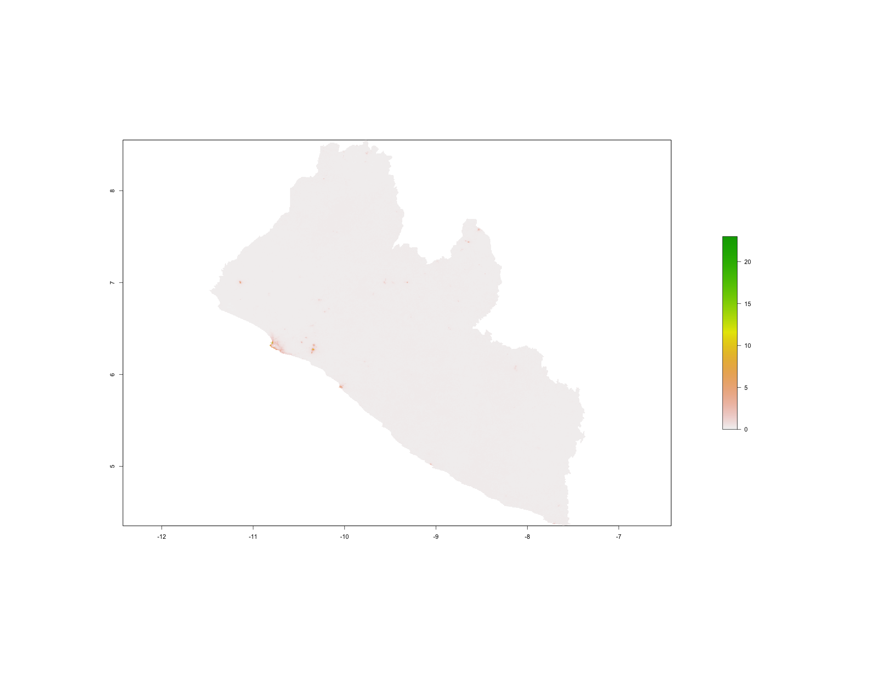
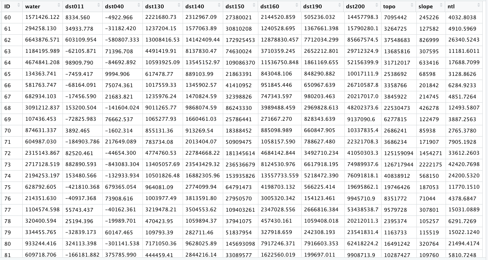

# Acquiring, Modifying and Describing the Data

For the next lab you will use land use and land cover data to describe and analyze your LMIC as well as to model relationships between different large area, geospatial attributes.  To start, create a new folder within your project `data` folder.  This will be the location where you will store a number of different raster files, or geospatial coveriates, that you will use to begin describing and analyzing your LMIC.  I have called my subfolder `lulc` which stands for land use and land cover.

Once you have created your `lulc` folder within your `data` folder, open google and search for the 3 digit ISO code for your seleted low or middle income country.  I simply type _ISO code Liberia_ and hit return in google and the result **LBR**.  Once you have determined your 3 digit ISO code, copy the following webaddress and paste it into your internet browser, BUT be sure to modify the last part of the path and replace it with your LMIC's ISO code.

[ftp://ftp.worldpop.org.uk/GIS/Covariates/Global\_2000\_2020/ISO/](ftp://ftp.worldpop.org.uk/GIS/Covariates/Global_2000_2020/ISO/)

After entering the path into your browser, you may be asked to enter your name and password in order to access the file transfer protocal \(ftp\) site at ftp.worldpop.uk.org.  Choose guest and then attempt to connect.


After connecting you may gain access to the folder at worldpop containing the geospatial covariates either though the finder or file explorer, or possibly directly through your browser.  My connection protocal in OS X forwards to my finder and opens a new folder from the worldpop server to my computer with the following subfolders for Liberia.


Each of these different folders contains sets of geospatial covariates or raster files that you will need to copy and paste into your `lulc` folder.  To start, open the `ESA_CCI_Annual` folder.  There should be several years within the folder, select the folder with the 2015 data.  Copy all of the files from the `ESA_CCI_Annual` folder to your `lulc` folder.  There will be several, each one being megabytes to tens of megabytes in size, so be patient when copying the data.  Also keep in mind, it is likely that the worldpop server will be overloaded with all of your classmates trying to access the data at the same time.  After you have copied the `ESA_CCI_Annual` raster data for 2015, do likewise for the `ESA_CCI_Water` raster that is found within the `DST` folder \(which stands for distance\).  Following the water geospatial covariate layer, continue to the folders that contain topographical and slope data.  Finally, open the `VIIRS` folder and copy the `.tif` file into your `lulc` folder that has the night time lights values for your LMIC.  After you have finished copying all of the files to your `lulc` folder, your data structure should appear similar to the following, except each of your files will begin with the ISO code for your LMIC.


Visit the ESA-CCI Viewer at [https://maps.elie.ucl.ac.be/CCI/viewer/](https://maps.elie.ucl.ac.be/CCI/viewer/) and have a look at large portion of the data you just copied into your data subdirectory.  In the bottom left hand corner of the viewer you will find a legend for the map.  Open the legend and consider the values in the left hand column as well as each one's corresponding label.  Each value cooresponds to the three digit code found within the raster files your just copied into your `lulc` folder.  For example, the file `lbr_esaccilc_dst150_100m_2015.tif` is the geospatial covariate layer for _Sparse vegetation \(tree, shrub, herbaceous cover\) \(&lt;15%\)_ since the third part of the file name **dst150** cooresponds to the 150 value in the legend.  As before, the dst part of the filename again stands for distance, since each gridcell will provide a distance measure.  Save the legend to your data folder for reference, since it is likely you will need it again later.

Once all the data is properly situated in your folder, open RStudio and create a new script.  Use the `library()` command to load the `raster`,`sf`,`tidyverse`, `doParallel` and `snow` libraries of functions just as we did before.  Set your working dirctory to your data folder.  Also, be sure to `load()` the `sf` files you previously created for your LMIC's adm1 & adm2, each one with the population data variable you created.

```r
rm(list=ls(all=TRUE))

# install.packages("raster", dependencies = TRUE)
# install.packages("sf", dependencies = TRUE)
# install.packages("tidyverse", dependencies = TRUE)
# install.packages("doParallel", dependencies = TRUE)
# install.packages("snow", dependencies = TRUE)
# install.packages("randomForest", dependencies = TRUE)

library(sf)
library(raster)
library(tidyverse)
library(doParallel)
library(snow)
library(randomForest)

setwd("/the_path/to_your/project_folder/with_data/")

### Import Administrative Boundaries ###

load("lbr_adms.RData")
```

With your working directory properly set to the `lulc` folder where all of your geospatial covariate rasters are located, use a command that imports all of the `esaccilc_dst` files into your R workspace, all at the same time, as well as stack each of the different rasters on top of one another, until you have formed what is called a brick.  To do this first start with the `list.files()` command and create an object named `f` that will contain the names of all of the `esaccilc_dst` files in your `lulc` folder.  It's probably possible to import ALL of your raster files from the `lulc` folder by identifying a common pattern to ALL the geospatial covariate files, but for now we will start with just the `esaccilc_dst` `.tif`files.  The `recursive = TRUE` argument will enable the `list.files()` command to search not only in the parent `lulc` directory, but also in any child subdirectories.

```r
f <- list.files(pattern="add_file_name_pattern_here", recursive=TRUE)
```

After properly executing the above command, you should notice the object `f` appear in your top right pane.  It is also possible to check the contents of `f` which should be the names of all the `esaccilc_dst` files. 


The object `f` is needed to identify all of the `raster` objects you will stack one on top of another until you have created your `RasterStack`.  You may recall in project 1 using the `raster()` command to import a `.tif` into RStudio.  This time you will use both the `raster()` command on the inside of a function as well as the `stack()` command on the outside of the function.  In combination with the `lapply()` command \(which stands for list apply\), the `raster()` command will iteratre through your `f` object, identifying the name of each `.tif` file from your `lulc` folder, until each one has been imported, and with the `stack()` command, stacked one by one, into your formal `RasterStack` class object.  The `function(i)` part of the argument is used to indicate which function will be used to iterate the number of times as objects in your `i` argument, which in this case is equal to the number of rows in `f`.

```r
lulc <- your_outside_cmd(lapply(f, function(i) your_inside_cmd(i, band=1)))
```

Once you have executed your `stack()` to create your `RasterStack` object in your workspace, you can check to confirm the contents of your `lulc` object.


You will notice that the `RasterStack` object not only is comprised of nearly 25 million gridcells in this instance, there is also a new dimension to the object named `nlayers`, which is 9.  Within this `RasterStack` is layer representing each one of the files we copied from the WorldPop website into your `lulc` data folder and then imported into RStudio.  The names of each layer is given on the `names` row, but the information has been directly assigned from each file name, which was long and confusing.  You will rename each layer, by again identifying patterns from the object `f` we created, and replacing the superfluous parts with an empty space or `""`.  You will need to retain the part of each file name that begins with `dst` and is then followed by three digits.  For example, with the file name `lbr_esaccilc_dst040_100m_2015.tif` you will need to retain everything BUT the `dst040` part of the name.  To do this, you will first want to replace the common pattern from the last part of the file name sequence with a `""`. Then you will want to replace the first part of the  the common pattern from the file name sequence with a `""`.  You will do this by nesting the two commands within each other.

```r
nms <- sub("last_part.tif", "", sub("first_part_", "", object_w_names))
```

Type `nms` directly into the console to confirm you have the truncated form of the name for each raster layer.


The first file that contains the distance to water layer had a slightly different naming pattern, but don't worry about it just yet.  You'll replace that layers name also, in a moment.

Once you have created your `nms` object that contains each layer's name, use the `names()` command with your `lulc` object as the object and simply assign the names using `nms`.

```r
command(RasterStack_obj) <- object_with_names
```

Confirm you have correctly used the `names()` command with your `lulc` object to rename each layer by viewing the `RasterStack` in the console.  You should notice that there are several new names listed for each layer in your `RasterStack`.  


There are still three more raster `.tif` files in your `lulc` data folder that need to be imported and added as new layers to your `lulc` `RasterStack` object.  Import the topography, slope and night time lights layers into R by using the `raster()` command as you have done in the past.

```r
topo <- raster("lbr_srtm_topo_100m.tif")
slope <- raster("lbr_srtm_slope_100m.tif")
ntl <- raster("lbr_viirs_100m_2015.tif")
```

Once you have those three new `raster` class objects in your R workspace, use the `addLayer()` command to combine all twelve layers into a single `RasterStack`.  Manually update the names for the water layer as well as each of the three later newly imported layers.  Again use the `names()` command with your `RasterStack` object, but this time specifiy which layers will have their names modified and updated.  In this case you want to update the names of the first layer as well as layers ten through twelve.

```r
add_command(object_name)[c(1,10:12)] <- c("water","topo","slope", "ntl")
```

With all of the geospatial covariates in place as separate layers within your `RasterStack` , you are now able to plot each one.  Have a look at a few of the different layers using the `plot()` command with the `[[layer_number]]` subscriting operators.  Try adding the `adm1` or `adm2` `sf` object to your plot as well or using the `contour()` command to add contour lines.

```r
plot(lulc[[12]])
```



```r
plot(lulc[[8]])
plot(st_geometry(lbr_adm1), add = TRUE)
```


```text
plot(lulc[[10]])
contour(lulc[[10]], add = TRUE)
```


## Extracting Land Use and Land Cover Data for Description

Now that you have your `lulc` `RasterStack` in place, use the `extract()` command to assign the adm2 ID to each gridcell.  Just as you did before, `save()` your `data.frame` object so you don't have to unnecessarily rerun the computational expensive `extract()` command again and again.

```r
ncores <- detectCores() - 1
beginCluster(ncores)
lulc_vals_adm2 <- raster::extract(lulc, lbr_adm2, df = TRUE)
endCluster()
save(lulc_vals_adm2, file = "lulc_vals_adm2.RData")
```

Comment off these 5 lines once the `extract()` has finished, and then add the `load("name_of_you_data_file.RData")` command to reload the data the next time you run your script.

Use the `sum()` command with the `summarize_all()` command to sum all of the values within each adm2 subdivision for each of the twelve different raster layers. 

```r
lulc_ttls_adm2 <- lulc_vals_adm2 %>%
  group_by(add_column_name) %>%
  summarize_all(sum, na.rm = TRUE)
```

Your object `lulc_ttls_adm2` should have the same number of rows as your `adm2` `sf` object as well as thirteen variables, one for each of the geospatial covariates obtained from WorldPop as well as an `ID` column.  You will notice that the names of each column in your `lulc_ttls_adm2` object will correspond with the names of each layer from your `RasterStack`.



Now use the `bind_cols()` command to bind each of these thirteen rows to the eleven existing variables in your adm2 object.

```r
lbr_adm2 <- add_command_here(lbr_adm2, lulc_ttls_adm2)
```


