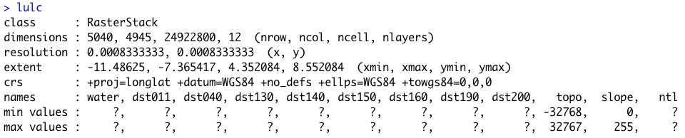
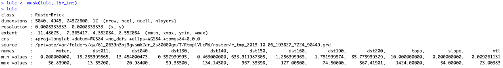
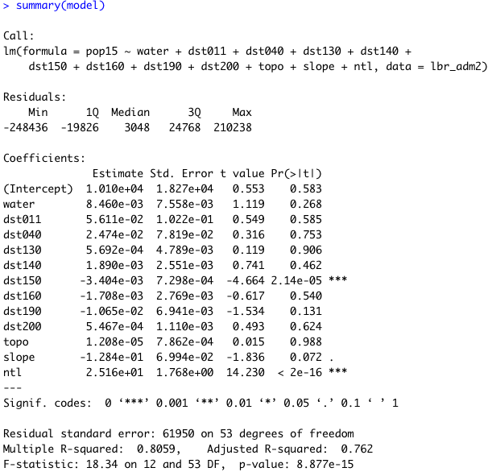

# Modeling & Predicting Spatial Values

In this lab, you will use the model estimates in order to predict spatial values across the landscape of your selected LMIC.  To do this create a new script, install and load needed packages and libraries, and set your working directory.  Once you have your script set up to go with `sf::` , `raster::`, `tidyverse::`, `doParallel::`, and `snow::` all in place, again load your `RasterStack` into your RStudio workspace.  I named my 12 layer `RasterStack` that describes land use and land cover throughout Liberia, `lulc`, and it has the following characteristics.



Also, load the `adm0` \(or international boundary\), `adm1` and `adm2` for your LMIC.  If you don't have your international boundary, go back to GADM, HDX or also look on Geoboundaries for the shapefile in order to import to your RStudio work session.







For this exercise, I will retrieve my shapefile from the Geoboundaries subdirectory and then use the `read_sf()` command to import the data as an object I named `lbr_int`.

You will also need the WorldPop raster later in the exercise in order to calculate a basic estimate of  spatial error.  In order to improve the predictive value of the model, I have gone back to the WorldPop raster file of Liberia for 2015, rather than 2019.  It is probably not going to have a huge impact, but if you want to try for the best results, the date value of your response variable should be the same as the date value of your geospatial covariates.

```r
lbr_pop15 <- raster("lbr_ppp_2015.tif")
```

You may have noticed when reviewing the characteristics of your `RasterStack` that many of the layers had `?` as the value for both the `min values` and `max values`.  The reason this occurred is because each of the layers within the `raster` is presenting interpretable values outside of the boundaries of our LMIC.  For example, with Liberia, you will notice that there is a large portion of the area within the plot that has an assigned value \(likely `NA`\) although it is technically not part of the raster analytical area.  In order to fix this problem, we need to use the `mask()` command to remove all of the gridcells that are not explicitly within the international border of our LMIC.

```r
yourRasterStack <- add_command_here(yourRasterStack, yourLMIC_intlborder)
```

It might take a few minutes to run the `mask()` command.  On a MBAir using the `mask()` command on a 12 layer `RasterStack` , each layer with about 25 million gridcells takes about 10 minutes.  Once the command is completed, you should now notice `min values` and `max values` when retrieving a summary of the object.



In using the `mask()` command, you have effectively transformed your `RasterStack` into a `RasterBrick`.

As in the previous exercise, estimate your linear model using the `pop15` variable as your response \(dependent variable\) and all of the covariates from your `adm2` sf object as the predictors \(independent variables\).

```r
model <- add_command_here(depvar ~  ind1 + ... + indN, data=your_adm2_sf)
```

Once you have estimated your model, use the `summary()` command to review a summary of its characteristics.



Confirm that each variable in your `lulc` object has a corresponding variable in the linear model you just estimated.  You will use these estimates with the 12 different geospatial coverariate layers within your `RasterBrick` to predict the population at each gridcell across your LMIC.  Use the `predict()` function from the `raster::` package with your `lulc` object as well as your `model` to predict the population value of every gridcell within the borders of your LMIC.

```r
predicted_values <- library::function(RasterBrick, your_model, progress="window")
```

Adding the `progress="window"` argument at the end of the command should force a progress window to appear on main desktop that informs you of how many steps are needed to completely execute the command as well as how many have been completed.  The `progress="window"` argument is purely optional.

The resulting object `predicted_values` should be a single `RasterLayer` with the same number of gridcells as each layer within your `RasterBrick`.   Type the name of the `RasterLayer` into the console to review its summary output, while also noting the minimum and maximum values across all gridcells.

Use the `cellStats(predicted_values, sum)` command to calculate the sum of all the values in every gridcell throughout your newly created `RasterLayer`.  With the model estimated for Liberia, the sum total of all predicted values is `113413402375`\(113 billion\).  Compared with the output from `sum(your_adm2$pop15)` \(which is `4039128`for Liberia\) your will very likely that your model has massively overestimated population values \(in this case by an order of about 28,000 times\).

While these predicted values are no where near the real population count at each gridcell, they do nonetheless provide a spatial description of the proportion of persons as distributed across the landscape of your LMIC.  In fact, if we execute some basic raster algebra and subtract the minimium value from my `predicted_values` `RasterLayer` and then sum the values of all gridcells, we will find that while the total population predicted is still very likely a gross overestimation, it is getting closer to our best estimate of the real value.

```r
base <- predicted_values - minValue(predicted_values)
cellStats(base, sum) 
```


