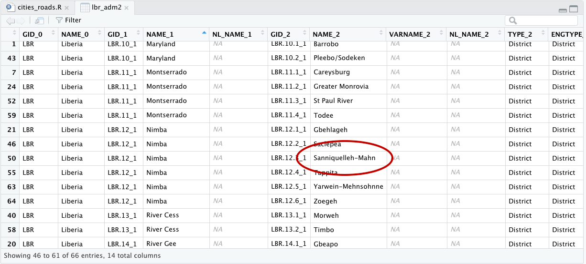

# De facto description of human settlements

For project 3, instead of starting with your LMIC at the scale of its international boundary, this time you will increase the scale of your focus area to an adm2 or adm3 within your country.  You will then use the probability distribution from your population raster as the basis for distributing of all persons within your adm2.  Then you will identify the _de facto_ boundaries of all urban areas based on the density of identified human settlements, instead of the typically used administrative boundaries, which are politically defined and do not necessarily represent the spatial continuity of urbanization.  Finally, you will use those organically derived boundaries to extract population totals for each _de facto_ city, town and village.

To begin, load the typical packages that we have been using in our previous labs.  Additionally, we will add two new packages `maptools` and `spatstat`.  Set your working directory, use the `raster()` command to load your worldpop ppp raster, and also use the `read_sf()` command to load your adm2 or adm3.  If you haven't been using the GADM shapefiles, be sure to make the switch at the beginning of this lab, as they have demonstrated over the course of this semester to be more reliable and better maintained than HDX adm shapefiles.

```text
rm(list=ls(all=TRUE))

# install.packages("raster", dependencies = TRUE)
# install.packages("sf", dependencies = TRUE)
# install.packages("tidyverse", dependencies = TRUE)
# install.packages("maptools", dependencies = TRUE)
# install.packages("spatstat", dependencies = TRUE)

library(raster)
library(sf)
library(tidyverse)
library(maptools)
library(spatstat)

setwd("~/path_to/your/working_directory/")

your_pop15 <- raster("your_ppp_2015.tif")

your_adm2  <- read_sf("gadm36_YOUR_2.shp")
```

After reading your adm2 into R as a `sf` object, view the data and consider the names of the different adm2s that comprise your LMIC.  Select one of the adm2s that you think might be interesting to analyze at a higher resolution.  You might need to google the name of the adm2 within your country in order to find out more information about it, in particular its population.  For my analysis, I am considering an administrative subdivision in Liberia that is located in the county Nimba near the northern border with Guinea, named Sanniquelleh-Mahn.



I enter the name of my prospective district into google and search for its population, which returns an estimate of about 125,000 persons inhabiting the district.  This is a good size to work with for this lab, although you could possibly select a district or area that is slightly larger, to start, try to keep the population under 200,000.  I will then use the `%>%` pipe operator and `filter()` command to subset the Sanniquelleh-Mahn district from my adm2 `sf` object.  If your adm2s are too large, you are also welcome to use an adm3 from within your LMIC.  If you country is smaller in size, it might also be best to select an adm1.  It just depends on the circumstances.

```r
your_subset_district <- your_adm2 %>%
  filter(NAME_2 == "Name-of-district")
```

Confirm your subset object exists.  You can also have a look at it using the `plot(st_geometry(your_adm2))`. 


As you have done in previous exercises, use the `crop()` and `mask()` function to subset your `rasterLayer` to just that part that is located within your selected adm2.  After cropping and masking your world pop person per pixel raster layer, use the `cellStats()` command to calculate the total number of people in your adm2 and assign it as a value to an object.  

```text
your_adm2_pop15 <- crop(your_LMIC_pop15, your_subset_district)
your_adm2_pop15 <- mask(your_adm2_pop15, your_subset_district)

pop <- floor(cellStats(your_adm2_pop15, 'sum'))
```

Entering `pop` into the console in my case returns a value of 124388, which is the estimated population of Sanniquelleh-Mahn in 2015.  Also use the `pdf()` and `dev.off()` commands to produce a pdf file of your subset raster with the subset `sf` adm2 object added to the plot.

```text
png("sm_pop15.png", width = 800, height = 800)
plot(your_masked_raster, main = NULL)
plot(st_geometry(your_subset_sf), add = TRUE)
dev.off()
```

The above script produces the following plot as a pdf file in your working directory.  In addition to seeking an adm2 subdivision that is between 100,000 and 200,000 persons, also notice that the area of my selected district is about .7 degree longitude by .6 degrees latitude.  Likewise, select an area that is less than 1 degree longitude by 1 degree latitude.  If you want to increase the size of the area being analyzed and likewise the population residing within that space, you will have an opportuntity to do that later, but for now, start small.


For the next step, you will use a slightly older, but very powerful R package called `spatstat`, which is used for all kinds of spatial statistics.  Spatial statistics typically involves much more than simply descriptive statistics, analytical models, and inference, it typically also involves some description and analysis of points, lines and polygons in that space.  For example, one might want to know how to describe a pattern of points that exists throughout a plane, and how it compares to a similarly existing pattern of points that is considered completely spatially randomly dispersed.  Additionally, one might also want to know if there is a spatial relationship with certain points within a point pattern and other points within that point pattern based on attributes of those points or other geospatial features.  In many ways, spatial statistics is just like traditional statistics, with the exception that an additinal layer of spatial and potentially geospatial complexity has been added.  

To start your basic spatial analysis, of your selected adm2, you will need to use the `st_write()` command to write your `sf` object as a shapefile back to your working directory, in order to reimport using a command that is compatible with `spatstat`.

```text
st_write(your_adm2_sf, "name_of_file.shp", delete_dsn=TRUE)
your_adm2_with_mtools <- readShapeSpatial("name_of_file.shp")
```

The `readShapeSpatial()` command is from the `maptools::` library and will create a `SpatialPolygonsDataFrame` in your workspace, which I have named above just `your_adm2_with_map_tools`.  You should only briefly need to use this command.  After creating your adm2\_with\_mtools object, use the `as(obj, "owin")` command to create a window object that will be used with the `rpoint()` function from the `spatstat::` library.  You can just call the new object `win`, and also have a look at it by executing `plot(win)`.

```text
win <- as(your_adm2_with_mtools, "owin")
```

For the next command, you will use this `win` object as the window or boundary for locating  a number of points equal to the total population of your adm2, and where each point represents one person.  In order to determine each persons location, use the spatial probability distribution of population decribed by your masked raster of your adm2.

```text
my_adm2_ppp <- rpoint(pop, f = as.im(my_masked_adm2_raster), win = win)
```

After creating your point pattern, have a look at it, by typing the name of your object in the R console.  You should notice that R recognizes your object that represents the geospatial distribution of all persons throughout your adm2 as a planar point pattern \(or `.ppp` class object\) as well as the number of points within that `ppp`.   Plot both the `win` and `ppp` objects together as a `.png`.

```text
png("your_file.pdf", width = add_width, height = add_height)
plot(win, main = NULL)
plot(your_ppp, cex = add_number, add = TRUE)
dev.off()
```

The following image is one instance from a probability model \(based on 2015 data\) used to distribute all 124,388 persons geospatially throughout Sanniquelleh-Mahn.  I have plotted both my window and planar point patter as a `.png` graphics object and have set the `width =` and `height =` arguments to `2000` each, while the `cex =`  argument is set to `0.15`.  You will want to test some of the parameters with the output on your own computer to see what produces the best results.


  


