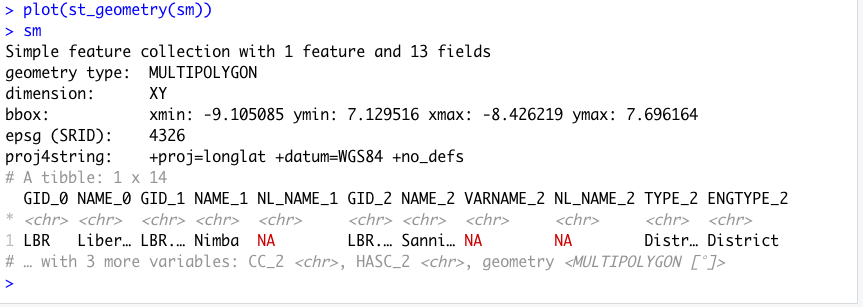

# De facto description of human settlements

For project 3, instead of starting with your LMIC at the scale of its international boundary, this time you will increase the scale of your focus area to an adm2 or adm3 within your country.  You will then use the probability distribution from your population raster as the basis for distributing of all persons within your adm2.  Then you will identify the _de facto_ boundaries of all urban areas based on the density of identified human settlements, instead of the typically used administrative boundaries, which are politically defined and do not necessarily represent the spatial continuity of urbanization.  Finally, you will use those organically derived boundaries to extract population totals for each _de facto_ city, town and village.

To begin, load the typical packages that we have been using in our previous labs.  Additionally, we will add two new packages `maptools` and `spatstat`.  Set your working directory, use the `raster()` command to load your worldpop ppp raster, and also use the `read_sf()` command to load your adm2 or adm3.  If you haven't been using the GADM shapefiles, be sure to make the switch at the beginning of this lab, as they have demonstrated over the course of this semester to be more reliable and better maintained than HDX adm shapefiles.

```text
rm(list=ls(all=TRUE))

# install.packages("raster", dependencies = TRUE)
# install.packages("sf", dependencies = TRUE)
# install.packages("tidyverse", dependencies = TRUE)
# install.packages("maptools", dependencies = TRUE)
# install.packages("spatstat", dependencies = TRUE)

library(raster)
library(sf)
library(tidyverse)
library(maptools)
library(spatstat)

setwd("~/path_to/your/working_directory/")

your_pop15 <- raster("your_ppp_2015.tif")

your_adm2  <- read_sf("gadm36_YOUR_2.shp")
```

After reading your adm2 into R as a `sf` object, view the data and consider the names of the different adm2s that comprise your LMIC.  Select one of the adm2s that you think might be interesting to analyze at a higher resolution.  You might need to google the name of the adm2 within your country in order to find out more information about it, in particular its population.  For my analysis, I am considering an administrative subdivision in Liberia that is located in the county Nimba near the northern border with Guinea, named Sanniquelleh-Mahn.


I enter the name of my prospective district into google and search for its population, which returns an estimate of about 125,000 persons inhabiting the district.  This is a good size to work with for this lab, although you could possibly select a district or area that is slightly larger, to start, try to keep the population under 200,000.  I will then use the `%>%` pipe operator and `filter()` command to subset the Sanniquelleh-Mahn district from my adm2 `sf` object.  If your adm2s are too large, you are also welcome to use an adm3 from within your LMIC.  If you country is smaller in size, it might also be best to select an adm1.  It just depends on the circumstances.

```r
your_subset_district <- your_adm2 %>%
  filter(NAME_2 == "Name-of-district")
```

Confirm your subset object exists.  You can also have a look at it using the `plot(st_geometry(your_adm2))`. 



As you have done in previous exercises, use the `crop()` and `mask()` function to subset your `rasterLayer` to just that part that is located within your selected adm2.  After cropping and masking your world pop person per pixel raster layer, use the `cellStats()` command to calculate the total number of people in your adm2 and assign it as a value to an object.  

```text
your_adm2_pop15 <- crop(your_LMIC_pop15, your_subset_district)
your_adm2_pop15 <- mask(your_adm2_pop15, your_subset_district)

pop <- floor(cellStats(your_adm2_pop15, 'sum'))
```

Entering `pop` into the console in my case returns a value of 124388, which is the estimated population of Sanniquelleh-Mahn in 2015.

