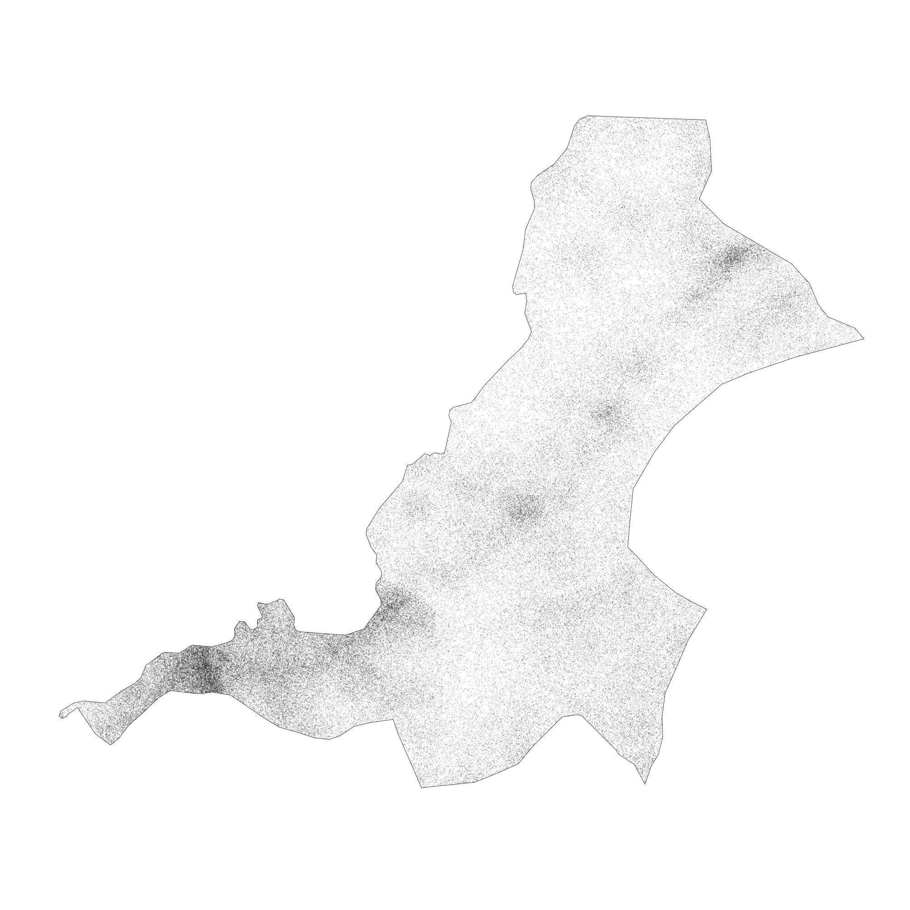

# De facto description of human settlements and urban areas

For project 3, instead of starting with your LMIC at the scale of its international boundary, this time you will increase the scale of your focus area to an adm2 or adm3 within your country.  You will then use the probability distribution from your population raster as the basis for distributing of all persons within your adm2.  Then you will identify the _de facto_ boundaries of all urban areas based on the density of identified human settlements, instead of the typically used administrative boundaries, which are politically defined and do not necessarily represent the spatial continuity of urbanization.  Finally, you will use those organically derived boundaries to extract population totals for each _de facto_ city, town and village.

To begin, load the typical packages that we have been using in our previous labs.  Additionally, we will add two new packages `maptools` and `spatstat`.  Set your working directory, use the `raster()` command to load your worldpop ppp raster, and also use the `read_sf()` command to load your adm2 or adm3.  If you haven't been using the GADM shapefiles, be sure to make the switch at the beginning of this lab, as they have demonstrated over the course of this semester to be more reliable and better maintained than HDX adm shapefiles.

```text
rm(list=ls(all=TRUE))

# install.packages("raster", dependencies = TRUE)
# install.packages("sf", dependencies = TRUE)
# install.packages("tidyverse", dependencies = TRUE)
# install.packages("maptools", dependencies = TRUE)
# install.packages("spatstat", dependencies = TRUE)

library(raster)
library(sf)
library(tidyverse)
library(maptools)
library(spatstat)

setwd("~/path_to/your/working_directory/")

your_pop15 <- raster("your_ppp_2015.tif")

your_adm2  <- read_sf("gadm36_YOUR_2.shp")
```

After reading your adm2 into R as a `sf` object, view the data and consider the names of the different adm2s that comprise your LMIC.  Select one of the adm2s that you think might be interesting to analyze at a higher resolution.  You might need to google the name of the adm2 within your country in order to find out more information about it, in particular its population.  For my analysis, I am considering an administrative subdivision in Liberia that is located in the county Nimba near the northern border with Guinea, named Sanniquelleh-Mahn.


I enter the name of my prospective district into google and search for its population, which returns an estimate of about 125,000 persons inhabiting the district.  This is a good size to work with for this lab, although you could possibly select a district or area that is slightly larger, to start, try to keep the population under 200,000.  I will then use the `%>%` pipe operator and `filter()` command to subset the Sanniquelleh-Mahn district from my adm2 `sf` object.  If your adm2s are too large, you are also welcome to use an adm3 from within your LMIC.  If you country is smaller in size, it might also be best to select an adm1.  It just depends on the circumstances.

```r
your_subset_district <- your_adm2 %>%
  filter(NAME_2 == "Name-of-district")
```

Confirm your subset object exists.  You can also have a look at it using the `plot(st_geometry(your_adm2))`. 


As you have done in previous exercises, use the `crop()` and `mask()` function to subset your `rasterLayer` to just that part that is located within your selected adm2.  After cropping and masking your world pop person per pixel raster layer, use the `cellStats()` command to calculate the total number of people in your adm2 and assign it as a value to an object.  

```text
your_adm2_pop15 <- crop(your_LMIC_pop15, your_subset_district)
your_adm2_pop15 <- mask(your_adm2_pop15, your_subset_district)

pop <- floor(cellStats(your_adm2_pop15, 'sum'))
```

Entering `pop` into the console in my case returns a value of 124388, which is the estimated population of Sanniquelleh-Mahn in 2015.  Also use the `pdf()` and `dev.off()` commands to produce a pdf file of your subset raster with the subset `sf` adm2 object added to the plot.

```text
png("sm_pop15.png", width = 800, height = 800)
plot(your_masked_raster, main = NULL)
plot(st_geometry(your_subset_sf), add = TRUE)
dev.off()
```

The above script produces the following plot as a pdf file in your working directory.  In addition to seeking an adm2 subdivision that is between 100,000 and 200,000 persons, also notice that the area of my selected district is about .7 degree longitude by .6 degrees latitude.  Likewise, select an area that is less than 1 degree longitude by 1 degree latitude.  If you want to increase the size of the area being analyzed and likewise the population residing within that space, you will have an opportuntity to do that later, but for now, start small.


For the next step, you will use a slightly older, but very powerful R package called `spatstat`, which is used for all kinds of spatial statistics.  Spatial statistics typically involves much more than simply descriptive statistics, analytical models, and inference, it typically also involves some description and analysis of points, lines and polygons in that space.  For example, one might want to know how to describe a pattern of points that exists throughout a plane, and how it compares to a similarly existing pattern of points that is considered completely spatially randomly dispersed.  Additionally, one might also want to know if there is a spatial relationship with certain points within a point pattern and other points within that point pattern based on attributes of those points or other geospatial features.  In many ways, spatial statistics is just like traditional statistics, with the exception that an additinal layer of spatial and potentially geospatial complexity has been added.  

To start your basic spatial analysis, of your selected adm2, you will need to use the `st_write()` command to write your `sf` object as a shapefile back to your working directory, in order to reimport using a command that is compatible with `spatstat`.

```text
st_write(your_adm2_sf, "name_of_file.shp", delete_dsn=TRUE)
your_adm2_with_mtools <- readShapeSpatial("name_of_file.shp")
```

The `readShapeSpatial()` command is from the `maptools::` library and will create a `SpatialPolygonsDataFrame` in your workspace, which I have named above just `your_adm2_with_map_tools`.  You should only briefly need to use this command.  After creating your adm2\_with\_mtools object, use the `as(obj, "owin")` command to create a window object that will be used with the `rpoint()` function from the `spatstat::` library.  You can just call the new object `win`, and also have a look at it by executing `plot(win)`.

```text
win <- as(your_adm2_with_mtools, "owin")
```

For the next command, you will use this `win` object as the window or boundary for locating  a number of points equal to the total population of your adm2, and where each point represents one person.  In order to determine each persons location, use the spatial probability distribution of population decribed by your masked raster of your adm2.

```text
my_adm2_ppp <- rpoint(pop, f = as.im(my_masked_adm2_raster), win = win)
```

After creating your point pattern, have a look at it, by typing the name of your object in the R console.  You should notice that R recognizes your object that represents the geospatial distribution of all persons throughout your adm2 as a planar point pattern \(or `.ppp` class object\) as well as the number of points within that `ppp`.   Plot both the `win` and `ppp` objects together as a `.png`.

```text
png("your_file.pdf", width = add_width, height = add_height)
plot(win, main = NULL)
plot(your_ppp, cex = add_number, add = TRUE)
dev.off()
```

The following image is one instance from a probability model \(based on 2015 data\) used to distribute all 124,388 persons geospatially throughout Sanniquelleh-Mahn.  I have plotted both my window and planar point patter as a `.png` graphics object and have set the `width =` and `height =` arguments to `2000` each, while the `cex =`  argument is set to `0.15`.  You will want to test some of the parameters with the output on your own computer to see what produces the best results.



In order to best use this newly created object, we need to estimate a model that describes the spatial probability density function of this planar point pattern.  Spatial probability density function or kernel density estimation is a three dimension version of the density plot that we looked at in a previous project.  You may recall that the two dimension probability density function created a line or smoothed function that closely followed the histogram of our observations.  Now with a three dimension, spatial probability density function, we will estimate a density function that will match histograms of observations in both the x & y directions \(or longitude and latitude\).  The good news is, there is a function to do this for us, but it requires two steps.  The first step is to calculate the bandwidth that will be used in the `density.ppp()` function.  While the bandwidth produced will simply be a number, in order to calculate this number, over a three dimensional space, can be fairly computationally intense.  Fortunately, we have limited the scope of our study area, as well as the number of points located within that bounary, and it shouldn't take to terribly long.  The following command took about 15 minutes on my MacBook Air for the ~125,000 point pattern.

```text
bw <- bw.ppl(your_ppp)
```

Once you have calculated the value of your bandwidth \(in my case "sigma" resulted in a 0.003077435\) use the `save()` and `load()` commands, so you don't need to rerun `bw.ppl()` each time.

```text
#bw <- bw.ppl(sm_pipo)
#save(bw, file = "bw.RData")
load("bw.RData")
```

After you have estimated the value of the bandwidth for your spatial probability density function, then execute the function itself.

```text
your_density_image <- density.ppp(your_ppp, sigma = bw)
```

The resulting object is a real valued pixel image, which is kind of like a raster layer, and it represents a function that describes the probability of the population density at each pixel throughout the entire space.


As you may notice, the scale on the right hand side of our density image, provides a representation of where population densities are the highest, or in more common terms, where urbanization has occurred.  The goal of this part of the lab is to identify the boundaries of each uniform and continuous urban area and then to assign the summed population value to each of those polygons.  To start that process, you will need to convert your density image to a spatial grid, then back to an image, and finally to contour lines that we will use to begin creating our polygons.  A key part of the `contourLines()` command is the `levels =`  argument on line 3 below.  In my example, I have set the `levels = 1000000`, which is the equivalent of the 1000000 density estimate contour line in the plot above.  What that means, is that R will produce a line that is equivalent to that contour value across the entire probabilty density function of the population.  You will want to modify your `levels =`  arugment to coorespond with the values on your produced density plot.  The value you choose will represnt the threshold set that uniformily and continuously differentiates urban areas from non-urban areas.  Later you will reassess this threshold after considering each polygon's area as well as its population.

```text
Dsg <- as(your_ppp, "SpatialGridDataFrame")  # convert to spatial grid class
Dim <- as.image.SpatialGridDataFrame(Dsg)  # convert again to an image
Dcl <- contourLines(Dim, levels = 1000000)  # create contour object
SLDF <- ContourLines2SLDF(Dcl, CRS("+proj=longlat +datum=WGS84 +no_defs"))
```

Once you have your object named `SLDF`, which is a Spatial Lines Data Frame, convert it back to an `sf` object using the `st_as_sf()` command.  The resulting object will be a `MULTILINESTRING`.

```text
sf_multiline_obj <- st_as_sf(SLDF, sf)
```

By plotting the spatial grid data frame with the newly created multiline object on top, the goal of our exercise will begin to become more readily visible.


You will notice that a number of the contour lines are closed and already prepared for conversion from multiline objects to polygons.  This is particularly true in the central areas, where a number of enclosed lines have been created.  On the contrary, the more densely populated area represented by the more red, orange and yellow collored gridcells, intersects directly with the edge of our administrative boundary and will present a more difficult challenge in order to create its polygon.  In order to create polygons that represent each indiividual urbanized area, we will need to isolate inside area polygons from outside area polygons.  First start with the `st_polygonize()` command to convert all of the closed polylines that are valid for conversion to polygons.

```text
inside_polys <- st_polygonize(SLDFs)
```

Run `plot(st_geometry(inside_polys))` and you should notice a plot produced with only the internal polygons.  To recapture the contour lines from our density plot that did not close, use the `st_difference()` command to isolate these linear elements.

```text
outside_lines <- st_difference(SLDFs, inside_polys)
```

Use `plot(st_geometry(outside_lines))` to view the resulting difference from the two objects and notice that these are the contour lines that did not close since they intersected with the adm2 boundary.

In order to fuse these unenclosed contour lines with the administrative boundary, I will use the `st_buffer()` command to offset each line, just a little bit, so as to make a cut in the adm2 border, after I intersect the two objects.  Also use the `st_cast()` command to convert the geometric collection of objects into individual polygons, where each one potentially represents one urbanized area.

```text
z <- st_buffer(outside_lines, 0.001)
zz <- st_difference(adm2_sf, z)
zzz <- st_cast(zz, "POLYGON")
```

You will notice that the resutant polygon, has been subdivided into many different polygons with a very small space where the unenclosed contour lines intersected the adm2 border.  While this is helpful in the regard that now we in fact have polygons representing each area, it also presents two subsequent problems.  First, we now have a very large polygon that represents all of Sanniquelleh-Mahn that had values below the selected contour line value.  Second, there are also polygons that resulted from urbanized areas intersecting and then reintersecting the adm2 border and thus resulting in smaller pockets of areas that also have values below the selected density contour line.  We will need to execute two appraoches in resolving these two issues.


The large polygon that represents that entire area of the adm2 that was not within the contour line, is also the largest polygon in the simple feature collection.  To remove it, calculate the area of all polygons in the collection using `st_area()` and then `filter()` based on the size of the largest feature.  To simpify the calculation, set the class of the area variable to numeric when calculating the area.

```text
zzz$area <- as.numeric(st_area(zzz))
```

Now look at the data for your created sf object \(I have named it `zzz` in the above example\) and order the area from largest to smallest.


In this example, the largest polygon has an area of about 1.28 x 10^9 m^2.  Remove that polygon, but retain the rest.

```text
subpolys <- zzz %>%
  filter(area < 250000000)
```

To evaluate the remaining polygons that were created from the intersection of the outside lines with your adm2 border, we will use the extracted population for each polygon.  First `extract()` the population values from your adm2 world pop raster and assign each polygons ID to each gridcell.  Next, aggregate the extracted values, group by polygon ID while also calculating the sum of all gridcells within each polygon.  Finally, add those values to your newly created subpolygon sf object \(that represents the intersection of the outside lines with the adm2 border\).  Since we are using a masked raster of your adm2 area, this single layer `extract()` command should take significantly less time than with the larger, stacked `rasterBrick` used in previous projects.

```text
subpolys_extract <- raster::extract(sm_pop15, subpolys, df = TRUE)

subpolys_totals <- subpolys_extract %>%
  group_by(ID) %>%
  summarize(pop15 = sum(lbr_ppp_2015, na.rm = TRUE))

subpolys <- subpolys %>%
  add_column(pop15 = subpolys_totals$pop15)
```

Have a look at the `pop15` value for each polygon in your `subpolys` object.


Removing the largest polygon was very effective at removing all areas that represented densities below the selected contour line.  You may also want to plot the subpolys \(over the density function\) to consider location and size.

```text
png("subpolys.png", width = 1200, height = 1200)
plot(sm_dens, main = NULL)
plot(st_geometry(subpolys), add = TRUE)
dev.off()
```

I'm going to use the `filter()` command to remove only those polygons with populations less than 750 persons.  You may want to increase or decrease this value based on your results.  A more thorough analysis might involve considering population density in setting this threshold, but for now just use an _ad hoc_ measure.  

```text
subpolys_filtered <- subpolys %>%
  filter(pop15 > 750)
```

You can compare earlier results with the newly produced filtered subpolys.

```text
png("subpolys_filtered.png", width = 1200, height = 1200)
plot(sm_dens, main = NULL)
plot(st_geometry(subpolys_filtered), add = TRUE)
dev.off()
```

We have evalutated the outside polygons by area and population, now let's likewise evaluate the inside polygons we have already created by population.  To transform a geometric collection into individual polygons use the `st_geometric_extract()` command.  Follow that by again extracting population values then aggregating and summing their values by each polygons ID.  Finally, add those values as a column to your inside\_polys `sf` object.

```text
inside_polys <- st_collection_extract(inside_polys, "POLYGON")

ips_extract <- raster::extract(sm_pop15, inside_polys, df = TRUE)

ips_totals <- ips_extract %>%
  group_by(ID) %>%
  summarize(pop15 = sum(lbr_ppp_2015, na.rm = TRUE))

inside_polys <- inside_polys %>%
  add_column(pop15 = ips_totals$pop15)
```

As with the outside polygons, set a value to filter population densities that do not qualify as urbanized.

```text
inside_polys_filtered <- inside_polys %>%
  filter(pop15 > 150)
```

We finally at the point where we will union the two sets of polygons, extract all population values and designate our de facto human settlements and urbanized areas.  First use the `st_union()` command to combine both sets of polygons into a single `sf` feature.

```text
uas <- st_union(inside_polys_filtered, subpolys_filtered)
```

Use the `st_cast()` command to transform any multipolygons into individual entities.

```text
urban_areas <- st_cast(uas, "POLYGON")
```

At this point, most of the columns in our `urban_areas` are nonsensical and can be simply removed.  Just be sure to keep the geometry.

```text
urban_areas[ ,1:19] <- NULL
```

Have a quick look at the urban area polygons and density.


Extract all population values and add them to your urban\_areas polygons.

```text
uas_extract <- raster::extract(sm_pop15, urban_areas, df = TRUE)

uas_totals <- uas_extract %>%
  group_by(ID) %>%
  summarize(pop15 = sum(lbr_ppp_2015, na.rm = TRUE))

urban_areas <- urban_areas %>%
  add_column(pop15 = uas_totals$pop15)
```

Again, look at your `sf` object `urban_areas` by entering its name into the console.


Compare the output when controlling for the number of unique polygons in your simple feature object.

```text
urban_areas %>%
  unique()
```


It seems somehow through the process of spatial modifcations and unions, I captured some repetitive polygons.  This might have an impact on plotting, so I will go ahead and assign the `unique()` set of simple features to the object, by simply overwritting it `urban_areas <- urban_areas %>% unique()`.

Use `ggplot()` to plot each of your de facto human settlements and urban areas.

```text
ggplot() +
  geom_sf(data = sm,
          size = 0.75,
          color = "gray50",
          fill = "gold3",
          alpha = 0.15) +
  geom_sf(data = urban_areas,
          fill = "lightblue",
          size = 0.45,
          alpha = 0.5)
```

Use `ggsave()` to save your plot.


In addition to identifying the urban areas, also describe their population and density.  You should already have population as a variable in your `urban_areas` object, but now also add density.  You will recall that we used this same snippet in the previous exercise.  Be sure to load the `library(units)` before using the `set_units()` command.

```text
your_sf_obj <- your_sf_object %>%
    mutate(add_name_here = st_area(your_sf_object) %>%
             set_units(km^2)) %>%
    mutate(density = as.numeric(pop_variable_here / area_variable_name_here))
```

Instead of assigning a geometric scale to the actual polygons, use a point that will be sized and assigned a color according to both population and density.  First `cast()` the centroid of each polygon as a new simple features object.

```text
ua_cntr_pts <-  urban_areas %>% 
  st_centroid() %>% 
  st_cast("MULTIPOINT")
```

Again, use `ggplot()` to plot a map of de facto urban areas and human settlements where each uniform and continuous area is statistically described in terms of its population as well as its density.

```text
ggplot() +
  geom_sf(data = adm2_sf,
          size = 0.75,
          color = "gray50",
          fill = "gold3",
          alpha = 0.15) +
  geom_sf(data = urban_areas_sf,
          fill = "lightblue",
          size = 0.25,
          alpha = 0.5) +
  geom_sf(data = cntr_pts_sf,
          aes(size = add_var_here, 
              color = add_var_here),
          show.legend = 'point') +
  scale_color_gradient(low = "add_color", high = "add_color")
```


