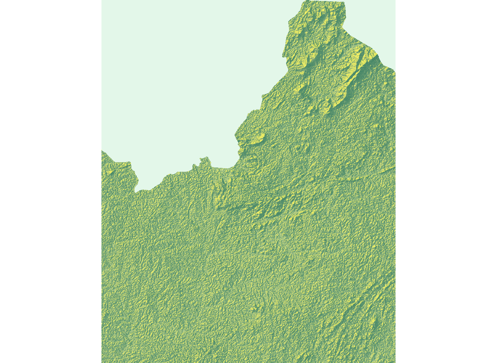

# Rendering Topography

In this last project, you will revist the de facto urban areas you defined as well as the transportation infrastructure and health care facilites you spatially located.  Using your combined adm2 or adm3, you will intersect those land use, transport and health care geographies with the topography of your selected adm2 or adm3.  You may recall that we used the `rayshader::` package back in project 1, which we will use again, but this time will focus on its application with rasters rather than starting with a `sf` object.

To start, be certain you have the `raster::`,`sf::` and `tidyverse::` library of functions available for your current R worksession.  Also, install and load the `rayshader::` and `rayrender::` packages.

```text
#install.packages("rayshader", dependencies = TRUE)

library(raster)
library(sf)
library(tidyverse)

library(rayshader)
library(rayrender)
```

Use the `setwd()` command to make certain your working directory is set to the data folder where you saved your raster and shapefiles.  Read your raster file that describes the topography throughout your LMIC into RStudio.  Also read the shapefile of your adm2 or adm3s as a simple features object into RStudio.  Following are my examples for Liberia.

```text
lbr_topo <- raster("lbr_srtm_topo_100m.tif")
lbr_adm2  <- read_sf("gadm36_LBR_2.shp")
```

With the polygon you previously created by unioning the two adm2s or adm3s you selected, use the `crop()` command to crop the raster describing the topography of your LMIC.  You could also `mask()` the topographical raster, but I am going to forego that step in favor of retaining the area within the bounding box used by the `sf` from my combined adm2.

```text
combined_topo <- crop(lbr_topo, combined_adm2s)
```

 Next you will convert your cropped raster into a matrix using the `raster_to_matrix()` command from the `rayshader::` library of functions.  When executing this function, R will return the dimensions of the matrix created.  Take note of these dimensions, since you will later need them to specify the width and height, in pixels, of the image you will produce of your urban areas, roads and health care that you will then overlay your topography.


Using the `sphere_shade()` command from the `rayshader::` library, plot your topography.  Use the `add_water()` and `detect_water()` commands to automatically add water features to your plot.  My initial plot is primarily rain forest, and water features aren't readily apparent.  Yours may or may not have water features, depending on the location.

```text
combined_matrix %>%
  sphere_shade() %>%
  add_water(detect_water(combined_matrix)) %>%
  plot_map()
```

The resulting plot is a two dimension relief of the bounding box encompassing your combined adm2 or adm3s.



To produce a three-dimension plot of your selected area, first apply the `ambient_shade()` command to your topography matrix.

```text
ambientshadows <- ambient_shade(combined_matrix)
```

Producing these shadows may take a few minutes, but once it is complete, you are ready to begin producing your three-dimension topographic plot.  There are lots of options you can use to produce your 3D plot.  Following is a basic specification.

```text
combined_matrix %>%
  sphere_shade() %>%
  add_water(detect_water(combined_matrix), color = "lightblue") %>%
  add_shadow(ray_shade(combined_matrix, sunaltitude = 3, zscale = 33, lambert = FALSE), max_darken = 0.5) %>%
  add_shadow(lamb_shade(combined_matrix, sunaltitude = 3, zscale = 33), max_darken = 0.7) %>%
  add_shadow(ambientshadows, max_darken = 0.1) %>%
  plot_3d(combined_matrix, zscale = 20,windowsize = c(1000,1000), 
          phi = 40, theta = 135, zoom = 0.5, 
          background = "grey30", shadowcolor = "grey5", 
          soliddepth = -50, shadowdepth = -100)
```

Using the `render_snapshop()` command, produce a similar type of image.

```text
render_snapshot(title_text = "Sanniquelleh-Mahn & Saclepea, Liberia", 
                title_size = 50,
                title_color = "grey90")
```


