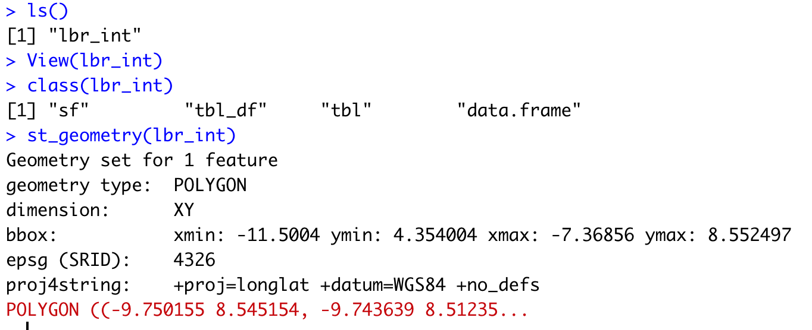

# An Introduction to Spatial Data

Since we have had a bit of practice with creating a theoretical environment, let's go ahead and move to a more practical application.  In this exercise you will learn how to install a package and load a library of functions into R, install spatial data as a simple feature and then plot your geospatial data.  To begin with, let's install a package that we will use in order to describe and analyze our simple features.

```r
install.packages("tidyverse", dependencies = TRUE)
```

In the above command we are installing a collection of packages designed for data science, where all packages share an common design.  Once RStudio has informed you that the package has been installed, you may then execute the command that makes the library function available for use during your current work session.

```r
library(tidyverse)
```

After executing the library command, R may inform you about the current version of attached packages while also identifying any conflicts that may exist.  Conflicts between functions often exist when one package installs a function that has the same name as another function in another package.  Generally, what happens, is the latest package to be installed will mask a same named function from a previously loaded library.

The tidyverse is not one library of functions, but is in fact a suite of packages where each one conforms to an underlying design philosphy, grammar and data structure.  In the previous exercise we used commands from the base R package, but in this exercise we will begin to consider the more recent development of the tidyverse syntax nomenclature that emerged from the gramar of graphics \(ggplot2\).  The [tidyverse](https://www.tidyverse.org/) is arguably a more coherent, effective and powerful approach to data science programming in R.

After installing and loading the `tidyverse` suite of packages, let's install yet another important important package for working with spatial data.

```r
install.packages("sf", dependencies = TRUE)
```

This will install the `sf` package,  or [simple features](https://r-spatial.github.io/sf/), which like the tidyverse is a recent, arguable more effective implementation of a design philosphopy for using spatial data in R.  The `sf` package also has been designed to integrate with the `tidyverse` syntax.  After installing sf, then as before run the `library()` function to load the library of functions contained within the package for use in your current R worksession.

After running the `install.packages()` command successfully, you should add a \# at the beginning of that line in order to comment it out. Running the `install.package()` command is only necessary one time, in order to retrieve the package from a remote location and install it on your local machine, but it is necessary to run the `library()` command each time you open R and wish to access a function from within that library.

Another helpful command to add at the beginning of your script is `rm(list=ls(all=TRUE))` , which will delete everything from your R workspace from the outset. By running this line of code first in your script, you will be working with what John Locke called a tabula rasa or a clean slate from the outset. After adding the remove all function as your first line of code but after installing your packages and loading those libraries, be sure to set your working directory. While it's fine to use the drop down menu to find the location of your working directory, the first time, it is always a good idea to copy that line of code into your script, so the `setwd()` command can be executed programmatically instead of through the GUI \(which will save you time\). At this point your script should look like the following snippet of code.

```r
rm(list=ls(all=TRUE))

# install.packages("tidyverse", dependencies = TRUE)
# install.packages("sf", dependencies = TRUE)

library(tidyverse)
library(sf)

setwd("the/path/to_my/working/directory")
```

The next step is to visit the [Humanitarian Data Exchange](https://data.humdata.org) website and begin to become familiar with all of the data available through that portal.  The front page of HDX offers a **Find Data** search tool on the right hand side towards the top.  As an example, enter **Liberia** into the find data search field and press enter.


The HDX website should return 125 or so datasets for the West African country of Liberia. Included in the search results will be data describing Liberia's healthsites, settlements, roads, population, pregnancies, births, and a number of other local dimensions of human development.  Some of the data made available through HDX will have been remotely sensed, most typically from a satellite orbitting the earth.  This remotely sensed data is then usually classified according to different discrete types or perhaps by assigning value or interval of possible values.  Other times the data available will have been obtained from a source in the field, anb most typically from some institution or group located or working within that particular country.  Surveys and census data are examples of secondary sources that were most often obtained from local institutions.  Like remotely sensed data, secondary sources also serve to provide a description of existing conditions, while serving as the basis for further analysis, modeling, inference and potential simulations.

Scroll through the results until you find a data set that provides a spatial description of **Liberia's administrative boundaries**.  Administrative boundaries refer to the national border as well as all of the regional, district and local government subdivisions of that country.  Typically these administrative boundaries and subdivisions have been obtained and provided by one of the regional offices within the _United Nations Office for the Coordination of Humanitarian Affaris_ \(OCHA\).  For example, the secondary sources of data that describe Liberia's political geography has been provided by the _Regional Office of West and Central Africa_ \(ROWCA\), presumable as they have obtained these sources from a ministry of government from within Liberia.  Every country employs a unique nomenclature in order to describe its administrative subdivisions.  Liberia is first subdivided into _counties_ with each county further subdivided into _districts_.  Each of Liberia's _districts_ is then further subdivided into what is called a _clan area._

Once you have found the **Liberia Administrative Boundaries** link, click on it and follow it to a web page where a number of files will be made available to you under a **Data and Resources** tab.  


For our purposes, we want to obtain the national boundary \(admint\), first level administrative subdivisions \(adm1\) and second level administrative subdivisions \(adm2\).  Download each of these folders by clicking on the download tab off to the right of each file name.  After the folders have been downloaded, go to your working directory and create a new folder named **data** and then move the folders describing Liberia's administrative subdivisions to within that folder.  The structure of your working directory should look something like the following.


You will also notice that within each folder, there are a number of different files, each one with the same file name yet also having a unique file extension.  The file extension is the _three letter part of the file name that is to the right of the period_, and acts somewhat as an acronym for the file type.  For example, files that have the `.shp` file extension are called shapefiles.  A shapefile contains the geometry of the points, lines and polygons used to spatially describe, in this example, the political geography of Liberia.  A shapefile also requires most of the other files found in the folder in order for it to function properly.  For example, the `.prj` file provides the projection that is used when plotting the geometry.  The `.dbf` file provides the attributes associated with each spatial unit \(for example the name associated with each county or district\).  Other files also provide information that enables RStudio to further interpret the spatial information in order to better serve our purposes.

In order to import a shapefile into RStudio we are going to use a command from the `sf::` package \(simple features\).  RStudio will need to find each of the `.shp` files in order to import the international border, the first level administrative subdivisions and the second level administrative subdivisions.  If I have set my working directory to the **data** folder, then RStudio will need to traverse through each subfolder in order to locate each of the `.shp` files.  You also will need to include the command from the `sf::` package that will import the `.shp` file into RStudio as a simple feature class object.  To import you will need to use the `read_sf()` command.

```r
lbr_int  <- your_command("folder_where_admint_is_located/lbr_admbnda_admint_ocha.shp")
```

Once you have successfully executed the above function using the `sf::read_sf()` command, you should observe a new object named `lbr_int`appearing in the top right data pane within your RStudio environment.  To the right of your newly created object there is a small gridded box that you will be able to click on in order to view individual attributes associated with this simple feature class spatial object.  You will also notice that within the data pane, RStudio also provides you with some basic information about the object, in this case 1 observation that has 7 variables.

The `sf::` package also includes a function called `st_geometry()` that will enable you to view some of the basic geometry associated with the object you have named `lbr_int`.  Type the name of your object within the `st_geometry()` command so that RStudio will return some basic geometric information about our spatial object that describes Liberia's international border.



After using the `st_geometry()` command with our `lbr_int` object, RStudio provides us with a basic description that includes the geometry type \(polygons in this case\), the x & y minimum and maximum values or also know as the bounnding box, the epsg spatial reference identifier \(a number used to identify the projection\) and finally the projection string , which provides additional information about the projection used.

Now that we have conducted a cursory investigation of our simple feature object geometry, let's plot it.  To plot, nest the object's geometry output using the same `st_geometry(lbr_int)` command, within the `plot()` command.

```r
first_command(second_command(sf_object))
```

An image in the bottom right pane of your RStudio environment should appear, and that image should be a single polygon that is describing the international border of Liberia.


You can further specify the lineweight used when plotting this border by adding the `lwd =`   argument to your plot command.  Within the use of your `plot()` command, add the `lwd =`  argument and specify a weight or line width associated with that particular object's plotted lines.  In the example above, I have set `lwd = 3`.

```r
plot(st_geometry(your_sf_object), lwd = some_value)
```

You have successfully created a simple feature object that represents Liberia's border, as well as plotted it.  Good job!  Now continue with the first level of administrative subdivisions for Liberia, counties.  In order to do this, return to your use of the `read_sf()` command in order to import and create an object named `lbr_adm1`.   

```r
lbr_adm1  <- your_command("folder_where_adm1_is_located/lbr_admbnda_adm1_ocha.shp")
```

As before you could use data pane in the top right corner to view attribute data.  You can also use the `st_geometry()` command to have a first look at your newly created simple features object that represents Liberia's administrsative subdividion of counties.


Instead of having 1 observation with 7 variables as with the international border, now your `lbr_adm1` simple feature object has 15 observations, with each observation having 8 different variables describing some attribute associated with each individual polygon.  Now let's plot both Liberia's international border as well as its 15 counties.  To do this we will again use our `st_geometry()` nested within our`plot()` command while using our `lbr_adm1` object.  As before, continue with an argument that specifies the line weight for each of the counties.  Since we are describing a first level subdivision, graphically it is generally best to use a lineweight that is less than the width used for the international border.  Also, notice that I have added a new argument to the series of commands `add = TRUE` , which will serve to add the county borders to the already plotted international boundary.

```r
plot(st_geometry(your_intl_border_obj), lwd = ?)
plot(st_geometry(your_adm1_obj), lwd = ?, border = "add_color_here", add = TRUE)
```

You may also add a lighter color to the administrative subdivisions in order to graphically display counties as subdividions of the larger nation.  In the above example I have set `border = gray` .  You are welcome to use any color that seemingly works best for you, although gray scales often achieve the task quite well.  Use the `color()` command directly in the console to view a list of all 650 or so colors that are available in base R.

In addition to spatially desribing the national border and all 15 of Liberia's counties, it would also be helpful to add some text that identifies the name of each county.  To do this we will use the `text()` command on a separate line of code within our script after our two `plot()` commands.  The `text()` command will require us to provide, first the location where each annotation is to be plotted and second the label to be plotted at each of those locations.  This time instead of just using the `st_geometry()` we will further nest inside of that command the `st_centroid()` command in order to provide the coordinates for the center point of each county or the location where each label will be placed.  Additionally, we will set the `labels =`  argument to the variable within our `lbr_adm1` object that provides the name of each county.   Each simple feature object's variable names can be found in the data pane, by clicking on the blue arrow to expand the object or by viewing object attributes \(obsevations and variables\) by clicking on the data viewer grid symbol to the right of your object, also in the data pane.  

You will notice that within your `sf` object named `lbr_adm1` the variable `admin1name` contains the names of each county.  In order to properly set the `labels =`  argument, you will need to specify both the simple feature object name as well as the variable within that object using the `$` operator.

```r
text(st_coordinates(st_centroid(your_adm1_obj)), labels = your_adm1_obj$variable_name, cex = ???)
```

One final argument that has been provided at the end of the `text()` command is  `cex =` .  The `cex =`  argument will scaled the size of each label in accordance with the value provided.  For example, above I have set `cex = .45`  which will scale the size of each label to be 45% smaller than the base value.  You could also set `cex =` values that are more than 1 in order to increase the proportionate size of the labels.


After adding the counties go back and add the second level of administrative subdivisions, or districts.  Again use `read_sf()` to import that shapefile as a simple feature object into your RStudio workspace.  Again use the `plot(st_geometry(lbr_adm2), lwd = ???, border = "some_color", add = TRUE` in order to add that layer to your previous two layers.  Again use the `text()` command with `st_coordinates(st_centroid(adm2_obj_name))` while also using the `labels =  my_adm2_sf_ob$variable_name`argument with the `cex = some_even_smaller_value`in order to plot those value.  At this point, your script should look similar to the following.

```r
rm(list=ls(all=TRUE))

# install.packages("tidyverse", dependencies = TRUE)
# install.packages("sf", dependencies = TRUE)

library(tidyverse)
library(sf)

setwd("the/path/to_my/working/directory")

lbr_int  <- your_command("folder_where_admint_is_located/lbr_admbnda_admint_ocha.shp")
lbr_adm1  <- your_command("folder_where_adm1_is_located/lbr_admbnda_adm1_ocha.shp")
lbr_adm2  <- your_command("folder_where_adm2_is_located/lbr_admbnda_adm2_ocha.shp")

plot(st_geometry(your_intl_border_obj), lwd = ?)
plot(st_geometry(your_adm1_obj), lwd = ?, border = "add_color_here", add = TRUE)
plot(st_geometry(your_adm2_obj), lwd = ?, border = "add_color_here", add = TRUE)

text(st_coordinates(st_centroid(your_adm1_obj)), labels = your_adm1_obj$variable_with_county_names, cex = ???)
text(st_coordinates(st_centroid(your_adm2_obj)), labels = your_adm2_obj$variable_with_district_names, cex = ???)

```

Once you have produced the output, you can use the **export** tab in the bottom right RStudio pane where plots are produced.  Save as an image to your working directory.  Your spatial plot describing the political geography of Liberia should appear similar to the following image.


