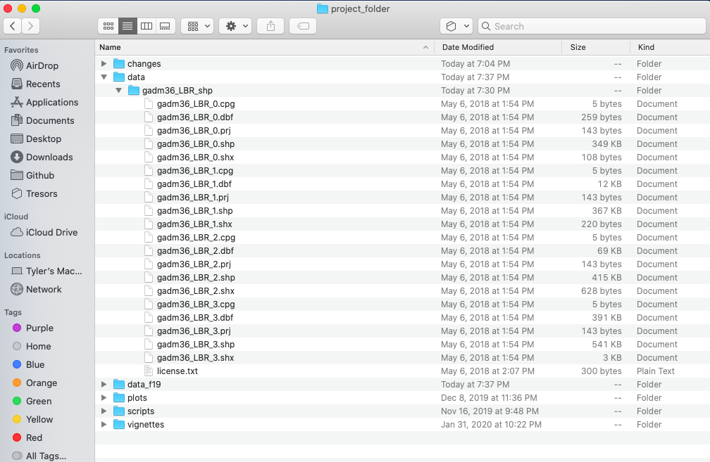

# Projecting, Plotting and Labelling Administrative Subdivisions

We have had a bit of practice creating a theoretical environment, but now we will move to a more practical application.  In this exercise you will learn how to **install a package** and **load a library of functions** into R, **install spatial data as a simple feature** and then **use the grammar of graphics** \(aka `ggplot::`\) to plot your geospatial data.  To begin, install a package that will be used in order to describe and analyze our simple features.

```r
install.packages("tidyverse", dependencies = TRUE)
```

In the above command we are installing a collection of packages designed for data science, where all packages share a common design.  Once RStudio has informed you that the package has been installed, you may then execute the command that makes the library function available for use during your current work session.

```r
library(tidyverse)
```

After executing the library command, R may inform you about the current version of attached packages while also identifying any conflicts that may exist.  Conflicts between functions often exist when one package installs a function that has the same name as another function in another package.  Generally, what happens, is the latest package to be installed will mask a same named function from a previously loaded library.

The tidyverse is not one library of functions, but is in fact a suite of packages where each one conforms to an underlying design philosphy, grammar and data structure.  In the previous exercises we used commands from the base R package, but in this exercise we will begin to consider the more recent development of the tidyverse syntax nomenclature that emerged from the gramar of graphics \(ggplot2\).  The [tidyverse](https://www.tidyverse.org/) is arguably a more coherent, effective and powerful approach to data science programming in R.

After installing and loading the `tidyverse` suite of packages, let's install yet another important package that is used when working with spatial data.

```r
install.packages("sf", dependencies = TRUE)
```

This will install the `sf` package,  or [simple features](https://r-spatial.github.io/sf/), which like the tidyverse is a recent, arguably more effective implementation of a design philosphopy for using spatial data in R.  The `sf::` package also has been designed to integrate with the `tidyverse` syntax.  After installing `sf::`, then as before run the `library()` function to load the library of functions contained within the package for use in your current R worksession.

After running the `install.packages()` command successfully, you should add a `#` at the beginning of that line in order to comment it out. Running the `install.package()` command is generally necessary only once, in order to retrieve the package from a remote location and install it on your local machine, but it is necessary to run the `library()` command each time you open R and wish to access a function from within that library.

Another helpful command to add at the beginning of your script is `rm(list=ls(all=TRUE))` , which will delete everything from your R workspace from the outset. By running this line of code first in your script, you will be working with what John Locke called a _tabula rasa_ or a clean slate from the outset. After adding the remove all function as your first line of code but after installing your packages and loading those libraries, be sure to set your working directory. While it's fine to use the drop down menu to find the location of your working directory, the first time, it is a good idea to copy that line of code into your script, so the `setwd()` command can be executed programmatically instead of through the GUI \(which will save you time\). At this point your script should look like the following snippet of code.

```r
rm(list=ls(all=TRUE))

# install.packages("tidyverse", dependencies = TRUE)
# install.packages("sf", dependencies = TRUE)

library(tidyverse)
library(sf)

setwd("the/path/to_my/working/directory")
```

The next step is to visit the [GADM](https://www.gadm.org/) website, which is a repository of spatial data that is describing global administrative subdivisions or every country on earth.  Select the data tab and become familiar with how the portal presents the administrative subdivision of each country.  Find the country link towards the top of the page that forwards you to another page with a drop down tab for downloading GADM data.


As an example, I will select the West African country of Liberia.  The result should present a number of different options for obtaining a spatial data that describes of **Liberia's administrative boundaries**.  Administrative boundaries refer to the national border as well as all of the regional, district and local government subdivisions of that country.  

Throughout the course of the semester we will use a number of different data sets that  describe healthsites, settlements, roads, population, pregnancies, births, and a number of other local dimensions of human development. Some of the data made available through WorldPop or the Humanitarian Data Exchange will have been **remotely sensed**, usually from a satellite orbitting the earth. This remotely sensed data is then classified according to different discrete types or perhaps by assigning values or intervals of possible values. Other times the data available will have been obtained from a source in the field, and most typically from some institution or group located or working within that particular country. Surveys and census data are examples of **secondary sources** that were most often obtained from local institutions. Like remotely sensed data, secondary sources also serve to provide a description of existing conditions, while serving as the basis for further analysis, modeling, inference and potential simulations.

Typically, administrative boundaries and subdivisions have been obtained and provided by one of the regional offices within the _United Nations Office for the Coordination of Humanitarian Affaris_ \(OCHA\).  For example, the secondary sources of data that describe Liberia's political geography were likely provided by the _Regional Office of West and Central Africa_ \(ROWCA\), presumably as they have obtained these sources from a ministry of government from within Liberia.  Every country employs a unique nomenclature in order to describe its administrative subdivisions.  Liberia is first subdivided into _counties_ with each county further subdivided into _districts_.  Each of Liberia's _districts_ is then further subdivided into what are called _clan areas._

Once you have found the the page for downloading Liberia's administrative subdivisions, note the different available spatial data types, as well as the different levels.    


For our purposes, we want to obtain the national boundary \(LBR\_0\), first level administrative subdivisions \(LBR\_1\) and second level administrative subdivisions \(LBR\_2\).  Click on the **Shapefile** link in order to download a folder that contains a shapefile as well as a number of different corresponding files.  After the folders have been downloaded, go to your working directory and create a new folder named **data** and then move the folders describing Liberia's administrative subdivisions to within that folder.  The structure of your working directory should look something like the following \(minus the additional folders\).



You will also notice that there are a number of different files, each one with the same file name yet also having a unique file extension.  The file extension is the _three letter part of the file name that is to the right of the period_, and acts somewhat as an acronym for the file type.  For example, files that have the `.shp` file extension are called shapefiles.  A shapefile contains the geometry of the points, lines and polygons used to spatially describe, in this example, the political geography of Liberia.  A shapefile also requires most of the other files found in the folder in order for it to function properly.  For example, the `.prj` file provides the projection that is used when plotting the geometry.  The `.dbf` file provides the attributes associated with each spatial unit \(for example the name associated with each county or district\).  Other files also provide information that enables RStudio to further interpret the spatial information in order to better serve our purposes.

In order to import a shapefile into RStudio we are going to use a command from the `sf::` package \(simple features\).  RStudio will need to find each of the `.shp` files in order to import the international border, the first level administrative subdivisions and the second level administrative subdivisions.  If I have set my working directory to the **data** folder, then RStudio will need to traverse through the subfolder in order to locate the correct `.shp` files.  You also will need to use the `read_sf()` command to import the `.shp` file into RStudio and create a simple feature class object.

```r
lbr_int  <- add_command_here("add_folder_here/add_file_name_here.shp")
```

Once you have successfully executed the above function using the `sf::read_sf()` command, you should observe a new object named `lbr_int`appearing in the top right data pane within your RStudio environment.  To the right of your newly created object there is a small gridded box that you will be able to click on in order to view individual attributes associated with this simple feature class spatial object.  You will also notice that within the data pane, RStudio also provides you with some basic information about the object, in this case 1 observation that has 7 variables.

The `sf::` package also includes a function called `st_geometry()` that will enable you to view some of the basic geometry associated with the object you have named `lbr_int`.  Type the name of your object within the `st_geometry()` command so that RStudio will return some basic geometric information about our spatial object that describes Liberia's international border.  You don't necessarily need to write this command in your script, you can just enter it directly into the console


After using the `st_geometry()` command with our `lbr_int` object, RStudio provides us with a basic description that includes the geometry type \(polygons in this case, but it could also return points or lines\), the x & y minimum and maximum values or also know as the bounnding box \(bbox\), the epsg spatial reference identifier \(a number used to identify the projection\) and finally the projection string , which provides additional information about the projection used.

Now that we have conducted a cursory investigation of our simple feature object geometry, let's plot our simple features class object that describes the international border of Liberia.  To plot, we will use a series of functions from a package called `ggplot()`.  The gg in the package name `ggplot::` stands for the grammar of graphics, and is a very useful package for plotting all sorts of data, including spatial data classes created with the `sf::` package.  To start add `ggplot() +` to your script and then on the following line add the `geom_sf(data = your_sf_obj)` in order to specify the data that `ggplot()` should use in producing its output.  

```r
ggplot() +
  geom_sf(data = your_sf_obj)
```

Following the `data =` argument, you can also specifiy the line weight for the border using the `size =` argument.  It is also possible to specify the `color =` as well as the opacity / transparency of your polygon using the `alpha =` argument.  With the following script I have set the international border line weight width to `1.5` , the color of the border to `"gold"` , the fill color for the internal portion of the polygon to `"green"` and the `alpha =`   value to .5 or 50% transparent.


It would also be helpful to have a label describing our plot.  In order to do this we can use either the `geom_sf_text()` command or the `geom_sf_label()` command.  In the following snippet of code you will notice that I have added the aesthetics argument within my `geom_sf_text()` command.  The `aes =` argument enables us to specify which variable contains the label we will place on our object.  If you click on the blue arrow to the left of the `lbr_int` object in the top right data pane, the object will expand below to reveal the names of all variables.  The second variable is named `NAME_0` and provides us with the name we will use as our label, Liberia.  Following the `aes()` argument, you can also specify the `size =` of your label as well as its `color =`.

```r
ggplot() +
  geom_sf(data = your_sf_obj,
          size = value,
          color = "color",
          fill = "color",
          alpha = value_between_0_&_1) +
  geom_sf_text(data = your_sf_obj,
               aes(label = variable_name),
               size = value,
               color = "color")
```


Good job!  You have successfully used ggplot from the tidyverse with the simple features package in order to properly project and plot Liberia's international border, as well as to include a label.  Now continue with the first level of administrative subdivisions, Liberia's fifteen counties.  In order to do this, return to your use of the `read_sf()` command in order to import and create an object named `lbr_adm1`.   

```r
lbr_adm1  <- add_command_here("add_folder_here/add_file_name_here.shp")
```

As before you could use the data pane in the top right corner to expand your view of the `lbr_adm1` file you created.  You can also click on the small grid symbol to the right of your data object \(within the data pane\) in order to view your data in a new tab in the same pane where your script is located.  Whereas before we had a simple feature class object with 1 observation with 7 variables, your `lbr_adm1` simple feature object has 15 observations, with each observation having 8 different variables describing some attribute associated with each individual polygon.  Let's plot both Liberia's international border as well as its 15 counties.

To do this, follow the same approach you used with the `lbr_int` object but replace it with the name of your adm1 spatial object, `lbr_adm1`.  Also follow the same approach you used for adding the labels in your previous snippet of code, but this time specify the variable with the county names from `lbr_adm1`.  

```r
ggplot() +
  geom_sf(data = your_adm1_sf_obj,
          size = value,
          color = "color",
          fill = "color",
          alpha = value) +
  geom_sf(data = your_int_sf_obj,
          size = value,
          color = "color",
          fill = "color",
          alpha = value) +
  geom_sf_text(data = your_adm1_sf_obj,
               aes(label = variable_name),
               size = value,
               color = "color") +
  geom_sf_label(data = your_int_sf_obj,
               aes(label = variable_name),
               size = value,
               color = "color")
```

The code above will produce the plot below when the`geom_sf()` function using the `lbr_adm1` arguments is specified with a line weight `size = 0.65`, line weight `color = "gray50"`, a polygon `fill = "gold3"` and a 65% opacity value of `alpha = 0.65`.  Additionally, I have set the `size = 2.0` , and the `alpha = 0` \(100% transparent\) for the `data = lbr_int` object. The `geom_sf()` command will default to a `color = "black"` if the line color is not specified. Additionally, since the `alpha = 0` no `fill = "color"` is needed \(since it will not appear\). The county labels have a `size = 2` \(and also defaults to a `color = "black"`, while the `geom_sf_text()` command to label Liberia has a `size = 12` argument. In order to nudge the label to the east and south I have also added the `nudge_x = 0.3` and `nudge_y = -.1` arguments to the `geom_sf_label()` command.


After adding the counties go back and add the second level of administrative subdivisions, or districts.  Again use `read_sf()` to import that shapefile as a simple feature object into your RStudio workspace.  Use the  `geom_sf_text()` command to add the labels, while also making sure to specify the correct variable name in the `aes(label = variable_name)` argument.  Size the district borders and labels so they are smaller than the internation border as well as the county delineations.

```r
rm(list=ls(all=TRUE))

# install.packages("tidyverse", dependencies = TRUE)
# install.packages("sf", dependencies = TRUE)

library(tidyverse)
library(sf)

setwd("~/Tresors/teaching/project_folder/data")

lbr_int  <- add_command_here("add_folder_here/add_file_name_here.shp")
lbr_adm1  <- add_command_here("add_folder_here/add_file_name_here.shp")
lbr_adm2  <- add_command_here("add_folder_here/add_file_name_here.shp")

ggplot() +
  geom_sf(data = adm2_object,
          size = value,
          color = "color",
          fill = "color",
          alpha = value) +
  geom_sf(data = adm1_object,
          size = value,
          color = "gray50",
          alpha = value) +
  geom_sf(data = int_object,
          size = value,
          alpha = value) +
  geom_sf_text(data = adm2_object,
               aes(label = variable_name),
               size = value) +
  geom_sf_text(data = adm1_object,
               aes(label = variable_name),
               size = value)

ggsave("liberia.png")
```

Use `ggsave(file_name.png)` to save your plot as a `.png` file, to your working directory.


## Team Challenge Question

Follow the steps from above that you used to produce your plot of Liberia, but instead each team member should select their own LMIC country and produce the output for it.  Go back to the GADM website and find the administrative boundaries for the LMIC country you have selected.  Plot and label the international border, the first level of administrative subdivisions and the second level of administrative subdivisions.  Make sure you designate heavier line widths for the higher level administrative subdivisions and thinner line widths for the more local governments.  You may also use darker and lighter colors to discern hierarchy.  Please be sure to use different label sizes and/or colors to further differentiate administrative hierarchies.  Modifying annotation transparency also as needed.

Meet with your group and prepare to present the best two plots for the Friday informal group presentation.  Then as a group, upload all 5 team members plots to \#data100\_igps \(informal group presentations\) by Sunday night.

## Individual Stretch Goal 1

Go to the [HDX](https://data.humdata.org) website, find and download the shapefiles for your selected country.  Compare their administrative subdivisions to those obtained from GADM.  Are they the same?  Are there any differences?  Which source do you think more closely describes the local political reality within your selected LMIC?  Do the HDX shapefiles work?

## Individual Stretch Goal 2

Create a new `ggplot() +` as you did before.  This time `filter` your `lbr_adm1` object by using the `>%>` \(pipe\) operator and using the assignment operator to create a new sf object that includes only the county named Montserrado.  Inside the `filter()` command you will need to specify the `admin1name = "Montserrado".` Then continue to use the `>%>` operator with your `lbr_adm2` object again filtering based on the `admin1Name == "Montserrado"` .  Follow that `>%>` with your `ggplot()`, `geom_sf()` and `geom_sf_text()` commands to plot the geometries and labels for both the first and second level administrative subdivisions of Montserrado, Liberia.

```r
new_sf_obj <- lbr_adm1 %>%
  filter(variable == "outcome")
  
lbr_adm2 %>%
  filter(variable == "outcome") %>%
  ggplot() +
  geom_sf(size = value) +
  geom_sf_text(aes(label = variable),
               size = value) +
  geom_sf(data = newly_created_sf_obj,
          size = value,
          alpha = value) +
  geom_sf_text(data = newly_created_sf_obj,
               aes(label = variable),
               size = value) +
  xlab("longitude") + ylab("latitude") +
  ggtitle("Montserrado County", subtitle = "Liberia's most populous county and its subdivisions") +
  theme(plot.title = element_text(hjust = 0.5), 
        plot.subtitle = element_text(hjust = 0.5))

ggsave("montserrado.png")
```


Now identify the most populous urban area within your LMIC and use `ggplot() +` to plot the first and second level administrative subdivisions where it is located.

## Individual Stretch Goal 3

Produce detailed maps of your more densely populated areas and include them in your final product.  Use the `geom_rect() +` command to identify the area of increased scale.  Also use the `annotation_custom() +` command to arrange each plot within a larger graphical layout. The following is a fully working example for Liberia.  Translate the script to your LMIC.  You may need to install and load the package `ggsflabel`.

```r
### Create Larger Map of Liberia with Rectangles identifying area of Detailed Maps

plot1 <- ggplot() +
  geom_sf(data = lbr_adm1,
          size = 0.5,
          color = "gray50",
          fill = "gold3",
          alpha = 0.5) +
  geom_sf(data = lbr_int,
          size = 2.0,
          alpha = 0) +
  geom_rect(data = lbr_adm1, xmin = -10.95, xmax = -10.3, ymin = 6.2, ymax = 6.9, 
            fill = NA, colour = "green", size = 2) +
  geom_rect(data = lbr_adm1, xmin = -8.80, xmax = -7.35, ymin = 4.3, ymax = 5.65, 
            fill = NA, colour = "blue", size = 2) +
  geom_sf_text(data = lbr_adm1,
               aes(label = admin1name),
               size = 3) +
  geom_sf_text(data = lbr_adm1,
               aes(x = -10.60, y = 6.05, label = "Detail A"),
               size = 5,
               color = "green") +
  geom_sf_text(data = lbr_adm1,
               aes(x = -9.10, y = 4.6, label = "Detail B"),
               size = 5,
               color = "blue") +
  xlab("longitude") + ylab("latitude") +
  ggtitle("Liberia", subtitle = "Details A & B") +
  theme(plot.title = element_text(hjust = 0.5), plot.subtitle = element_text(hjust = 0.5),
        panel.background = element_rect(fill = "azure"),
        panel.border = element_rect(fill = NA))

### Create Detail A Map

mont_cnty <- lbr_adm1 %>%
  filter(admin1name == "Montserrado")

plot2 <- lbr_adm2 %>%
  filter(admin1Name == "Montserrado") %>%
  ggplot() +
  geom_sf(size = .15) +
  geom_sf_text(aes(label = admin2Name),
               size = 1.75) +
  geom_sf(data = mont_cnty,
          size = .5,
          alpha = 0) +
  geom_sf_text(data = mont_cnty,
               aes(label = admin1name),
               size = 3.75,
               alpha = .5) +
  xlab("longitude") + ylab("latitude") +
  ggtitle("Detail A", subtitle = "Montserrado County") +
  theme(plot.title = element_text(hjust = 0.5), plot.subtitle = element_text(hjust = 0.5),
        panel.background = element_rect(fill = "azure"),
        panel.border = element_rect(fill = NA))


### Create Detail B Map

east_cnties <- lbr_adm1 %>%
  filter(admin1name == "Grand Kru" | admin1name == "Maryland" | admin1name == "River Gee")

plot3 <- lbr_adm2 %>%
  filter(admin1Name == "Grand Kru" | admin1Name == "Maryland" | admin1Name == "River Gee") %>%
  ggplot() +
  geom_sf(size = .15) +
  
  geom_sf_text(aes(label = admin2Name),
               size = 1.75) +
  geom_sf(data = east_cnties,
          size = .5,
          alpha = 0) +
  geom_sf_text(data = east_cnties,
               aes(label = admin1name),
               size = 3.75,
               alpha = .5) +
  xlab("longitude") + ylab("latitude") +
  ggtitle("Detail B", subtitle = "River Gee, Grand Kru & Maryland Counties") +
  theme(plot.title = element_text(hjust = 0.5), plot.subtitle = element_text(hjust = 0.5),
        panel.background = element_rect(fill = "azure"),
        panel.border = element_rect(fill = NA))


ggplot() +
  coord_equal(xlim = c(0, 6.0), ylim = c(0, 4), expand = FALSE) +
  annotation_custom(ggplotGrob(plot1), xmin = 0.0, xmax = 4.0, ymin = 0, 
                    ymax = 4.0) +
  annotation_custom(ggplotGrob(plot3), xmin = 4.0, xmax = 6.0, ymin = 0, 
                    ymax = 2.0) +
  annotation_custom(ggplotGrob(plot2), xmin = 4.0, xmax = 6.0, ymin = 2.0, 
                    ymax = 4.0) +
  theme_void()

ggsave("details.png")
```


