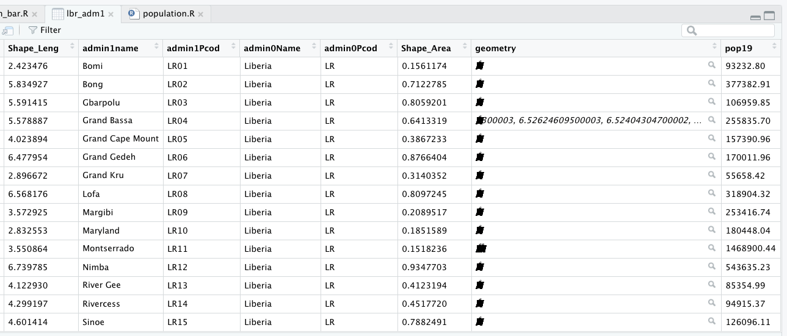
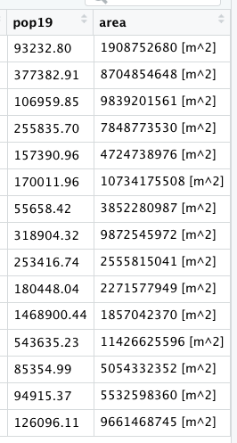
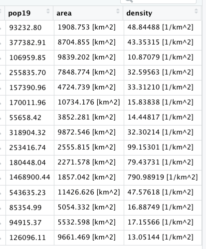

# Creating a Geometric Bar Plot with your Simple Feature object

In the previous exercise, you extracted population data from a raster, and then aggregated these totals to the first level administrative area of your selected LMIC.  You then added this new column describing the population of each first level administrative subdivision to your simple feature object.  Now we are going to use that newly created column as the basis for generating a geometric bar plot of population, share of population and density by first level adminsitrative subdivision.

First, rerun the code you used to create your adm1 `sf` class object in R, including the newly added population column.  Click on the View grid symbol to the right of the data object in the top right RStudio pane under the environment tab.  When the data viewer appears in the top left pane, it should look something like the following.



Confirm that your `sf` object has the name of each first level administrative subdivision as well as the population data you calculated and introduced.  Then use the `save()` command to save your `sf` object to your working directory.

```r
save(your_adm1_obj, file = "name_of_the_file_you_save.RData")
```

Once you have run the `save()` command you should be able to find your newly created `.RData` file in your working directory.  After you have saved the `.RData` file containing your  `sf` class object, create a new script in RStudio, and save it to your working directory.

As you have done with your prior scripts, start with the `rm()` command to clean the workspace, followed with `install.packages()` which are normally all commented off with the `#` at the beginning of each line and then the `library()` command, in order to load your needed libraries of commands.

```r
rm(list=ls(all=TRUE))

# install.packages("tidyverse", dependencies = TRUE)
# install.packages("sf", dependencies = TRUE)

library(tidyverse)
library(sf)
 
setwd("~/your/working/directory/for_data")
```

Once you have loaded the `tidyverse::` and `sf::` libraries as well as set your working directory, use the `load()` command to load into your workspace the `.RData` file that contains your adm1 `sf` class object with the newly created `pop19` variable \(column\).

```r
load("name_of_the_file_you_saved.RData")
```

One you have executed this command you should notice your adm1 `sf` object reappear in the top right pane under the environment tab.

Next, we are going to add two new columns to our adm1 object, first is a column that provides us with the area in square kilometers and the second is a column that describes the density of each first level administrative subdivision of your LMIC.  In order to add these two columns, we will use the `%>%` operator followed by the `mutate()` function.  The `mutate()` command is part of the tidyverse syntax and is used to create a new variable which is calculated from data found in another variable.  As part of the argument within the `mutate()` command, you will give the new column that you are creating a name.

Start with just the name of your adm1 object, the pipe operator and newly created column which we will name `area`.  In order to calculate this newly created column, we will also use a new command from the `sf` library of functions called `st_area()`.  

```r
yourLMIC_adm1 <- yourLMIC_adm1 %>%
  mutate(area = sf::new_command_here(yourLMIC_adm1))
```

After you execute this command, view the data associated with yout adm1 object and confirm that you have a new column named `area`. 



While these area calculations are likely accurate, to describe a country in square meters is probably not the most useful unit to select.  Instead of meters squared, we will convert our area unit of measurement to kilometers squared.  In order to do this, we must first install a new library of functions for use in RStudio.  Install the `units::` package and use the `library()` command in order to make it available for use.

The command we need from the `units::` package is `set_units()`, although this time we will nest our command within a `%>%` to modify the units of measurement from `m^2` to `km^2`.

```r
yourLMIC_adm1 <- yourLMIC_adm1 %>%
  mutate(area = sf::new_command_here(yourLMIC_adm1) %>% 
           units::new_command_here(new_units))
```

Notice how the last parenthesis doesn't coorespond with the new command from the `units::` library but rather with the parenthesis from the line prior.  We specify our syntax in this manner since we are applying the `set_units()` command to the results from the `st_area()` command.

The last step of creating our two new columns is to use the `area` variable we created and _on the fly_ also create a column named `density` which will be the result of our `area` column divided by the `pop19` variable we created in the last exercise and added to your adm1 object.

```r
yourLMIC_adm1 <- yourLMIC_adm1 %>%
  mutate(area = sf::new_command_here(yourLMIC_adm1) %>% 
           units::new_command_here(new_units)) %>%
  mutate(density = numerator_variable / denominator_variable)
```

Since we have modfied the units, you should notice density being measured in terms of number of persons per square kilometer.



Since we have all of the data needed in place, start your bar plot by first using the `%>%` from your adm1 object.  Follow that pipe operator with your `ggplot()` command that provides the  `x` and `y` variables you will identify from your `sf` class object.  Since we are plotting a bar plot, we will use the `geom_bar()` command.  We will also use the `stat = "identity"` argument since we are plotting the values of individual units of observation, in this case the population of each first level administrative subdivision from your LMIC.  Also add a `color =`  argument to your `geom_bar()` command as well as set the width of each bar.  Following the `geom_bar()` command, use the `coord_flip()` to flip the county names along the xaxis and give them a verticle disposition.

```text
lbr_adm1 %>%
  ggplot(aes(x=admin1name, y=pop19)) +
  geom_bar(stat="identity", color="blue", width=.65) +
  coord_flip() +
  xlab("county") + ylab("population")
```


