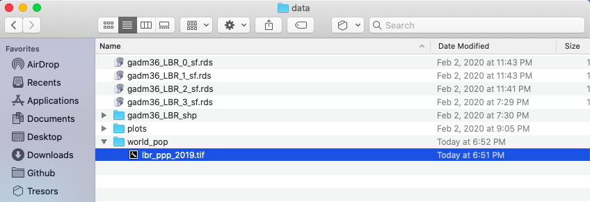
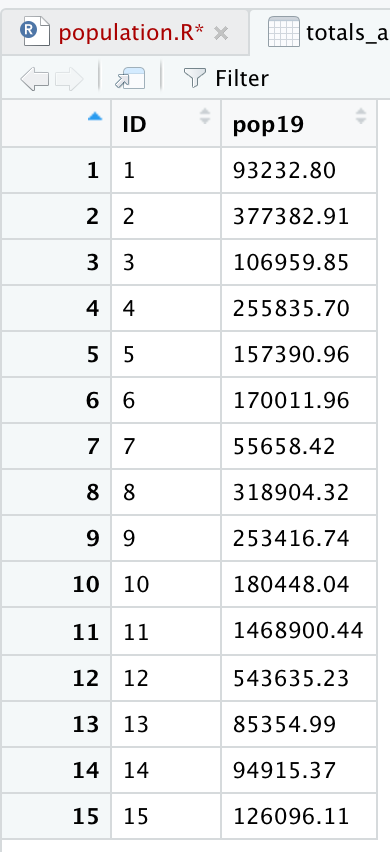
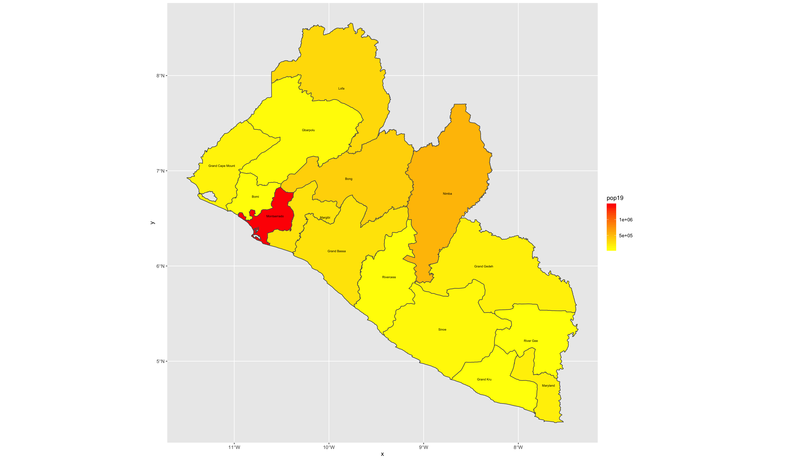
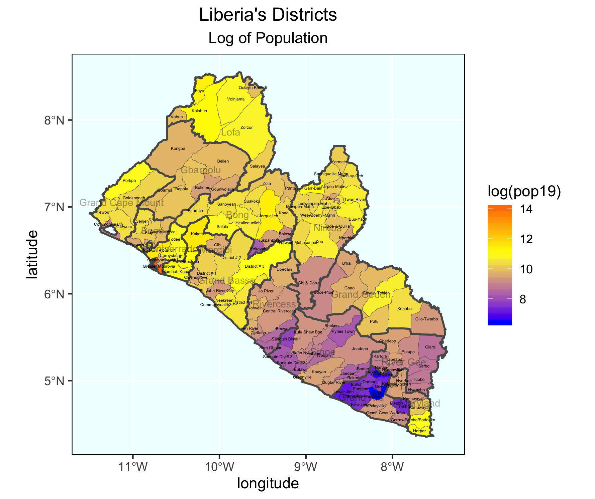
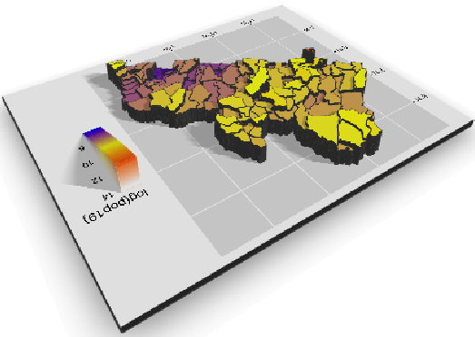

# Extracting Populations from a Raster and Aggregating to each Unit

Now that you have selected your LMIC and produced a basic geospatial description of that country at both the adm1 and adm2 levels of government, you are now set to join some data to each of those units and begin conducting a basic descriptive analysis.  Start by going back to the [WorldPop](https://www.worldpop.org) website, click on the **population** tab under the **data** pull down menu, search individual countries and type the name of your selected LMIC.  Click on the 2019 data and resources tab for your country and then select the download button in order to obtain the spatial distribution of population for your selected LMIC.  For Liberia the downloaded file is named **lbr\_ppp\_2019.tif**.  Move the file to the data folder within your working directory.


You may need to right click or two finger click and choose the **download linked file** option in order to initiate the process of downloading the `.tif` file into your downloads folder.  Sometimes your web browser may be set to try and display the image file directly within the browser itself.  You should still be able to save the file directly to your downloads folder by right clicking on it and saving it.

After you have succesfully downloaded the file, go to your project folder that you previously used as your working directory and create a new folder within the `/data` folder that will be dedicated to raw data from worldpop.  I have made a subdirectory within my `data` folder named `world_pop` to further categorize and organize my source data.



Once you have your `.tif` file located within a subdirectory of the data folder, you can go ahead and open up RStudio.  Create a new, R Script file, and save it in your scripts folder.  Add the `rm(list=ls(all=TRUE))` at the beginning of your code and then load the `tidyverse` and `sf` libraries.  Following your libraries, be sure to set your working directory.

```r
rm(list=ls(all=TRUE))

# install.packages("tidyverse", dependencies = TRUE)
# install.packages("sf", dependencies = TRUE)

library(tidyverse)
library(sf)

setwd("~/path/to_my/working/directory/")
```

For this exercise, we will install a new package and then load its library of functions.  Use the `install.packages()` to install the `raster::` package.  Be sure to set the `dependencies = TRUE` argument within your command.  After you have successfully installed the `raster::` package, use the `library()` function to load `raster::` and make its set of commands available as part of your current RStudio work session.

The first command we will use from the `raster::` package shares the same name as the library itself.  We use the `raster()` function to import our `.tif` file from its location within our data subdirectory to the current RStudio work session.  Keep in mind, if you set your working directory to the `/data` folder, but then also created a subfolder named `/world_pop` you will need to include the subdirectory path, as well as the full name of the `.tif` within the `raster()` command.

```r
myLMIC_raster_pop19 <- add_command_here("add_folder_name_here/add_file_name_here.tif")
```

Once you have created your new raster object, by using the `raster()` function, you should notice a new _Formal class RasterLayer_ data object appear in the top right data pane.  In order to find out some basic information about my newly created raster object, I will type the name of my object directly into the console.


The name of my raster class object is `lbr_pop19` and by typing the objects name directly into the console, R informs me of the class of the object, dimensions, resolution, extent, coordinate reference system as well as the minimum and maximum values.  The information about the objects dimensions can be useful, since it is informing us of how many rows of gridcells by how many columns of gridcells are contained within the object.  In the case of the WorldPop raster layer describing Liberia's population in 2019, the object contains 24,922,800 gridcells of equal size, each one with a value describing how many people live in that location.  Resolution informs us of the size of each grid cell, which in this case is defined in terms of decimal degress.  We can also, obtain additional information about the projection of the raster layer from the crs row, which is in longitude and latitude \(decimal degrees\) while using the WGS84 datum.  We will want to confirm that our shapefiles also are using the WGS84 datum in their projection.

You'll want to note the number of gridcells that your raster layer contains.  If your country contains too many gridcells the computational expense required to execute calculations may be too time intensive.  As noted above, Liberia has about 25 million gridcells, while quite large, most modern desktop and laptop computers should be able to handle this data within a reasonable amount of time.  Comparatively, Ghana has about 41 million, Syria has about 48 million while Cuba has about 53 million total gridcells.  While a bit larger in size than Liberia as well as the computational power that will be demanded in order to execute calculations over those raster files, countries of this approximate size \(40 to 50 million gridcells\) should also be manageable.  Raster files containing more than 50 million gridcells will begin to become exorbitantly more time intensive.  For example, South Sudan with 140 million, Madagascar with 143 million, Morocco with 144 million, or Vietnam with 156 million gridcells per raster will all likely be computationally very expensive in terms of the time it will take to execute commands using the raster files.

If your country has a very large number of gridcells within the population raster, there are two recommendations for how to proceed.  First you are welcome to reselect your LMIC by choosing one that is smaller in terms of area and number of gridcells.  Second, you are also welcome to select a subdivision of your LMIC and then subset your country to include only that administrative area.  

As we  did in the previous exercise, we will again import our shapefiles using the `read_sf()` command from the `sf::` library of functions.  Let's start out by importing the adm1 shapefile for your selected LMIC.

```r
myLMIC_sf_adm1  <- add_command_here("add_folder_here/add_file_name_here.shp")
```

In a manner similar to how we retrieved a basic description of our raster file, we can simply type the name of our simple features class object into the console.


R informs us that our simple feature collection has 15 features, each one with 7 fields \(or variables\).  R also provides us with the bounding box for our collection of polygons in terms of the minimum and maximum longitude and latitude values.  Additionally, we are able to confirm that the source shapefile used to important our sf object also used the WGS84 datum for projection.

You also may notice that below the proj4string row, R describes the object as a tibble: 15 x 8.  A **tibble** is a new object class for data that is commonly used with the tidyverse syntax.  **Tidyverse** syntax is sometimes referred to as **tidyR** and is different from the baseR syntax.  While tidyR is fully capable of calling variables from data frames using either the `$` operator or the `[ ]` subscripting operators, it is a more advanced design in its approach to data that can include multiple dimensions, and thus `%>%` pipe operators can be very effective.  For now, all you need to know is that a **tibble** is a kind of data object, and **tidyR** is a new kind of data science syntax for R.

Since both our `raster` and `sf` objects are similarly projected, we should be able to plot both and confirm they have the same bounaries.  Start by plotting the `raster` object.  Follow that on the next line, by also plotting your `sf` object.  You will want to nest the name of your `sf` object within the `st_geometry()` command in order to plot just the geometry for all 15 polygon features.  Finally, also include the `add = TRUE` argument to the command, in order to add the ploygon features to the already plotted raster layer.

```r
plot(your_raster_object)
plot(st_geometry(your_adm1_sf_obj), add = TRUE)
```


We can see that we now have a scale on the right hand side of the plot that is using a color scale to coorespond with all continuous values between a minimum and maximum \(from about 0 to a little more than 112\).  We can also begin to identify the locations throughout Liberia where people have settled.  Clearly there is a large clump of green and yellow gridcells located along the southern coast \(this is the location of Liberia's capital city Monrovia\).  As we move away from the centrally populated coastal urban area, inland to the north-east we also notice some less densely populated areas along the outskirts of Monrovia, which have pinkish colored gridcells.  There are also a few, less populated urban areas further to the south as well as along the northern border with Guinea.  In fact, if we looked at all 24,922,800 gridcells that indivually comprise this map, each one would have a value and cooresponding color that indicates its population.

We can confirm that our `raster` and `sf` objects have almost coterminous boundaries \(not exactly, but fairly close\).  Now we will use a function from the `raster::` package that will evaluate each gridcell according to its location, which will be one of the 15 counties.  Since we have 24,922,800 gridcells to evaluate in accordance with one of 15 different locations, we can imagine this could very well be a computationally expensive task.  Before executing your extract command, it is a good idea to close all applications and processes that you may have running on your desktop or laptop.  It is also a good idea to connect your computer to a power supply cable that is plugged into a 110V wall jack.  Restarting your computer from a cold boot and confirming that no superfluous processes automatically begin during start-up, will also help to maximize your potential computational power for RStudio. 

In order to optimize the efficiency of your computer, we are also going to do something called _parallel processing_ by sending streams of data to available cores found in the central processing unit of your computer.  To do this, we will need to add two new packages in your script.  Go back to the top of your script and add a line of code beneath the other lines where you executed the `install.packages()` command.  This time, install two new packages, `doParallel::` and `snow::`.  Add the `dependencies = TRUE` argument to inform RStudio to include any other packages that `doParallel::`and `snow::` may depend upon in order to properly function.  After you have sucessfully installed both packages \(always observe their installation and watch to see if any errors pop up\), then use the `library()` command in order to load each packages' associated library of functions.  Don't forget to comment off the `install.packages()` lines of code after they have finished.

Once you have successfully made both of these new packages available, move back to after the last lines of code you wrote, where you plotted your `raster` layer with the `sf` layer on top.  First, check to see how many cores are available on your computer.  To do this use, enter the `detectCores()` command directly into the console.  When running parallel processes on your computer, you should always save at least one core for system operations, thus we will create an object that is equal to the number of cores on your computer - 1.  

In the next steps that follow, **do not** execute any of the following four lines of code until you have first properly specified them in your script \(I'll indicate when to run them further below\).  Start by creating an object that designates the number of cores you will use once you begun parallel processing.  Follow the creation of your `ncores` object with the `beginCluster()` command, which will inform RStudio to start parallel processing.

```r
ncores <- detectCores() - 1
beginCluster(ncores)
```

Once parallel processing has been engaged, we will add the command from the `raster::` package that will evaluate all of the gridcells and assign a number to each one that cooresponds to its location as being within one of the 15 counties.  This command is called `extract()`.  The `extract()` command will need two objects, the first will be our raster layer object while the second will be our simple features class object.  In addition to adding the `extract()` command itself to the script, I will also further specify the `raster::` library in the command to make certain, RStudio doesn't attempt to execute a different `extract()` command from another library.  Do not run this command yet, just write it in your script after `beginCluster()`.

```r
pop_vals_adm1 <- raster::extract(your_raster_obj, your_sf_obj, df = TRUE)
```

Also add the `df = TRUE` argument at the end of the command to create the new object as a data frame.  Following the `extract()` command, add the `endCluster()` command, to inform RStudio that you will no longer need to use additional cores for parallel processing.  This snippet of code should appear as follows.  Select all four lines and run them at the same time.

```r
ncores <- detectCores() - 1
beginCluster(ncores)
pop_vals_adm1 <- raster::extract(lbr_pop19, lbr_adm1, df = TRUE)
endCluster()
```

Depending on your computer, the size of the `raster` file as well as the size of your `sf` file, running the above 4 lines of code could take a few minutes.  You will want to be patient and wait for the `extract()` command to complete its evaluation of every grid cell.  If you would like to monitor the progress of your comptuer you could go to the activity monitor on a Mac or the task manager on a Windows machine.  


For example on this particular Mac, you will see that 7 processes have been allocated to R in order to evaluate the location of all ~25 million gridcells.  You will also notice the CPU load has increased considerable, to almost 90% in the above case.  With 7 i7 cores, it took about 1 minute and 10 seconds to extract the values of all 4 million persons distributed across the 25 million gridcells throughout Liberia.  Your case could be faster or slower depending on the size of the data, the speed of your machine, and how much computational power you have reserved for the given task.

After your `raster::extract()` has finished, you should have a new data frame object in your top right data pane that is populated with probably hundreds of thousands if not millions of rows \(observations\), and two columns \(variables\).  Each row will have a number between 1 and 15 in the above case \(each number cooresonding to each of Liberia's counties\) and then a following column that provides the WorldPop estimate for how many people occupy each individual gridcell.  You may notice that all of the observational values have fractions and even quite a large number are likely to be a fraction less than 1.  While not an ideal outcome, these fractions are a result of the current methodology and essentially is still state of the art for dasymmetric population distribution.  In the future, I expect new methodologies will discretize intervals and over come this "zero cell problem" by some means other than adding these small values across the entire space that essentially amount to "noise."

Since this newly created data frame is quite large, and it would be better if you didn't have to run the `extract()` command everytime you opened and ran this script, it is a good idea to go ahead and save the data frame as a `.RData` file.  You can save data using the `save()` command, and then you can also later load data using the `load()` command.  Once you have executed the `save()` command, you can then comment it off, thus only needing to `load()` the data.

```r
# ncores <- detectCores() - 1
# beginCluster(ncores)
# pop_vals_adm1 <- raster::extract(lbr_pop19, lbr_adm1, df = TRUE)
# endCluster()
# save(pop_vals_adm1, file = "pop_vals_adm1.RData")

load("pop_vals_adm1.RData")
```

We have assigned a cooresponding ID for each gridcell according to its county, and now we will sum the totals all gridcells by ID.  Start with the data frame that you created with your `extract()` command.  For my Liberia example, I have called the data frame object `pop_vals_adm1`.  Follolw your object with the `%>%` pipe operator.  You will use the `group_by()` command in order to group all of the observations within our data frame according to its `ID`.  Follow the `group_by()` command again with another `%>%` pipe operator.  Now specify that you will group each row according to its `ID` and also summarize all of the rows with the same `ID` according to the `lbr_ppp_2019` variable, which contains the estimate of how many persons live within each gridcell.  Finally, be sure to add the `na.rm = TRUE` argument to your command, which will remove from the calculation all grid cells that do not have a value \(generally designated in R as NA\).

```r
totals_adm1 <- pop_vals_adm1 %>%
  group_by(add_ID_variable_here) %>%
  summarize(name_of_newly_created_var = sum(add_pop_var_here, na.rm = TRUE))
```

Grouping the data frame we produced with the `extract()` function, by `ID` while also summing together all gridcell values that share that same `ID` will produce the following estimated population totals for every county in Liberia.  



Review the sum totals to see if they are realistic.  Execute the equivalent of  `sum(totals_adm1$pop19)` directly in the console, and consider the total returned.  In the above example, R returns a total of 4,288,144 total persons living in 15 different counties across Liberia during the year 2019.  What does R return for your LMIC?  Is the sum total realistic?  Research the population of your LMIC in 2019 and confirm your returned value is realistic.

Now that we have the total population for each county, we need to add it to our `sf` class object so that we can spatially describe the population of our LMIC.  You can do this with the `%>%` pipe operator and the `add_column()` command.  In the argument of the `add_column()` command first specify the name of the column you will be creating in your `sf` adm1 object and then set that `=` to the name of the data frame and variable where those population totals exist.  In our example case `pop19 = totals_adm1$pop19`.  Also notice how I simply write over my existing `sf` object by assigning the newly created object the exact same name `lbr_adm1 <- lbr_adm1 %>%`. 

```r
myLMIC_adm1 <- myLMIC_adm1 %>%
  add_column(pop19 = totals_adm1$name_of_newly_created_var)
```

After running the above code, look in the data pane in the top right corner of RStudio and find your modified adm1 simple features object.  Click on the small grid off to the right of the object to view the data in the top left pane \(scripts pane\).  Scroll all the way to the right in the data, and you should notice a new column named `pop19` that has the population counts for every adm1 subdivision in your country.

Now that we have totals for each county, it is finally time to plot our results.  Since we are only going to call one object in the first example, we can start our `ggplot()` command by automatically specifying the object we will be using in our plot.  Within the `geom_sf()` command, use the `aes(fill = )` argument to identify the variable that will be used to spatially describe the continuous values of population totals for each of Liberia's counties.  Also add the `scale_fill_gradient()` command with the `low =`  and `high =`  arguments to desginate a color that will coorespond to the low and high ends of the value range.  A heatmap typically sets the color yellow to coorespond with the minimum value and red as the maximum value.

```r
ggplot(myLMIC_adm1) +
  geom_sf(aes(fill = pop19)) +
  geom_sf_text(aes(label = admin1name),
               color = "color",
               size = size) +
  scale_fill_gradient(low = "color", high = "color")
  
  ggsave("lbr_pop19.png")
```




## Team Challenge Question

Follow the steps from above that you used to produce your plot of Liberia, but instead each team member should use their own selected LMIC country.  Go back to the HDX website and find the population totals for the LMIC country you have selected.

Meet with your group and prepare to present the two best plots for the Friday informal group presentation.  Then as a group, upload all 5 team members plots to \#data100\_igps \(informal group presentations\) by Sunday night.

## Individual Stretch Goal 1

Go back and replicate the step by step instructions from above, but instead of extracting and plotting the values for your LMIC's adm1 subdivisions, do it for adm2.  Set the `fill =`  argument by making it equal to the log transformation of your population variable `log(variable_name)`.   


## Individual Stretch Goal 2

Take your spatial description of population at the district level from above and add the adm1 boundaries, such that you can determine where each district is located.  Be sure to add the `data =`  argument where you specify both your adm1 and adm2 `sf` class object for  each `geom_sf()` function within the `ggplot()` object you are creating.  Set the `size =`  argument for the adm1 object as much smaller than the lines width for the adm2 \(in my plot below they are `.1` and `.65` respectively.  Also be sure to set the `alpha = 0` for the adm1 object, in order to be able to see the districts.

Again, include the `data =`  argument when using the `geom_sf_text()` command in order to add the labels for both the districts and counties.  District labels can be relatively small, perhaps `size = 1.0` while they should be considerable larger for the county labels, possibly along the order of `size = 2.5`. In your `geom_sf_text()` argument for the county lables, set the `alpha = .35`, such that the labels are transparent enough to interpret whats beneath them, while still discenable enough to read.

Change your `scale_fill_gradient()` command to `scale_fill_gradient2()` in order to add a third color and midpoint to the colors mapped to each contiuous value.  Look at the value from the previous scale.  What is the midpoint?  

```r
scale_fill_gradient2(low = "blue", mid="yellow", high="red", midpoint = add_value_here)
```

Add other descriptive elements to your plot, such as labels for axes, title and panel background.



## Individual Stretch Goal 3

Install the package `rayshader::` from Tyler Morgan Wall's github repository.

```r
remotes::install_github("tylermorganwall/rayshader", dependencies = TRUE)
```

Once it has been installed \(it might take a few minutes\), use the `library(rayshader)` command to load the library of functions.  Create a simple ggplot\(\) of adm2 values without any annotations or other descriptive details.  Keep either the `scale_fill_gradient()` or `scale_fill_gradient2()` . Notice how assign my `ggplot()` object to a new object named `gglbr_adm2`.  I used the following code for Liberia.

```r
gglbr_adm2 <- ggplot(lbr_adm2) +
  geom_sf(aes(fill = log(pop19))) +
  scale_fill_gradient2(low = "blue", mid="yellow", high="red", midpoint = 11.0)
```

Finally, create a three dimension plot of all log of density population values by district.  Notice the name of the `ggplot` object I created above is the same object used in the `plot_gg()` command from the `rayshader::` package.

```text
plot_gg(gglbr_adm2, multicore = TRUE, width = 6 ,height=2.7, fov = 70)
```




