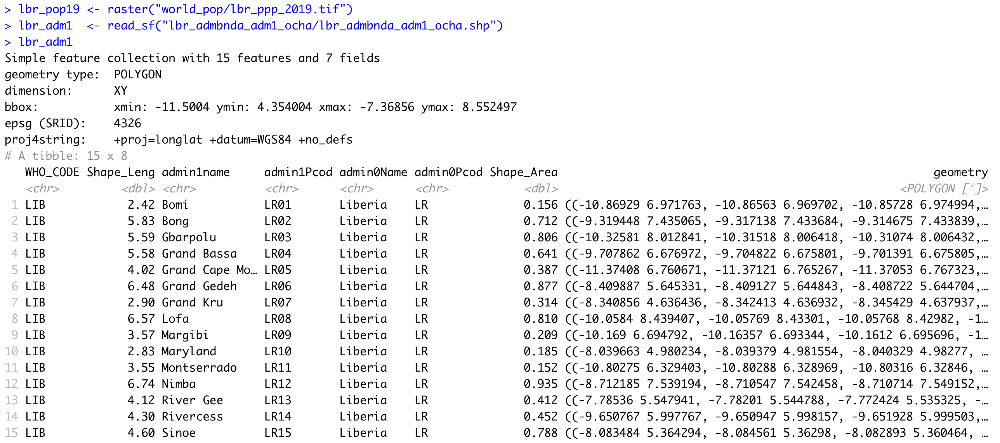

# Extracting Populations from a Raster and Aggregating to each Unit

Now that you have selected your LMIC and produced a basic geospatial description of that country at both the adm1 and adm2 levels of government, you are now set to join some data to each of those units and begin conducting a basic descriptive analysis.  Start by going back to the HDX website and search for the available datasets associated with your selected country.  Look for a dataset with the name of your country followed by the term population.  For Liberia the link is named **Liberia - Population**.  After you find the link, follow it where you should find a page that lists the names of several `.tif` files under the **Data and Resources** tab.  Since it is the year 2019, go ahead and download the file for this year.  For Liberia the file is named **lbr\_ppp\_2019.tif**.  


Clicking on the download tab may automatically begin the process of downloading the `.tif` file into your downloads folder.  Sometimes your web browser may be set to try and display the image file directly within the browser itself.  You should still be able to save the file directly to your downloads folder, OR go back to the download tab, right click on it, and select **download linked file**, in order to override any attempt to display the image.

After you have succesfully downloaded the file, go to your project folder that you previously used as your working directory and create a new folder within the `/data` folder that will be dedicated to raw data from worldpop.


Once you have your `.tif` file located within a subdirectory of the data folder, you can go ahead and open up RStudio.  Create a new file, R Script, and save it in your scripts folder.  Add the `rm(list=ls(all=TRUE))` at the beginning of your code and then load the tidyverse and sf libraries.  Following your libraries, be sure to set your working directory.

```r
rm(list=ls(all=TRUE))

# install.packages("tidyverse", dependencies = TRUE)
# install.packages("sf", dependencies = TRUE)

library(tidyverse)
library(sf)

setwd("~/path/to_my/working/directory/")
```

Now for this exercise, we will install a new package and then load its library of functions.  Use the `install.packages()` to install the `raster::` package.  Be sure to set the `dependencies = TRUE` argument within your command.  After you have successfully installed the `raster::` package, use the `library()` function to load `raster::` and make its set of commands available as part of your current RStudio work session.

The first command we will use from the `raster::` package shares the same name as the library itself.  We use the `raster()` function to import our `.tif` file from its location within our data subdirectory to the current RStudio work session.  Keep in mind, if you set your working directory to the `/data` folder, but then also created a subfolder named `/world_pop` you will need to include the subdirectory path, as well as the full name of the `.tif` within the `raster()` command.

```r
myLMIC_ppp_pop19 <- add_command_here("add_folder_name_here/add_file_name_here.tif")
```

Once you have created your new raster object, by using the `raster()` function, you should notice a new _Formal class RasterLayer_ data object appear in the top right data pane.  In order to find out some basic information about my newly created raster object, I will type the name of my object directly into the console.


The name of my raster class object is `lbr_pop19` and by typing the objects name directly into the console, R informs me of the class of the object, dimensions, resolution, extent, coordinate reference system as well as the minimum and maximum values.  The information about the objects dimensions can be useful, since it is informing us of how many rows of gridcells by how many columns of gridcells are contained within the object.  In the case of the WorldPop raster layer describing Liberia's population in 2019, the object contains 24,922,800 gridcells of equal size, each one with a value describing how many people live in that location.  Resolution informs us of the size of each grid cell, which in this case is defined in terms of decimal degress.  We can also, obtain additional information about the projection of the raster layer from the crs row, which is in longitutde and latitude \(decimal degrees\) while using the WGS84 datum.  We will want to confirm that our shapefiles also are using the WGS84 datum in their projection.

As we  did in the previous exercise, we will again import our shapefiles using the `read_sf()` command from the `sf::` library of functions.  Let's start out by importing the adm1 shapefile for your selected LMIC.

```r
myLMIC_adm1  <- add_command_here("add_folder_here/add_file_name_here.shp")
```

In a manner similar to how we retrieved a basic description of our raster file, we can simply type the name of our simple features class object into the console.



R informs us that our simple feature collection has 15 features, each one with 7 fields \(or variables\).  R also provides us with the bounding box for our collection of polygons in terms of the minimum and maximum longitude and latitude values.  Additionally, we are able to confirm that the source shapefile used to important our sf object also used the WGS84 datum for projection.

You also may notice that below the proj4string row, R describes the object as a tibble: 15 x 8.  A tibble is a new object class for data that is commonly used with the tidyverse syntax.  Tidyverse syntax is or sometimes referred to as tidyR is different from the baseR syntax.  While tidyR is fully capable of calling variables from data frames using either the `$` operator or the `[ ]` subscripting operators, it is a more advanced design in its approach to data that can include multiple dimensions, and thus `%>%` pipe operators can be very effective.  For now, all you need to know is that a tibble is a kind of data object, and tidyR is a new kind of data science syntax for R.

Since both our `raster` and `sf` objects are similarly projected, we should be able to plot both and confirm they have the same bounaries.  Start by plotting the `raster` object.  Following that on the next line, by also plotting your `sf` object.  You will want to next the name of your `sf` object within the `st_geometry()` command in order to plot just the geometry for all 15 polygon features.  Finally, also include the `add = TRUE` argument to the command, in order to add the ploygon features to the already plotted raster layer.

```r
plot(your_raster_object)
plot(st_geometry(your_adm1_sf_obj), add = TRUE)
```


