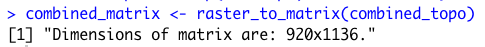

# Rendering Topography

In this last project, you will revist the de facto urban areas you defined as well as the transportation infrastructure and health care facilites you spatially located.  Using your combined adm2 or adm3, you will intersect those land use, transport and health care geographies with the topography of your selected adm2 or adm3.  You may recall that we used the `rayshader::` package back in project 1, which we will use again, but this time will focus on its application with rasters rather than starting with a `sf` object.

To start, be certain you have the `raster::`,`sf::` and `tidyverse::` library of functions available for your current R worksession.  Also, install and load the `rayshader::` and `rayrender::` packages.

```text
#install.packages("rayshader", dependencies = TRUE)

library(raster)
library(sf)
library(tidyverse)

library(rayshader)
library(rayrender)
```

Use the `setwd()` command to make certain your working directory is set to the data folder where you saved your raster and shapefiles.  Read your raster file that describes the topography throughout your LMIC into RStudio.  Also read the shapefile of your adm2 or adm3s as a simple features object into RStudio.  Following are my examples for Liberia.

```text
lbr_topo <- raster("lbr_srtm_topo_100m.tif")
lbr_adm2  <- read_sf("gadm36_LBR_2.shp")
```

With the polygon you previously created by unioning the two adm2s or adm3s you selected, use the `crop()` command to crop the raster describing the topography of your LMIC.  You could also `mask()` the topographical raster, but I am going to forego that step in favor of retaining the area within the bounding box used by the `sf` from my combined adm2.

```text
combined_topo <- crop(lbr_topo, combined_adm2s)
```

 Next you will convert your cropped raster into a matrix using the `raster_to_matrix()` command from the `rayshader::` library of functions.  When executing this function, R will return the dimensions of the matrix created.  Take note of these dimensions, since you will later need them to specify the width and height, in pixels, of the image you will produce of your urban areas, roads and health care that you will then overlay your topography.



Using the `sphere_shade()` command from the `rayshader::` library, plot your topography.  Use the `add_water()` and `detect_water()` commands to automatically add water features to your plot.  My initial plot is primarily rain forest, and water features aren't readily apparent.  Yours may or may not have water features, depending on the location.

```text
combined_matrix %>%
  sphere_shade() %>%
  add_water(detect_water(combined_matrix)) %>%
  plot_map()
```

The resulting plot is a two dimension relief of the bounding box encompassing your combined adm2 or adm3s.


To produce a three-dimension plot of your selected area, first apply the `ambient_shade()` command to your topography matrix.

```text
ambientshadows <- ambient_shade(combined_matrix)
```

Producing these shadows may take a few minutes, but once it is complete, you are ready to begin producing your three-dimension topographic plot.  There are lots of options you can use to produce your 3D plot.  Following is a basic specification.

```text
combined_matrix %>%
  sphere_shade() %>%
  add_water(detect_water(combined_matrix), color = "lightblue") %>%
  add_shadow(ray_shade(combined_matrix, sunaltitude = 3, zscale = 33, lambert = FALSE), max_darken = 0.5) %>%
  add_shadow(lamb_shade(combined_matrix, sunaltitude = 3, zscale = 33), max_darken = 0.7) %>%
  add_shadow(ambientshadows, max_darken = 0.1) %>%
  plot_3d(combined_matrix, zscale = 20,windowsize = c(1000,1000), 
          phi = 40, theta = 135, zoom = 0.5, 
          background = "grey30", shadowcolor = "grey5", 
          soliddepth = -50, shadowdepth = -100)
```

Using the `render_snapshop()` command, produce a three dimesnional image similar to the following for your selected and combined adm2s.

```text
render_snapshot(title_text = "Sanniquelleh-Mahn & Saclepea, Liberia", 
                title_size = 50,
                title_color = "grey90")
```


The `sphere_shade(texture = ...)` command presents other options such as  `texture = "desert"` .  To review all of the texture options, type `?sphere_shade` in the console.  Test each option out to determine which one best matches the physical geography of your selected area.

Return to the plot produced at the end of project 3.  Use `ggplot()` to produce a border of your combined adm2s.  Set the size, linetype and color appropriate for a border.  Also set the `alpha = 0` such that the plot is transparent.  Notice at the end I have added several arguments that effectively remove the axes, the gridded background, labels and expands the plot itself to its boundary in order to maximize the total plot area.

```text
ggplot() +
  geom_sf(data = combined_adm2s,
          size = 4.5,
          linetype = "11",
          color = "gold",
          alpha = 0) +
  theme_void() + theme(legend.position="none") +
  scale_x_continuous(expand=c(0,0)) +
  scale_y_continuous(expand=c(0,0)) +
  labs(x=NULL, y=NULL, title=NULL)
```

Use the script above to produce a similar plot for your selected adm2 within your LMIC.


Now, instead of producing the plot in R, modify the first line of the code in order to assign the ggplot to an object.

```text
obj <- ggplot() + ...
```

Then use the `png()` command to create your graphic object.  Set the `width =` and `height =` to the same dimensions previously returned by the `raster_to_matrix()` command.  Set the `units =`  to pixels, and also set the `bg =` arugment to transparent, so only the lines themselve appear without any background in your `.png` file. 

```text
png("combined.png", width = 920, height = 1136, units = "px", bg = "transparent")
obj
dev.off()
```

After you have saved your `.png` graphics file to your working directory, use the `readPNG()` command from the `png::` library and import your image.  Once it has been imported to R, add the `add_overlay()` command, in order to overlay the dashed, gold border of your combined adm2s.

```text
overlay_img <- png::readPNG("combined.png")

combined_matrix %>%
  sphere_shade() %>%
  add_water(detect_water(combined_matrix)) %>%
  add_overlay(overlay_img, alphalayer = 0.95) %>%
  plot_map()
```


Likewise, add the `add_overlay()` command when producing your three-dimension plot.

```text
combined_matrix %>%
  sphere_shade() %>%
  add_water(detect_water(combined_matrix), color = "lightblue") %>%
  add_shadow(ray_shade(combined_matrix, sunaltitude = 3, zscale = 33, lambert = FALSE), max_darken = 0.5) %>%
  add_shadow(lamb_shade(combined_matrix, sunaltitude = 3, zscale = 33), max_darken = 0.7) %>%
  add_shadow(ambientshadows, max_darken = 0.1) %>%
  add_overlay(overlay_img, alphalayer = 0.95) %>%
  plot_3d(combined_matrix, zscale = 20,windowsize = c(1000,1000), 
          phi = 40, theta = 135, zoom = 0.75, 
          background = "grey30", shadowcolor = "grey5", 
          soliddepth = -50, shadowdepth = -100)
```

Modifying the `alphalayer =` argument will set the transparency of the combined adm2s border.  Increasing the `zoom =`  argument will move your perspective in the three-dimension plot further away from your rendered object.  Modifying the `phi =` and `theta =`  parameters will also alter the viewers perspective by orbiting the camera around the scene or changing the angle of the camera above the horizon.  Once you plot the image, again use the `render_snapshot()` to save your image.  If you would like to make some changes and replot, first run `rgl::rgl.clear()` to clear your existing rgl object.


Add the boundaries of your de facto urban areas to your `ggplot` object and again create your `.png` file.

```text
obj <- ggplot() +
  geom_sf(data = combined_adm2s,
          size = 5.0,
          linetype = "11",
          color = "gold",
          alpha = 0) +
  geom_sf(data = combined_polys,
          size = 0.75,
          color = "gray50",
          fill = "gold3",
          alpha = 0.5) +
  theme_void() + theme(legend.position="none") +
  scale_x_continuous(expand=c(0,0)) +
  scale_y_continuous(expand=c(0,0)) +
  labs(x=NULL, y=NULL, title=NULL)

png("combined.png", width = 920, height = 1136, units = "px", bg = "transparent")
obj
dev.off()
```

Again, run the `readPNG()` command to reimport your `.png` file as an object.

```text
overlay_img <- png::readPNG("combined.png")
```

Produce your three-dimensional plot with borders and urban areas.


Next add your roads.


Then add your health care facilities.


Finally, label the primary urban area.  You will need to modify the `x =`  and `y =`  argument to properly place the label.

```text
render_label(combined_matrix, "Ganta", textcolor ="white", linecolor = "white", 
             x = 250, y = 575, z = 1000, textsize = 2.5, linewidth = 4, zscale = 10)
```


## Project 4. Individual and Group Deliverable

Produce a three-dimensional, topographic plot that describes the _de facto_ boundaries of urban areas, the center lines of classified roadways and the location of health care facilities by type throughout your selected and combined adm2, adm3 or adm4 areas.  Combine your plot with each of your team members, and provide a single written statement that compares each of the selected adm2 areas, while also considering the following.

1. How has topography appeared to have impacted the development of urban areas?
2. How has topography appeared to have impacted the development of transportation facilities?
3. How has topography appeared to have impacted the location of health care facilities?
4. Has producing your three-dimensional map resulted in an interpretion that is different from your previous analysis?

Upload your group's finished product to the slack channel \#data100\_project4 no later than 5:00PM on Tuesday, November 26th.  Your team will present an extended, comparison of your selected administrative areas within each LMIC, during the final group presentation, held on either December 4th or December 6th.

